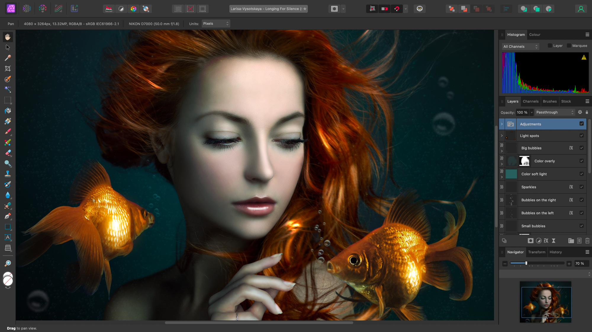

# What is Affinity Photo 2?

Affinity Photo 2 brings a new beginning to image editing for professional photographers, photo retouchers and conceptual artists. With high-end image editing in mind, Photo has been designed with power, speed and performance from its inception, balanced with an intuitive workflow-oriented user interface.

### About Affinity Photo 2

Here's an overview of what you can expect.

- Stunning performance with instant redraw
- Real-time pro-level dynamic tools
- **macOS:** Built from the ground up to live in the Cloud-connected App store world
- Different tool sets (Personas) for different design needs—Photo, Liquify, Develop (RAW), HDR and Export
- Develop Persona—a dedicated studio for camera RAW processing
- End-to-end CMYK, RGB, LAB, and grayscale pro color spaces
- Non-destructive Adjustment Layers and live filters
- Comprehensive blend mode set
- Retouching heaven with all the industry standard tools you'll ever need
- Liquify tools for retouch or crazy effects
- PSD import/export with fidelity
- Interworking with other Affinity products

and much more...

Why not review the product's [key features](02-features.md) in more detail?

**macOS:**

### Apple Photos app and Affinity Retouching

The Affinity Photo 2 architecture and a powerful suite of retouch tools have been brought together to create a photo retouching solution integrated within Apple Photos as an extension.

> **Note:** The extension is a component of Affinity Photo 2 itself so requires Affinity Photo 2 to be installed.

### System requirements

Please see [this link](https://affinity.serif.com/photo/full-feature-list/) for up-to-date system requirements.

#### SEE ALSO:

- [Key features](02-features.md)
