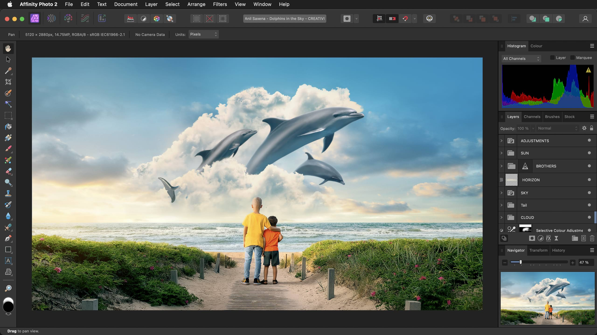

# Interface Visual Reference

Hover over any highlighted area to display a tooltip and identify it.

Photo

Liquify

Develop

Tone Mapping

Export

## Persona Toolbar

#### Allows you to switch between Personas: different workspaces for various tasks. The active Persona's icon appears with saturated colors.

## Toolbar

#### This contains commonly used functions. Its contents change depending on the active Persona and are customizable.

## Context Toolbar

#### This presents options for the currently selected tool.

## Tools panel

#### Gives access to various tools for editing. The tools change based on the Persona that is selected. The panel's contents can be customized.

## Right Studio

#### Various panels providing essential functionality for controlling settings. Panels may differ between Personas. Additional panels can be toggled via the Window menu.

## Status bar

#### Highlights available keyboard modifiers for the selected tool.

## Document view

#### The area that displays your current document. If you are using artboards, it will display them surrounded by a pasteboard.

## Menu bar

#### The menu bar shows commands appropriate to the selected Persona, organized by task or category.

## Persona Toolbar

#### Allows you to switch between Personas: different workspaces for various tasks. The active Persona's icon appears with saturated colors.

## Toolbar

#### This contains commonly used functions. Its contents change depending on the active Persona and are customizable.

## Tools panel

#### Gives access to various tools for editing. The tools change based on the Persona that is selected. The panel's contents can be customized.

## Right Studio

#### Various panels providing essential functionality for controlling settings. The panels displayed may change to reflect the selected Persona. Additional panels can be toggled via the Window menu. Their layout can be customized.

## Status bar

#### Highlights available keyboard modifiers for the selected tool.

## Document view

#### The area that displays your current document. If you are using artboards, it will display them surrounded by a pasteboard.

## Menu bar

#### This shows commands appropriate to the selected Persona, organized by task or category.

## Persona Toolbar

#### Allows you to switch between Personas: different workspaces for various tasks. The active Persona's icon appears with saturated colors.

## Toolbar

#### This contains commonly used functions. Its contents change depending on the active Persona and are customizable.

## Tools panel

#### Gives access to various tools for editing. The tools change based on the Persona that is selected. The panel's contents can be customized.

## Right Studio

#### Various panels providing essential functionality for controlling settings. The panels displayed may change to reflect the selected Persona. Additional panels can be toggled via the Window menu. Their layout can be customized.

## Status bar

#### Highlights available keyboard modifiers for the selected tool.

## Document view

#### The area that displays your current document. If you are using artboards, it will display them surrounded by a pasteboard.

## Menu bar

#### This shows commands appropriate to the selected Persona, organized by task or category.

## Persona Toolbar

#### Allows you to switch between Personas: different workspaces for various tasks. The active Persona's icon appears with saturated colors.

## Toolbar

#### This contains commonly used functions. Its contents change depending on the active Persona and are customizable.

## Tools panel

#### Gives access to various tools for editing. The tools change based on the Persona that is selected. The panel's contents can be customized.

## Right Studio

#### Various panels providing essential functionality for controlling settings. The panels displayed may change to reflect the selected Persona. Additional panels can be toggled via the Window menu. Their layout can be customized.

## Status bar

#### Highlights available keyboard modifiers for the selected tool.

## Presets panel

#### Click a tone mapping preset to apply it to the current image. You can create your own presets to appear here.

## Menu bar

#### This shows commands appropriate to the selected Persona, organized by task or category.

## Persona Toolbar

#### Allows you to switch between Personas: different workspaces for various tasks. The active Persona's icon appears with saturated colors.

## Toolbar

#### This contains commonly used functions. Its contents change depending on the active Persona and are customizable.

## Tools panel

#### Gives access to various tools for editing. The tools change based on the Persona that is selected. The panel's contents can be customized.

## Right Studio

#### Various panels providing essential functionality for controlling settings. The panels displayed may change to reflect the selected Persona. Additional panels can be toggled via the Window menu. Their layout can be customized.

## Status bar

#### Highlights available keyboard modifiers for the selected tool.

## Export Slice

#### An area of your current document designated for export to its own file.

## Export Slice

#### An area of your current document designated for export to its own file.

## Menu bar

#### The menu bar shows commands appropriate to the selected Persona, organized by task or category.

On Windows and earlier versions of macOS, Affinity Photo 2's toolbar and title bar are presented as separate elements but otherwise function the same.

#### SEE ALSO:

- [Toolbar](02-toolbar.md)
- [Persona toolbar](03-persona-toolbar.md)
- [Context toolbar](04-context-toolbar.md)
