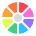
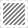
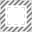
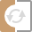
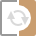
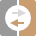

# Toolbar

The Toolbar hosts commonly used tools and options to keep them at your fingertips. Options are placed in logical groups to improve ease of use.

The tools and options may differ depending on the currently active Persona.

### Settings

The following options are available from the Toolbar.

#### Enhancement:

-  **Auto Levels**—automatically applies a levels adjustment to the image.
-  **Auto Contrast**—automatically applies a contrast adjustment to the image.
-  **Auto Colors**—automatically applies a color adjustment to the image.
-  **Auto White Balance**—automatically applies a white balance adjustment to the image.

#### Selection:

-  **Select All**—selects all pixels on the entire layer.
-  **Deselect**—deselects all pixels in the current selection.
-  **Invert Selection**—selects the portion of the current layer outside the current selection.

#### Quick Mask:

-  **Quick Mask**—click to switch to [Quick Mask mode](../08-selections/04-edit-selection-as-layer-using-quick-mask.md) to create selections using the painting tools.
- Quick Mask options—customize settings from the pop-up menu.

#### Snapping:

-  **Force Pixel Alignment**—when selected (default), vector content and pixel selections will snap to full pixels when created, moved or modified. If this option is off, partial pixels can be occupied.
-  **Move by whole pixels**—allows you to constrain the movement of vector objects, nodes and handles to whole pixels.
-  **Snapping**—when selected, layer content will obey the snapping rules defined by the current snapping options. If this option is off (default), snapping is disabled.
- Snapping options—customize settings from the pop-up menu.

#### Assistant Settings:

-  **Assistant Settings**—click to control layer rasterization behavior and enable supporting on-screen alerts.

#### Order:

-  **Move to Back**—repositions the selected layer(s) at the bottom of the **Layers** panel.
-  **Back One**—moves the selected layer(s) down one position in the **Layers** panel.
-  **Forward One**—moves the selected layer(s) up one position in the **Layers** panel.
-  **Move to Front**—repositions the selected layer(s) at the top of the **Layers** panel.

> **Note:** The above options are also available from the **Arrange** menu.

#### Align:

-  **Alignment**—displays a pop-up dialog allowing you to align and distribute layer content.

#### Insert Target:

-  **Insert behind the selection**—when selected, new layers are added below the currently selected layer(s).
-  **Insert at the top of the layer**—when selected, new layers are added at the top of the layer stack.
-  **Insert inside the selection**—when selected, new layers are added inside the current selection.

> **Note:** If all target options are off (default), new layers are added above the currently selected layer.

#### Mesh (Liquify Persona only):

-  **Reset Mesh**—applies a new mesh and removes all currently applied effects from the underlying image.
-  **Save Mesh**—saves the current mesh for future application.
-  **Load Mesh**—applies a previously saved mesh.

#### Mask (Liquify Persona only):

-  **Clear Mask**—removes the mask from the image.
-  **Mask All**—applies a new mask to the entire image.
-  **Invert Mask**—reverses which areas are masked and which areas are not.

#### Split View (Liquify and Develop Personas only):

-  **None**—displays in full view.
-  **Split**—displays in split view for side-by-side 'Before - After' comparison.
-  **Mirror**—displays a split mirrored view for side-by-side 'Before - After' comparison.

#### Before / After (Develop Persona only):

-  **Sync Before**—updates the 'Before' view using the settings applied in the 'After' view.
-  **Sync After**—removes all the settings applied in the 'After' view to return the image to the 'Before' view.
-  **Swap**—switches the applied settings of the 'Before' and 'After' views.

#### Orientation (Develop Persona * only):

-  **Flip Horizontal**—flips the selected object(s) left to right.
-  **Flip Vertical**—flips the selected object(s) top to bottom.
-  **Rotate Anticlockwise**—rotates the image 90° to the left.
-  **Rotate Clockwise**—rotates the image 90° to the right.

*Use **View>Customize Toolbar** to add.

#### Design Aids (Develop Persona only):

-  **Show Clipped Highlights**—when selected, highlight areas which suffer from loss of detail due to clipping are displayed on the image in red.
-  **Show Clipped Shadows**—when selected, shadow areas which suffer from loss of detail due to clipping are displayed on the image in blue.
-  **Show Clipped Tones**—when selected, midtone areas which suffer from loss of detail due to clipping are displayed on the image in yellow.

#### Account:

-   **Account**—registers your app, accesses your Affinity account and synchronizes with purchased content. The icon will show green when signed into your account.

#### SEE ALSO:

- [Customizing the Toolbar](../31-workspace/04-customize/04-toolbar.md)
- [View](../03-get-started/07-viewing.md)
- [Ordering](../07-layer-operations/14-ordering.md)
- [Transforming](../05-sizing-cropping-and-warping/05-transforming.md)
- [Snapping](../30-design-aids/11-snapping.md)
