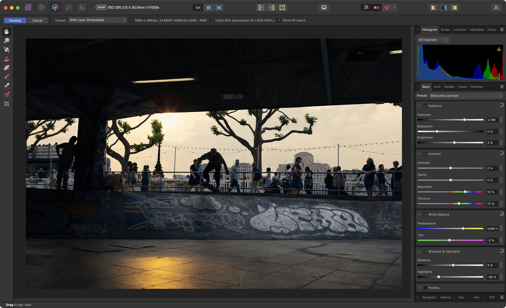

# Developing a raw image

Develop Persona is a dedicated non-destructive environment used for processing raw images captured using a digital camera.

## Working in Develop Persona

If a [supported raw file format](../34-appendix/01-supported-file-formats.md) is opened, it will automatically display in Develop Persona. You can then process the image using the dedicated adjustments, panels and tools. You can use non-destructive development which lets you redevelop the original raw image at any time without affecting the original file.

> **Note:**
>
> **macOS:** Only **Serif Labs RAW Engine** can be used for non-destructive operation. To swap to it, go to **Affinity Photo 2>Settings** (or **>Preferences**), then **Assistant>Develop Assistant** and select **Serif Labs** from the **RAW Engine** pop-up menu.
>
> **Windows:** Only **Serif Labs RAW Engine** can be used for non-destructive operation. To swap to it, go to **Edit>Settings**, then **Assistant>Develop Assistant** and select **Serif Labs** from the **RAW Engine** pop-up menu.

Develop Persona gives you access to the following:

- **Output** options that will retain your original raw image as a non-destructive raw layer, with the raw file either embedded (copied into your document) or linked (left in its original file location).
- **Develop Assistant Settings** to control behavior on loading the RAW image:
  - **macOS:** choice of RAW engine for RAW processing
  - enable/disable automatic lens correction (SerifLabs RAW engine only)
  - enable/disable automatic noise reduction
  - enable/disable automatic tonal adjustment (curves)
  - enable/disable automatic exposure adjustment
- Tonal adjustments using the [Basic](03-basic-panel.md) and [Tones](04-tones-panel.md) panels.
- Sharpening and Noise adjustments using the [Details panel](05-details-panel.md).
- Lens correction adjustments using the [Lens panel](06-lens-panel.md).
- [Overlays](02-using-overlays.md) for applying adjustments to specific brushed image regions.
- Crop Tool for [cropping](../05-sizing-cropping-and-warping/04-cropping-and-straightening.md) your image.
- Blemish Removal Tool for [correcting image imperfections](../09-retouching/03-removing-blemishes.md).
- [Focus panel](08-focus-panel.md).
- [Scope panel](../33-panels/21-scope-panel.md).
- [Snapshots panel](09-snapshots-panel.md) for comparing different image processing settings.

At any point while working with an image or any selected pixel layer, you can switch to Develop Persona to make use of its unique features.

**macOS:**

## Choosing between RAW engines

The Develop Assistant Settings provides a choice between Apple (Core Image RAW) and Serif Labs engines for processing RAW images.

Apple's engine provides the benefits of predetermined behaviors for demosaicing, lens correction, noise reduction, cropping and more.

Serif Labs' engine allows for greater manual configuration. You can specify luma and chroma noise reduction separately or disable noise reduction altogether, override lens correction, and benefit from superior demosaicing.

Apple's engine crops to whatever aspect ratio was selected in camera and so was written into the image's metadata, even if the camera sensor's aspect ratio is different. Data outside of the crop area may be removed during RAW processing. The Serif Labs engine doesn't destructively crop images, so all sensor data remains available.

## Split view options

There are a variety of split view options available in Develop Persona's View Tool which give you the opportunity of seeing how your processed image compares to the original raw data.

## Syncing

While applying adjustments, you can update the 'Before' and 'After' view to give you a more focused representation of the applied changes. Rather than comparing the processed image with the original raw data, you can sync the views so 'Before' adopts the current applied adjustments. The 'After' view continues to update as more adjustments are made.

## Show Clipping

An incorrect level of exposure within an image can lead to pixels 'falling out' of the viewable intensity range. This results in the loss of detail in areas of shadow, highlights, or midtones and is known as clipping.

In Develop Persona, you have the ability to display **Clipped Shadows**, **Clipped Highlights** and/or **Clipped Tones** directly on the image. This can help you identify areas which need correcting as well as preventing overenthusiastic modifications which result in clipping. The Develop Persona remembers your choices for these options from the last time you used it, even when editing a different photo.

## Preset behavior

To develop RAW files faster, you may save previously modified panel settings as a **Preset** and then select it from the list in the panel. Each time you open a new RAW file, all panels reset to the **Default** state (no presets are applied).

Presets are available for the **Basic**, **Lens**, **Details** and **Tones** panels.

**To develop a raw image:**

1. [Open a raw image](../03-get-started/02-opening-a-raw-image.md). Develop Persona will analyze the data and pre-process it, ready for editing.*
2. On the Toolbar, activate your preferred view mode.
3. Adjust the image using the various panel options and [tools](../32-tools/12-raw-tools-develop-persona/01-raw-tools.md).
4. (Optional) Sync applied settings within the view and repeat the above step.
5. On the context toolbar, select an **Output** option. Choose from:
  - **Pixel**—output will be destructive; a pixel layer is created from your developed raw image.
  - **RAW layer (Embedded)**—when developed, an editable non-destructive raw layer is created; the raw image is copied into your document.
  - **RAW layer (Linked)**—when developed, an editable non-destructive raw layer is created; the raw image is kept in its original file location.
6. If redeveloping a raw image, if **Show All Layers** is checked above your workspace then all layers (e.g., adjustments or filters) applied in Photo Persona will be displayed if the raw image is redeveloped. Uncheck to hide other layers.
7. On the context toolbar, select **Develop**.

> **Note:** You need to decide on the **Output** option when you open your RAW file for the first time. Once set, it cannot be modified when you return to the **Develop** persona.

> **Tip:** *To alter the pre-processing for a raw image, change the develop options available in the **Develop Assistant Settings** discussed later.

> **Tip:** When adjusting settings, you can double click each adjustment slider to reset it to its default value.

> **Note:**  You can 'develop' any existing pixel layer by clicking **Develop Persona** on the Toolbar.

**To redevelop a raw image:**

- On the **Layers** panel, double-click the raw layer's thumbnail. Develop Persona will be launched for raw redevelopment.

> **Note:** Redevelopment is only possible if the initial development used an **Output** setting of **RAW layer (Embedded)** or **RAW layer (Linked)**. Upon re-development, an image layer will be rasterized regardless of the color mode selected. The behavior can be changed via the app's **Settings**.

**To create settings preset:**

1. Modify your develop settings, as required (Basic, Lens, Details or Tones panel).
2. At the top of the panel, click **Default** and select **Add Preset** from the list.
3. On the pop-up window, type a name for the preset and click **OK**.

**To activate split view modes:**

On the Toolbar, do one of the following:

- Click **Single View** to display the processed image in isolation.
- Click **Split View** to display both processed and original raw image on the same page. A sliding divider can be repositioned to view the image 'Before' and 'After' processing.
- Click **Mirror View** to display processed and original raw image side-by-side on separate pages. Panning and zooming affects both pages simultaneously so the same area is always displayed in both pages.

> **Note:** The output will adopt all the settings as displayed in the 'None' or 'After' view. The 'Before' view is for comparison purposes only.

**To synchronize applied settings in view modes:**

On the Toolbar, do one of the following:

- Click **Sync Before** to update the 'Before' view to the most recent applied settings, i.e. those in the 'After' view.
- Click **Sync After** to revert the settings applied in the 'After' view back to the settings shown in the 'Before' view.
- Click **Swap** to switch the applied settings between the views.

**To show clipping:**

On the Toolbar, do one of the following:

- Click **Show Clipped Highlights** to display all 'blown' highlights as a high-contrast red color.
- Click **Show Clipped Shadows** to display all clipped shadow areas as a high-contrast blue color.
- Click **Show Clipped Tones** to display all clipped midtone areas as a high-contrast yellow color.

**To change initial develop settings:**

On the Toolbar, do the following:

1. Click the **Develop Assistant Settings** to open its settings dialog.
2. Choose from the following settings:
  - **macOS:** **RAW Engine**: Provides a choice of RAW processing engines for you to use—Affinity's own Serif Labs engine (used by default) or Apple's Core Image RAW engine.
  - **Default lens profile**: The **Auto-select** option enables automatic lens correction for supported camera [Lens profiles](https://affin.co/rawlist) if installed with the app. If a camera is not included (perhaps a new model), you can include it by adding its profile—a downloaded Lensfun XML file or Adobe Lens Correction Profile (LCP)—to the database by using **Settings (or Preferences)>General**. The **Last used** option uses the **Lens Profile** previously chosen from the Develop Persona's **Lens Panel** (Lens Correction).
  - **Noise reduction**: Automatically enables either color noise reduction, color and luminance noise reduction, or disables any initial noise reduction. Color noise reduction is recommended for the vast majority of camera raw images.
  - **RAW output format**: Choose between **RGB (16 bit)** or **RGB (32 bit HDR)** output when developing a raw image. Choosing **RGB (32 bit HDR)** allows you to maintain a full 32-bit float environment from initial raw development to export and take advantage of extra precision.
  - **Tone curve**: If the default 'Apply tone curve' option is active, your raw image is adjusted using a suggested tone curve. The 'Take no action' option makes no tonal correction; the image can be altered within the **Basic** panel later.
  - **Alert when assistant takes an action**: When checked, a pop-up message appears on loading the RAW image to indicate that adjustments have been applied automatically.
  - **Exposure bias**: Choose whether to apply exposure bias value if stored in the raw image's EXIF data. Like Histogram stretch, both 'default' and 'initial' give the same results but reports zeroed or actual values, respectively. The 'Take no action' option ignores the exposure bias value.
  - **macOS:** **Map default region**: Sets the map that displays in the **Location** panel to a chosen region, if the raw image contains no GPS location data in its EXIF data.

> **Note:** The chosen RAW Engine will be remembered the next time a raw image is loaded.

> **Note:** If you choose not to apply initial develop settings, your images will not undergo any processing. They may look flat, dull in tone and lacking contrast, but you will have absolute control in how the image is processed.

#### SEE ALSO:

- [Raw Tools](../32-tools/12-raw-tools-develop-persona/01-raw-tools.md)
- [Settings (or Preferences)](../37-settings-preferences/01-settings-preferences.md)
