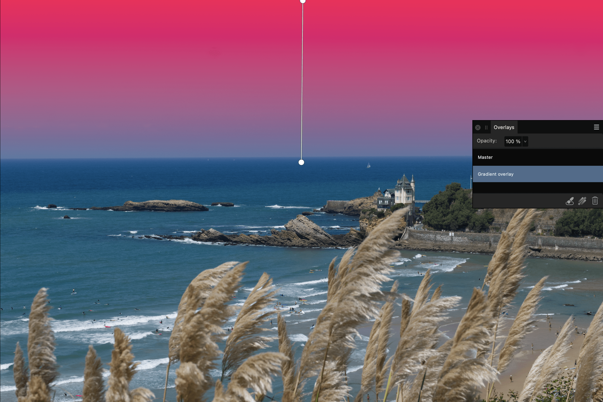

# Using overlays

The Overlay tools can be used in combination with the **Overlays** panel to allow you to apply standard adjustments to isolated areas of an image.

*Gradient Overlay applied in the Develop Persona.*

## About overlays

Overlays are elements within Develop Persona which are placed on top of an image. Any adjustment applied to an overlay affects the image below.

However, overlays can have a varying level of visibility, which varies the impact its adjustments have on the underlying image. In this respect, Overlays in Develop Persona act in a similar way to [masks in Photo Persona](../06-layers/12-layer-masks.md).

Areas of an overlay which are transparent ignore the overlay's adjustments, while opaque areas display the applied adjustments. Areas of semi-transparency (such as those created with the Overlay Gradient Tool) will display the adjustments by a varying degree.

The adjustments applied to an overlay are determined using the [Overlays panel](07-overlays-panel.md).

### Types of overlay

There are two types of overlay: Brush and Gradient.

Brush overlays can only be edited using the **Overlay Paint** and **Overlay Erase** Tools. Areas are added to an overlay using the Overlay Paint Tool. Areas are removed using the Overlay Erase Tool.

The **Overlay Gradient Tool** applies a gradient from transparent to opaque across Gradient overlays only.

### Settings ( Overlay Paint and Erase Tools only)

- **Size**—controls the size of the overlay brush in pixels.
- **Hardness**—how hard the edges of the brush are. The painted overlay appears softer and more feathered as the percentage decreases.
- **Edge Aware**—when checked, enables edge detection, which allows for easier overlay painting around edges without having to zoom in and reduce the brush size.
- **Show Overlay**—keep checked to display a strong pink overlay to identify an area for targeted editing; uncheck to hide the overlay and make your edits directly without this aid.

**To create an overlay:**

Do any of the following:

- On the **Overlays** panel, select **Add Brush Overlay** to create a transparent, pixel overlay.
- On the **Overlays** panel, select **Add Gradient Overlay** to create an opaque Gradient overlay.
- With no overlay selected, drag on the image with the **Overlay Paint Tool**. A Brush overlay is added automatically.
- With no overlay selected, drag on the image with the **Overlay Gradient Tool**. A Gradient overlay is added automatically.

**To apply adjustments to an overlay:**

1. On the **Overlays** panel, select an **overlay**.
2. From the **Basic** panel, click an adjustment's checkbox to activate it.
3. Drag the adjustment slider to set the value.

**To remove an overlay:**

On the **Overlays** panel:

1. Select an **overlay**.
2. Click **Delete Overlay**.

#### SEE ALSO:

- [Overlays panel (Development Persona only)](07-overlays-panel.md)
- [Raw Tools](../32-tools/12-raw-tools-develop-persona/01-raw-tools.md)
- [Developing a raw image](01-developing-raw-images.md)
