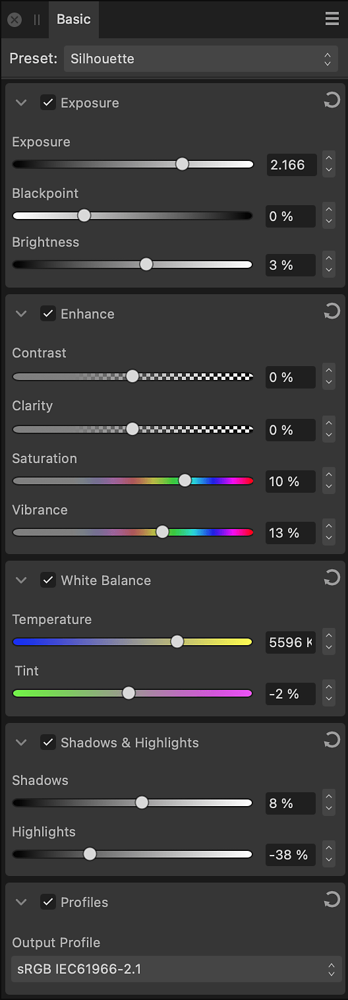

# Basic panel (Develop Persona only)

The **Basic** panel provides standard adjustments which can be applied to an image.

*The Basic panel in Develop Persona.*

### Available Adjustments:

- [Exposure](../10-adjustments/02-tonal-adjustments/03-adjustment-exposure.md)—adjusts the overall exposure of the image, changes black point and overall brightness.
- [Enhance](03-basic-panel/01-adjustment-enhance.md)—adjusts contrast, clarity, saturation and vibrance.
- [White Balance](../10-adjustments/03-color-adjustments/13-adjustment-whitebalance.md)*—removes undesirable color casts from a photo by adjusting the 'temperature' of the light. The default value is the 'As shot' White balance setting from your camera.
- [Shadows & Highlights](../10-adjustments/02-tonal-adjustments/05-adjustment-shadowshighlights.md)—applies tonal adjustment to the darkest and/or lightest areas in a photo.
- Profiles—sets a system-installed ICC **Output Profile** for color managing the developed image.

### Settings (or Preferences)

- **Preset**—manages adjustment presets via a pop-up menu.
  - **Add Preset**—saves the current adjustment settings as a named preset for later use. The pop-up menu populates with the preset name on saving.
  - **Delete Preset**—deletes the preset currently checked in the Preset pop-up menu.
  - **Default**—reverts the current adjustment settings back to default settings.
-  Active/Inactive—when checked, the adjustment is applied to the image.
-  Reset—sets adjustment slider(s) back to default.

> **Note:** *The White Balance adjustment can be set automatically using the [White Balance Tool](../32-tools/12-raw-tools-develop-persona/01-raw-tools.md).

#### SEE ALSO:

- [Developing a raw image](01-developing-raw-images.md)
- [Customizing the workspace](../31-workspace/04-customize/02-workspace.md)
