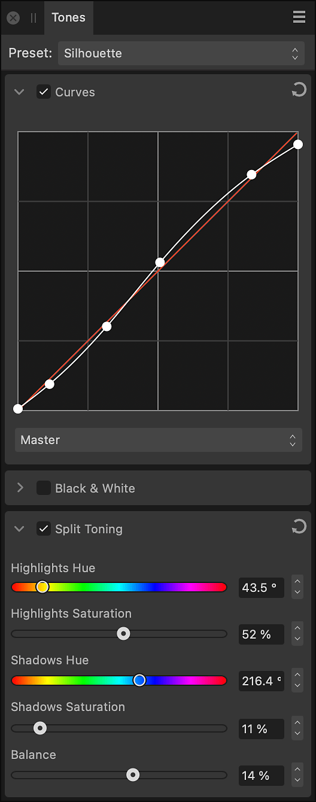

# Tones panel (Develop Persona only)

The **Tones** panel provides adjustments for correcting the tonal and color values of pixels in an image.

*The Tones panel showing tonal adjustments.*

### Available Adjustments:

- [Curves](../10-adjustments/02-tonal-adjustments/02-adjustment-curves.md)—uses graph manipulation to precisely adjust the lightness and contrast of a photo.
- [Black & White](../10-adjustments/03-color-adjustments/02-adjustment-blackandwhite.md)—converts a color photo to grayscale.
- [Split Toning](../10-adjustments/03-color-adjustments/10-adjustment-splittoning.md)—tints and recolors highlights and shadows.

### Settings (or Preferences)

- **Preset**—manages adjustment presets via a pop-up menu.
  - **Add Preset**—saves the current adjustment settings as a named preset for later use. The pop-up menu populates with the preset name on saving.
  - **Delete Preset**—deletes the preset currently checked in the Preset pop-up menu.
  - **Default**—reverts the current adjustment settings back to default settings.
-  Active/Inactive—when checked, the adjustment is applied to the image.
-  Reset—sets adjustment slider(s) back to default.

#### SEE ALSO:

- [Developing a raw image](01-developing-raw-images.md)
- [Customizing the workspace](../31-workspace/04-customize/02-workspace.md)
