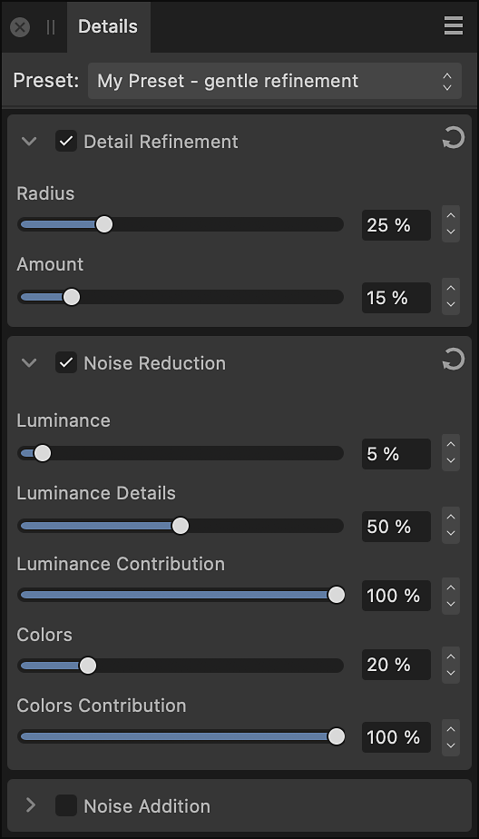

# Details panel (Develop Persona only)

The **Details** panel provides adjustments to refine the edges of images and remove (or add) noise.

*The Details panel in Develop Persona.*

### Available Adjustments:

- [Detail Refinement](05-details-panel/01-adjustment-detailrefinement.md)—sharpen edges to add clarity to raw images. Can be used in conjunction with the Noise Reduction adjustment.
- [Noise Reduction](05-details-panel/03-adjustment-noisereduction.md)—reduce and remove random luminance and/or color pixels.
- [Noise Addition](05-details-panel/02-adjustment-noiseaddition.md)—adds random pixels to an image to introduce and enhance noise.

### Settings (or Preferences)

- **Preset**—manages adjustment presets via a pop-up menu.
  - **Add Preset**—saves the current adjustment settings as a named preset for later use. The pop-up menu populates with the preset name on saving.
  - **Delete Preset**—deletes the preset currently checked in the Preset pop-up menu.
  - **Default**—reverts the current adjustment settings back to default settings.
-  Active/Inactive—when checked, the adjustment is applied to the image.
-  Reset—sets adjustment slider(s) back to default.

#### SEE ALSO:

- [Developing a raw image](01-developing-raw-images.md)
- [Customizing the workspace](../31-workspace/04-customize/02-workspace.md)
