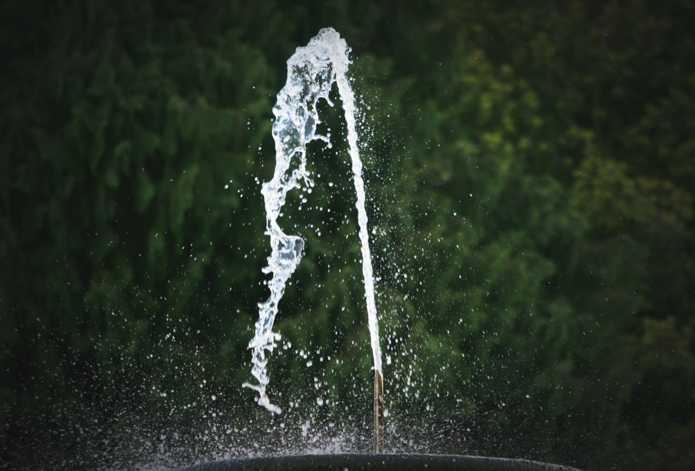
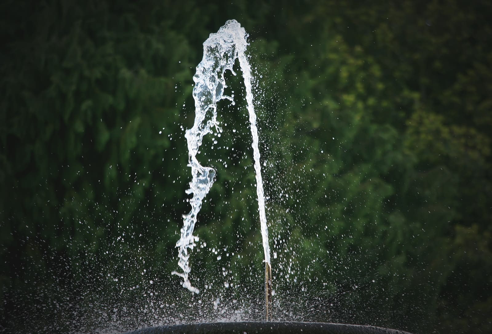

# Detail Refinement

Sharpen edges to add clarity to images.

> **Note:** This adjustment is only available in [Develop Persona](../01-developing-raw-images.md).

### Settings

The following settings can be adjusted:

- **Radius**—controls the number of pixels affected around the existing light pixels. Drag the slider to set the value.
- **Amount**—controls how much contrast is added but does not define the number of pixels affected. Drag the slider to set the value.

#### SEE ALSO:

- [Developing a raw image](../01-developing-raw-images.md)
