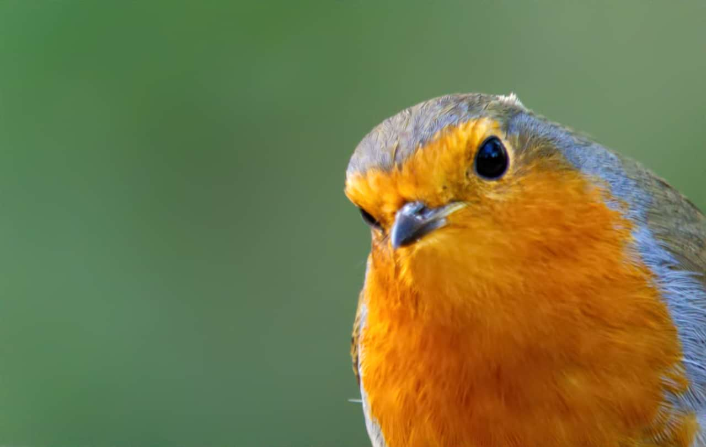

# Noise Reduction

Reduce and remove random luminance and/or color pixels from images.

> **Note:** This adjustment is only available in [Develop Persona](../01-developing-raw-images.md).

### Settings

The following settings can be adjusted:

- **Luminance**—controls the intensity of noise removal from the luminance channel. Drag the slider to set the value.
- **Luminance Details**—adjusts the detail edge smoothing threshold. Higher values will allow more fine detail through, whereas lower values will smooth fine detail and provide stronger noise reduction.
- **Luminance Contribution**—controls how much of the overall luminance noise reduction is added to the image.
- **Colors**—controls the intensity of noise removal from the chrominance channels. Drag the slider to set the value.
- **Colors Contribution**—controls how much of the overall chrominance noise reduction is added to the image.

#### SEE ALSO:

- [Developing a raw image](../01-developing-raw-images.md)
