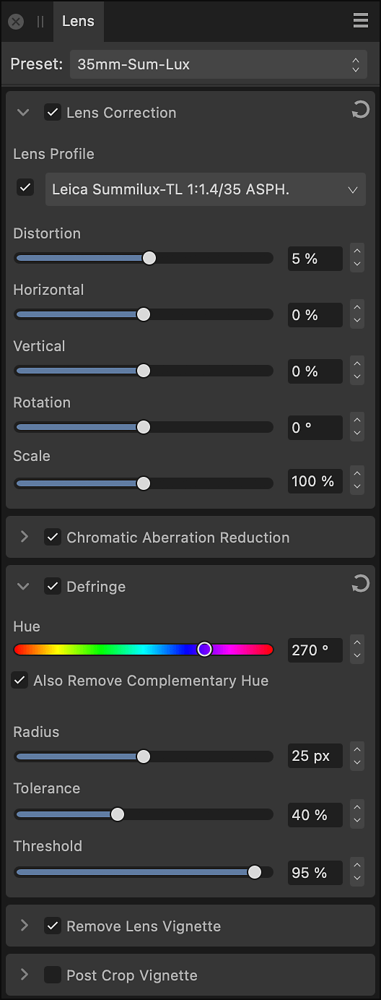

# Lens panel (Develop Persona only)

The **Lens** panel provides adjustments which can be used to correct lens distortions which can appear in images.

*The Lens panel in Develop Persona.*

### Available Adjustments:

- [Lens Correction](06-lens-panel/03-adjustment-lenscorrection.md)—fixes various types of lens distortion by straightening and aligning lines in an image.
- [Chromatic Aberration Reduction](06-lens-panel/01-adjustment-chromaticaberrationreduction.md)—fixes chromatic aberration by realigning blue, green, and red planes.
- [Defringe](06-lens-panel/02-adjustment-defringe.md)—corrects purple fringing (bichrominance) at the edges of high contrast areas.
- [Remove Lens Vignette](06-lens-panel/04-adjustment-lensvignette.md)—corrects unwanted vignetting by adjusting the brightness at the edges of an image.
- [Post Crop Vignette](06-lens-panel/04-adjustment-lensvignette.md)—As with Lens Vignette but adjusted after a crop has been applied to an image.

## Check adjustment status

One or more status icons may be displayed to the right of an adjustment's heading. Hover over each for more information.

- A blue information icon indicates success in auto-selecting a lens profile, or that the **Develop Assistant Settings** is not set to auto-select a profile.
- A yellow warning icon indicates something could not be done. The Develop Assistant Settings may not have been able to auto-select a lens profile for some reason; the image contains insufficient metadata to perform the adjustment; or corrections have already been applied to the image.

Any status indicator related to the Develop Assistant Settings is cleared if you select a profile manually.

## Manual application

Though Affinity Photo 2 may determine a suitable lens profile for your image, in the following circumstances one or more adjustments may be turned off. They can be turned on manually, if you want.

- The image is not a linear RAW format—its light values are logarithmic. This is rare.
- The image is not a RAW format. For example, you opened a JPEG file and then selected Develop Persona.
- **macOS:** In the Develop Assistant Settings, **RAW Engine** is set to **Apple (Core Image RAW)**.
- The image contains insufficient metadata, such as focal length and aperture, to perform some aspects of correction.
- Other software has already corrected the image.

### Settings (or Preferences)

- **Preset**—manages adjustment presets via a pop-up menu.
  - **Add Preset**—saves the current adjustment settings as a named preset for later use. The pop-up menu populates with the preset name on saving.
  - **Delete Preset**—deletes the preset currently checked in the Preset pop-up menu.
  - **Default**—reverts the current adjustment settings back to default settings.
-  Active/Inactive—when checked, the adjustment is applied to the image.
-  Reset—sets adjustment slider(s) back to default.

#### SEE ALSO:

- [Developing a raw image](01-developing-raw-images.md)
- [Settings (or Preferences) (Assistant)](../37-settings-preferences/01-settings-preferences.md)
- [Customizing the workspace](../31-workspace/04-customize/02-workspace.md)
