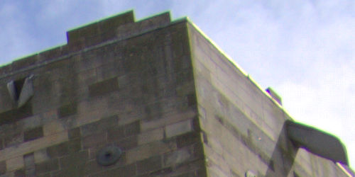

# Chromatic Aberration Reduction

Fixes chromatic aberration by realigning blue, green, and red planes.

*Aligning the chroma planes using the filter.*

This adjustment has no customizable settings.

#### SEE ALSO:

- [Developing a raw image](../01-developing-raw-images.md)
