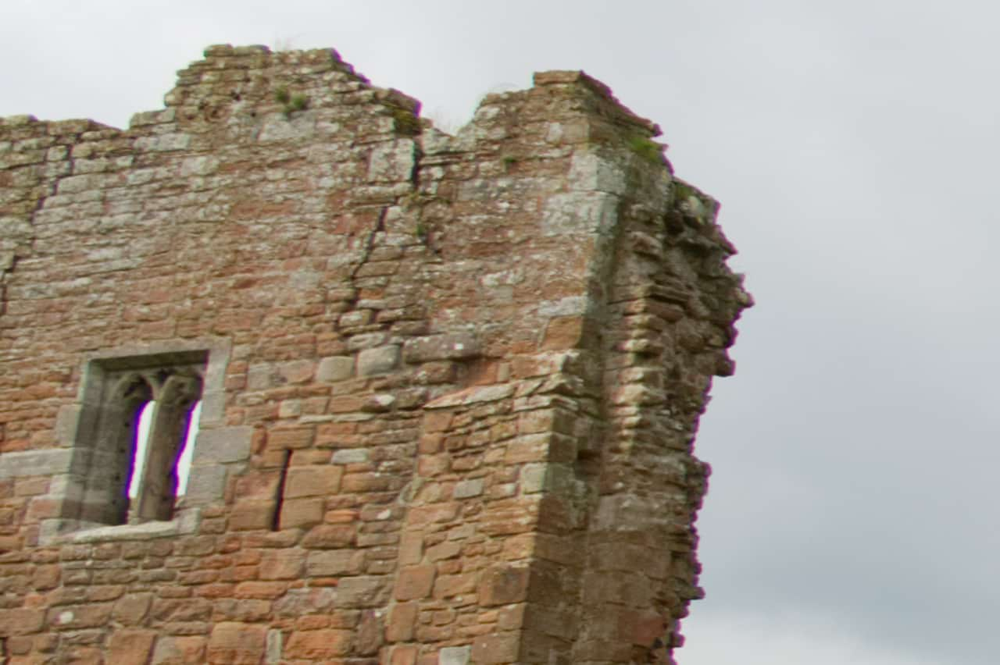

# Defringe

Corrects purple fringing (bichrominance) at the edges of high contrast areas.

*Using the Defringe filter to remove purple fringing from the window edges.*

> **Note:** This adjustment is only available in [Develop Persona](../01-developing-raw-images.md).

### Settings

The following settings can be adjusted:

- **Hue**—defines the color of the fringe to be desaturated. Drag the slider to set the value.
- **Radius**—defines the radius of the pixels affected around the fringed areas. Drag the slider to set the value.
- **Tolerance**—defines how close the fringe color must be to the defined color before it is affected. Drag the slider to set the value.
- **Threshold**—defines the amount of contrast needed between the fringed areas before affecting the pixels. Drag the slider to set the value.

#### SEE ALSO:

- [Developing a raw image](../01-developing-raw-images.md)
