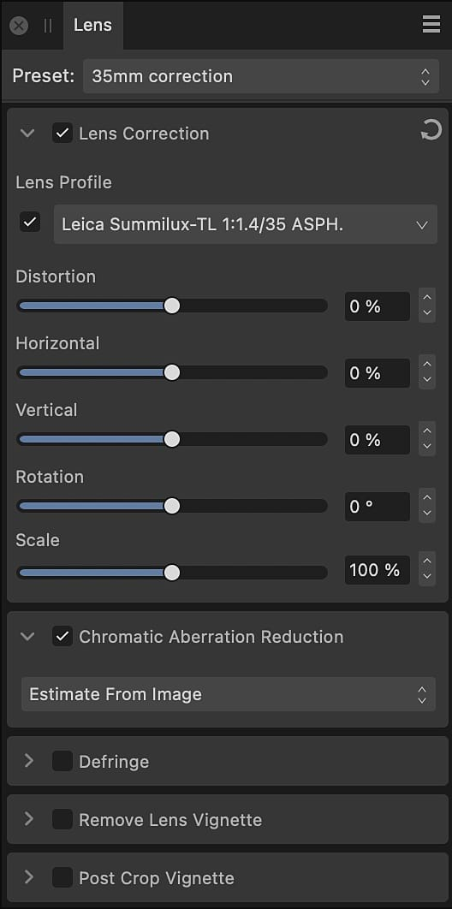
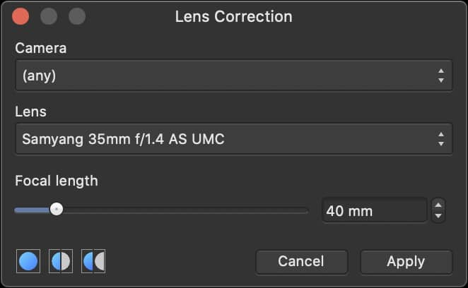
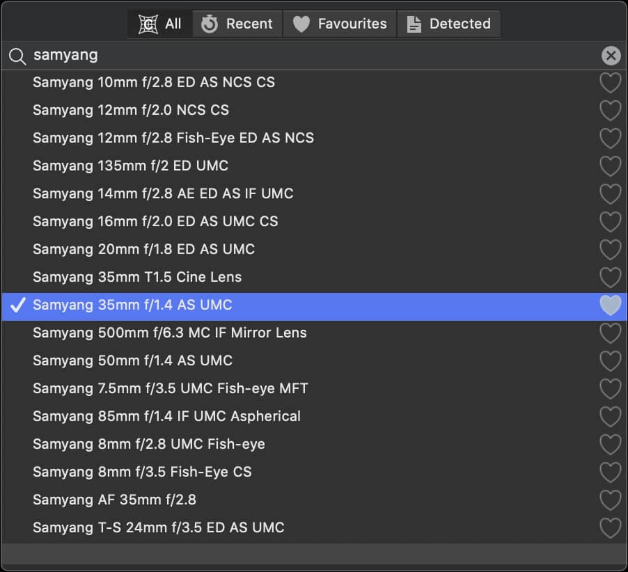

# Lens Correction

Fixes various types of lens distortion by straightening and aligning lines in an image.

This adjustment is available on the **Lens** panel in [Develop Persona](../01-developing-raw-images.md), where the appropriate lens profile is applied automatically if possible, or can be chosen manually.

In **Photo Persona**, you have the option to apply a Lens Correction filter that lets you manually select your camera and a lens profile.

Types of problems which can be fixed include:

- Barrel or pincushion distortion
- Incorrect horizontal and/or vertical perspective
- Angled horizons

### Settings

The following settings can be adjusted from Develop Persona:

- **Lens Profile**—if the lens is supported in Affinity Photo 2's [lens correction database](https://affin.co/rawlist), distortion correction will automatically be applied1. You can manually choose a profile. If you wish not to apply the correction, however, you can uncheck this option.
- **Distortion**—controls the strength (and type) of distortion. Drag the slider to the left to remove barrel distortion (where straight edges are bowed outwards). Drag to the right to remove pincushion distortion (where straight edges a bowed inwards).
- **Horizontal**—controls an image's horizontal perspective. Drag the slider until horizontal lines become parallel.
- **Vertical**—controls an image's vertical perspective. Drag the slider until vertical lines become parallel.
- **Rotation**—sets the angle of the image. Drag the slider to the left to rotate counter-clockwise. Drag to the right to rotate clockwise.
- **Scale**—sets the size of the image from the center. This is useful for removing unwanted transparent areas which appear after applying the settings above.

1 This depends on your chosen settings in **Develop Assistant Settings**.

The following lens correction settings can be adjusted from **Filters>Distort>Lens Correction**:

- **Camera**—select the camera you want to correct for.
- **Lens**—choose a lens profile to manually apply the lens correction. The list will change depending on the lenses supported for each camera.
- **Focal Length**—sets the focal length for the correction, e.g. 50mm.

**To locate a lens profile manually:**

- On the Lens Profile pop-up menu, do one of the following:
  - Select **All** and scroll through the lens profile database.
  - **macOS:** Filter the list by typing the lens brand or another detail, e.g. 35mm, in the search bar.
  - **Windows:** Filter the list by clicking the text, which reads ‘(none)’ or the currently selected profile name, and typing the lens brand or another detail, e.g. 35mm.
  - Select **Recent** if you have used the profile to develop another photo recently.
  - Select **Favorites** if you have marked the lens as a favorite previously.
  - If Develop Assistant Settings is not set to **Auto-select** a profile, select **Detected** to see which lens profile, if any, has been identified from the image file.

**To manually apply a lens profile:**

- Locate the relevant profile.
- Select the profile's row to see how it will affect your image.
- Either double-click the profile's row or click outside of the pop-up menu.

**To mark a lens profile as a favorite:**

- Locate the relevant profile.
- Click the heart icon to the right of the profile's name so it has a filled-in appearance.

#### SEE ALSO:

- [Developing a raw image](../01-developing-raw-images.md)
