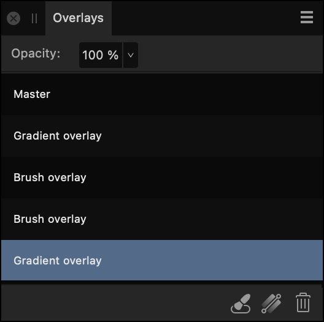

# Overlays panel (Develop Persona only)

The **Overlays** panel (in combination with the [Overlay tools](../32-tools/12-raw-tools-develop-persona/01-raw-tools.md)) allows you to apply standard adjustments to isolated areas of a raw image.

*The Overlays panel in Develop Persona.*

## About the Overlays panel

The Overlays panel allows you to add new blank overlays to your raw image as well as setting the adjustments which are applied to individual overlays.

### Options

The following options are available in the panel:

- **Opacity**—Adjusts the opacity of the applied adjustments within the masked area.
-  **Add Brush Overlay**—adds a new overlay set which can be modified using the **Overlay Paint** and **Overlay Erase** tools.
-  **Add Gradient Overlay**—adds a new overlay set which can be modified using the **Overlay Gradient Tool**.
-  **Delete Overlay**—removes the currently selected overlay set.

#### SEE ALSO:

- [Using overlays](02-using-overlays.md)
- [Developing a raw image](01-developing-raw-images.md)
- [Raw Tools](../32-tools/12-raw-tools-develop-persona/01-raw-tools.md)
- [Customizing the workspace](../31-workspace/04-customize/02-workspace.md)
