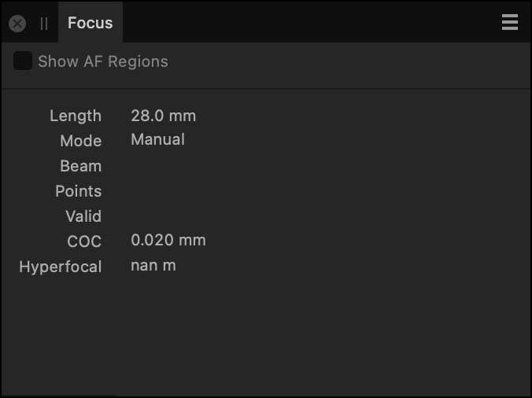

# Focus panel (Develop Persona only)

The **Focus** panel reports the camera settings at the point at which the image was captured. Reported settings include Mode, Beam, CoC and Hyperfocal.

*The Focus panel in Develop Persona.*

### Settings (or Preferences)

The following settings are available in the panel:

- **Show AF Regions**—when selected, areas of the image, which are within the auto focus region set by the camera, are highlighted. This is a feature for Canon cameras (CR2)

#### SEE ALSO:

- [Developing a raw image](01-developing-raw-images.md)
- [Metadata panel](../33-panels/17-metadata-panel.md)
- [Customizing the workspace](../31-workspace/04-customize/02-workspace.md)
