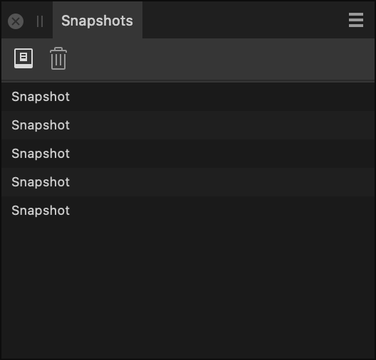

# Snapshots panel (Develop Persona)

The **Snapshots** panel lets you 'save' different raw image processing settings to compare their effects.

*The Snapshots panel showing snapshots of different raw image processing settings.*

> **Note:** In contrast, the **History** panel automatically logs every change that's made to your image processing settings, and lets you step back through them, one at a time, to the exact point that's required.

> **Note:** In the **Photo Persona**, the Snapshots panel lets you compare versions of your document from arbitrary points in time. Snapshots in the Photo Persona are saved as part of your document.

## About the Snapshots panel

In the Develop Persona, the Snapshots panel is visible by default in the right studio.

Snapshots are created manually at any time you choose.

You can quickly compare different processing settings by clicking snapshots on the panel.

After restoring a snapshot, you can make further changes to settings prior to developing your raw image.

> **Warning:** Snapshots in the **Develop Persona** are temporary. They are deleted when you leave the persona by clicking **Develop** or **Cancel**.

### Settings (or Preferences)

In the Develop Persona, the following options are available on the panel:

-  **Add Snapshot**—adds a snapshot of the current processing settings for your raw image.
-  **Delete Snapshot**—deletes the selected snapshot from the panel's snapshot list.

#### SEE ALSO:

- [Using snapshots](../30-design-aids/04-using-snapshots.md)
- [Developing a raw image](01-developing-raw-images.md)
- [Snapshots panel (Photo Persona)](../33-panels/22-snapshots-panel.md)
- [History panel](../33-panels/11-history-panel.md)
- [Customizing the workspace](../31-workspace/04-customize/02-workspace.md)
