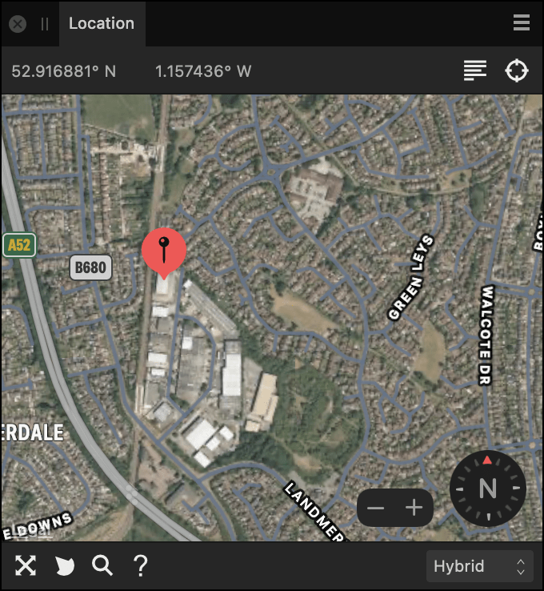

# Location panel (Develop Persona only)

**macOS:**

The **Location** panel allows you to review and set the GPS metadata of your raw image.

Raw images from cameras with built-in GPS capability will show the image location in the Location panel. For all other cameras, the image location can be set manually from the panel instead.

**Windows:**

The **Location** panel is only available in the Mac version of Affinity Photo 2.

**macOS:**

 The Location panel showing the location of Affinity's secret headquarters.   The current location's latitude and longitude are listed at the top-left of the panel.

Options The following options are available in the panel:  Click anywhere on the map to set the location of the pin. This information will then be integrated into your image's metadata  **Address**—search for a location using an address.  **Locate**—sets the pin to your current location (see note below).  **Scale guide**—displays the measurements used in the map.  **Compass**—provides the ability to rotate the map for convenient navigation.  **Zoom**—provides the ability to zoom in or out of the map.  **Points of Interest**—displays landmarks on the map. Map views—sets the type of map which displays in the panel. Select from the pop-up menu.   To use the **Locate** option, you must allow Maps.app to find your location. This can be managed in **System Settings (or System Preferences) > Security & Privacy > Privacy > Location Services**.

#### SEE ALSO:

- [Developing a raw image](01-developing-raw-images.md)
- [Customizing the workspace](../31-workspace/04-customize/02-workspace.md)
