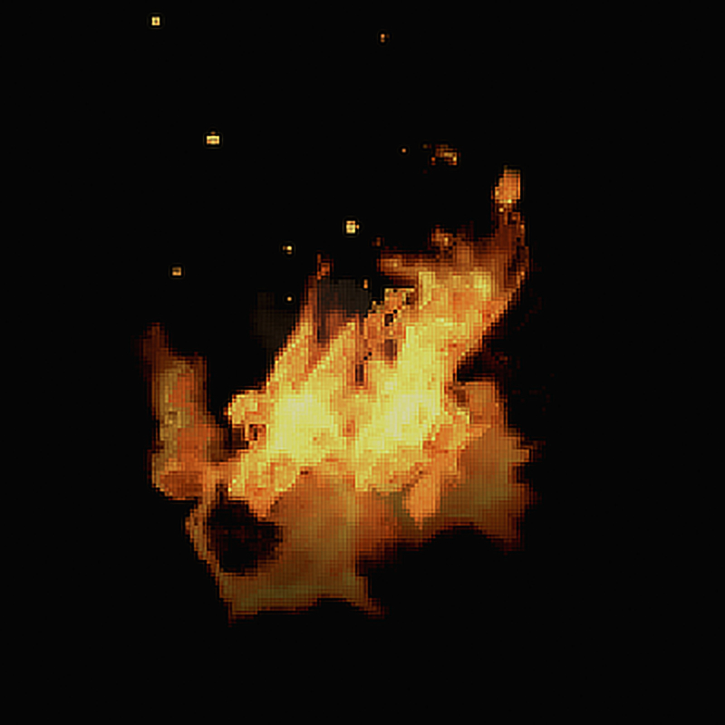

# Pixel Art resizing

The **Resize Pixel Art Document** option, found on the **Document** menu, allows you to upsample your document using one of two renowned pixel art resampling algorithms: XBR and HQX.

***Before**: Image upsampled 4x using Bicubic filter. Observe the jaggy edges and ringing. **After**: Image upsampled 4x using XBR filter. See how the edges are smoother and more refined.*

**To resize using pixel art filters:**

1. From the **Document** menu, select **Resize Pixel Art Document**.
2. Choose from either **HQX** or **XBR** as the resampling method, and pick a size multiplier from **2x**, **3x** or **4x**.

> **Tip:** If you are seeking very smooth results, it is recommended to try **XBR** as the resampling method. **HQX** produces sharper results but exhibits more jaggedness around fine edges.

#### SEE ALSO:

- [Changing image size](01-changing-image-size.md)
- [Changing canvas size](03-changing-canvas-size.md)
