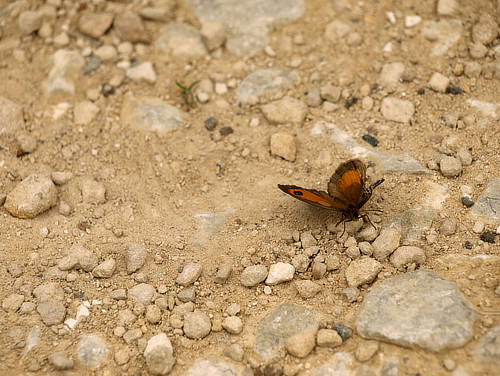
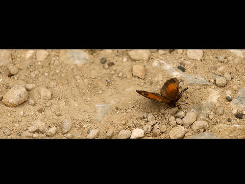

# Changing canvas size

In Affinity Photo 2 there are options to resize the canvas of opened images and newly created documents.

Changing the canvas size involves adding or taking away pixels from around the edge of your image, much like adding a border to a picture or cropping the image to a smaller size, respectively. Unaffected pixels are not stretched or squashed.

*Resizing the image canvas*

Unwanted canvas area can be removed (trimmed) from the document edge, and conversely, you can expand your canvas to fit layer content which extends over your document edge.

**To change canvas size:**

1. From the **Document** menu, select **Resize Canvas**.
2. Enter your new canvas dimensions in the **Size** boxes—left box for width, right box for height.
  - To resize the width and height independently, click the link icon (to unlink) between the **Size** boxes.
3. (Optional) Select a different measurement unit from the **Units** pop-up menu. Rulers will update to the new measurement unit.
4. In the **Anchor** box, select alignment options to resize the canvas 'under' the image from that anchor point.
5. Click **Resize**.

**To remove unwanted canvas areas:**

- From the **Document** menu, select **Clip Canvas**.

**To expand the canvas to fit layer content:**

- From the **Document** menu, select **Unclip Canvas**.

#### SEE ALSO:

- [Changing image size](01-changing-image-size.md)
- [Creating new documents](../03-get-started/03-create-new-documents.md)
