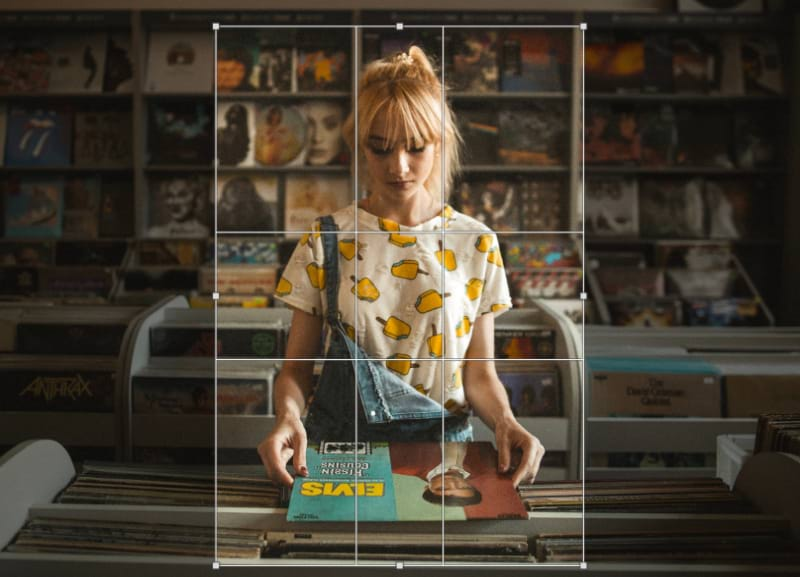
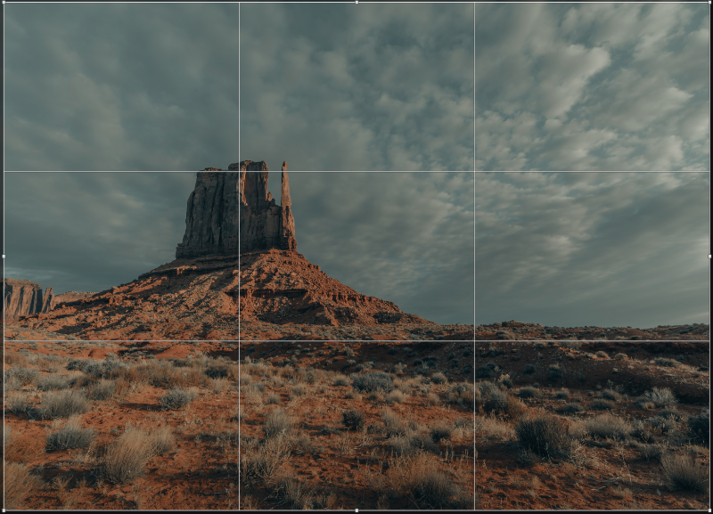

# Cropping and straightening

Cropping removes unwanted areas of your image for either practical reasons or better composition. Straightening simply means correcting a crooked image.

## About cropping

Use cropping for practical reasons or aesthetic reasons equally. For instance, an unwanted object or person can be excluded which might otherwise detract from your desired image. Aesthetically, you can balance image content in your composition so that it is more appealing to the eye.

Affinity Photo 2 lets you crop unconstrained or to original or custom aspect ratios. For print or web delivery, you can specify common print sizes (e.g., 6" x 4") or create pixel-accurate custom crop regions, respectively.

If [snapping](../30-design-aids/11-snapping.md) is active, the crop area can snap to page edges and [guides](../30-design-aids/05-ruler-and-column-guides.md) when being resized or moved.

Unconstrained (Portrait)

Unconstrained (Landscape)

Original Ratio

Custom Ratio (16x9)

Resample (6inx4in; 300 dpi)

> **Note:** The Crop Tool affects the entire canvas, which is typically the native dimensions of an opened image. When a crop is applied, the regions outside the drawn crop area will be hidden. However, cropping is non-destructive, which means you can uncrop your image at a later date.

### Crop modes

When cropping, you may wish to work unconstrained or to specific ratios or absolute dimensions. These are some of the options available:

- **Unconstrained**—The crop area can be sized freely.
- **Original Ratio**—Retains your image's original aspect ratio.
- **Custom Ratio**—Uses the adjacent input boxes to set the ratio—width in the left box, height in the right box. Can be saved as a preset.
- **Resample**—Use the adjacent **Width** and **Height** settings to set dimensions for the crop area at your chosen measurement **Units** and **DPI**. This is a great way to crop to a chosen print size (e.g., 10in x 8in) with print-ready resolution, e.g. a DPI of 300.

You can crop to absolute pixel dimensions by entering pixel width and height values adjacent to the **Mode** setting.

### Straighten images

When activated, dragging on the page will orient the photo to align it with the drawn line. We recommend using a reference within your photo such as the horizon or the edge of a building. When straightening or rotating an image, the crop box automatically adjusts to fit the new composition excluding any transparent areas.

*Before and after straightening an image.*

### Compositional overlays

If you're cropping to remove unwanted subject matter in your image, compositional overlays can be ignored. However, if you're looking for better composition, one of several overlays can be used. The examples below show a post-crop overlay applied to aid composition.

Thirds Grid

Golden Spiral

Diagonals

Phi Grid

- **Thirds Grid**—Shown by default, the Rule of Thirds grid's intersection lines can be positioned over an object of interest in your image.
- **Golden Spiral**—Size and position the grid so the inner origin of the spiral is centered over the subject of interest; this balances the composition naturally. Also known as Fibonacci Spiral or divine proportions.
- **Diagonals**—Position two objects of interest under the diagonal line intersections to balance the objects against each other.
- **Phi Grid**—Unlike the Rule of Thirds, this grid doesn't divide the frame into nine equal frames; instead, only the top and bottom segments are the same. Position the subject of interest within the center of the frame.

**To crop an image:**

1. From the **Tools** panel on the left, select the **Crop Tool**.
2. From the context toolbar, select a crop mode from the **Mode** pop-up menu.
3. Adjust the context toolbar settings.
4. Drag a corner, edge handle or anywhere on the edge to resize the grid to suit, then reposition the grid by dragging within it.
5. From the context toolbar, click **Apply** or press the `Return`  to commit the crop.

**To reset your crop:**

Do one of the following:

- Press the `Esc` key.
- On the context toolbar panel, click **Reset**.

**To crop an image to selection:**

1. From the **Tools** panel on the left, select any **Selection Tool**.
2. Draw out the selection to set the prospective crop area.
3. Select the **Crop Tool**.
4. (Optional) Adjust the context toolbar settings.
5. (Optional) Drag a corner or edge handle on the grid to resize the grid to suit, then reposition the grid by dragging within it.
6. From the context toolbar, click **Apply** or press the **Return** key to commit the crop.

> **Note:** Conveniently, your selection is remembered even if you switch between tools during cropping.

**To uncrop the cropped image:**

- From the **Document** menu, click **Unclip Canvas**.

**To straighten an image:**

1. From the **Tools** panel on the left, select the **Crop Tool**.
2. From the context toolbar, select **Straighten**.
3. Drag on the image to define the new alignment.
4. From the context toolbar, click **Apply**.

**To save crop settings as a preset:**

1. Adjust the context toolbar settings.
2. From the context toolbar, choose  **Presets**, click the  menu and select **Create Preset**.
3. Type a name for the crop preset and (optional) choose a category to put it in, then click **Create**.

**To delete a crop preset:**

1. From the context toolbar, choose  **Presets**.
2. Right click a preset and choose **Delete Preset**.

**To manage, import and export presets:**

- From the context toolbar, click  **Presets**. Click the  menu, then select **Manage Presets**.
  - To create a new preset category for custom presets, click **Create Category**. Type a category name then click **Create**.
  - To delete a preset, right click it and choose **Delete Preset**.
  - To restore the original presets if they have been altered or deleted, click **Restore Master Presets**.
  - To restore a single original preset to its default settings, right click the preset and choose **Revert user changes**.
  - To export a single preset, right click the preset and choose **Export preset**.
  - To export your custom presets to back them up, click **Export User Presets** and choose an export location and file name.
  - To import custom presets, click **Import Presets** and choose a valid **.aftoolpresets** file.
  - To filter presets based on type, click the **Filter** combo box and choose from the crop types available.

> **Note — Modifier keys:** The following modifier keys can be used:
>
> - Holding down `Shift` while cropping in the **Unconstrained** mode constrains the current aspect ratio.
> - The left and right arrow s can be used to nudge the area in single-pixel increments. Holding down `Shift` while pressing the left and right arrow s nudges the crop area in 10-pixel increments.
> - **macOS:** Holding down the `Cmd`  and dragging on the page (not using handles) toggles the crop area overlay and enters the **Straighten** mode. When pressed while cropping using one of the handles, the tool's bounding box allows to recompose the image around its center.
> - **Windows:** Holding down the `Ctrl` and dragging on the page (not one of the handles) toggles the crop area overlay and enters the **Straighten** mode. When pressed while cropping using one of the handles, the tool's bounding box allows to recompose the image around its center.
> - You can quickly toggle between overlay modes by pressing **O**.
>
> These modifiers can be used in combination.

#### SEE ALSO:

- [Crop Tool](../32-tools/01-photo-editing-tools/06-crop-tool.md)
- [Changing canvas size](03-changing-canvas-size.md)
- [Snapping](../30-design-aids/11-snapping.md)
- [Guides](../30-design-aids/05-ruler-and-column-guides.md)
