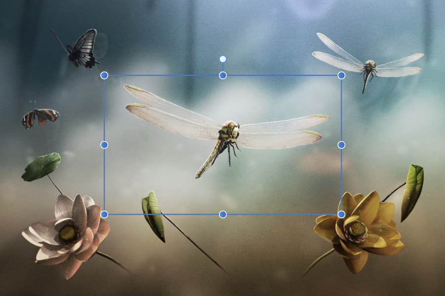
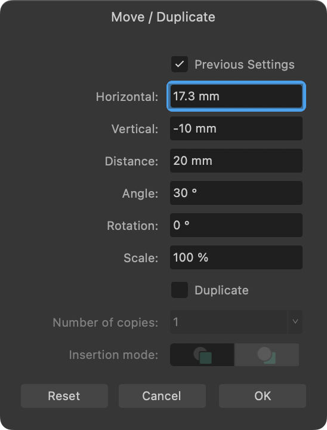

# Transforming

Layer content can be positioned, sized, rotated or sheared on the page either 'by eye' or with absolute precision. Flipping operations are also possible.

Transforming is a general term to describe the repositioning, sizing (scaling), rotation, shearing or flipping of objects. Several choices are available:

- "by eye": Using the **Move Tool** or by dragging control/rotation handles.
- Move data entry: For accurate repositioning, rotating, scaling and duplicating of layer content by dialog.
- **Transform** panel: For accurate repositioning, resizing, rotating and shearing objects via panel.

*Sizing an image proportionally around its center*

**To position layer contents accurately:**

1. Select one or more layers.
2. On the **Transform** panel, change **X** and/or **Y** values.

**To nudge layer content:**

1. Select layer content.
2. Do one of the following:
  - For nudging by a single unit of measurement: Press an arrow key.
  - For 10x the single unit of measurement: Press an arrow key with the `Shift`  pressed.

**macOS:**

> **Note:** You can change nudge distances via **Affinity Photo 2>Settings** (or **Preferences**) in the **Tools** category.

**Windows:**

> **Note:** You can change nudge distances via **Edit>Settings** (or **Preferences**) in the **Tools** category.

**To move, rotate or scale layer content accurately (by Move data entry):**

1. Select one or more layers.
2. Press the `Return`  to display a **Move / Duplicate** dialog.  
Enter new settings that will offset the object from its original position, with optional **Angle**, **Rotation** and **Scale** settings. **Distance** is the measurement between the original and moved object's centers.

  

The dialog also lets you [duplicate](../07-layer-operations/05-duplicating.md) the original layer content by a set number of copies.

Check **Previous Settings** if you want to retain and use the last used transformation values entered into the dialog; uncheck to transform with new values.

> **Tip:** The **Rotation** field will accept equations, so it's easy to set the correct rotation amount—simply enter the equation as, e.g. *360/6* if you were setting up six positions, then set the **Number of copies** to be *≥5* (as you already have one object).

**To size layer content with mathematical precision:**

1. Select one or more layers.
2. On the **Transform** panel, change **W** and/or **H** values.

> **Note:** You can scale layer content from a custom transform origin (rather than an anchor point) that has been placed prior to transforming.

**To size layers to same:**

1. Select multiple layers, ensuring the layer to be sized to is selected *first*. To do this, use `Shift`-click to target it first or a marquee selection that encompasses it first.
2.   On the Toolbar, click **Alignment**, then set the **Make Same** option, choosing to size to **Width** or **Height**.
3. (Optional) Check **Maintain Aspect Ratio** to ensure the layers will resize using their original proportions.
4. Click **Apply**.

**To size layers to a targeted key object:**

1. Select multiple layers.
2. With the `Alt`  pressed, click the target key object (i.e., a layer). The selected key object will possess a strong outline.
3.   On the Toolbar, click **Alignment**, then set the **Make Same** option, choosing to size to **Width** or **Height**.

**To size layer content interactively on the canvas:**

1. Select one or more layers.
2. Drag a corner or edge control handle on the selection's bounding box. The opposite handle is used as the anchor point.

The following effects can be applied individually or in combination when sizing content:

| Action | Key |
| --- | --- |
| Resize proportionally | `Shift` |
| Anchor operation to center | `Cmd` |

**To transform selected objects separately:**

1. Select multiple objects.
2. With the **Move Tool** selected, select **Transform Objects Separately** from the context toolbar.
3. Apply a sizing, [rotation or shearing](../07-layer-operations/03-rotating-and-shearing.md) transformation. Each selected object is transformed relative to its individual attributes, not those of the selection as a whole.

**To size selected objects separately to absolute sizes**

1. Select multiple objects.
2. Ensure **Transform Objects Separately** is selected from the context toolbar.
3. On the **Transform** panel, resize by entering an absolute value into the **W** or **H** input boxes. For example enter *=100px* into the **W** box to make all objects 100px wide.

This absolute sizing is in contrast to scaling other objects in your selection proportionately to a targeted key object resized to, e.g. 100px. Note the importance of the "=" symbol to signify an expression being used.

## Scale override

When an object is resized, the stroke width, layer effect radii, corner radii and text frame contents can be forced to scale by using the **Transform** panel. If **Scale with object** settings are unchecked on the object itself (stroke, layer effect, etc.) then they will be ignored.

> **Tip:** For best results, use Scale override when resizing and maintaining the object's aspect ratio.

**To override scaling on objects:**

1. Select an object.
2. On the **Transform** panel, enable **Scale Override**.
3. Resize via the object's handles with the `Shift`  pressed.

**To override scaling on objects selectively:**

1. Select an object.
2. On the **Transform** panel, click the **Scale Override** down arrow to check/uncheck the following settings:
  - **Line weights**—useful when working on vector objects with a stroke. For example, you can either force or prevent scaling while resizing with the setting set to **Scale with object** or **Locked**, respectively.
  - **Shape corners**—to control the scaling of a shape's corners while resizing, you can either force (**Scale with object**) or prevent (**Locked** setting).
  - **Layer effect radii**—to control the scaling of the radius of a layer effect added to an object.
  - **Text frame contents**—to control the scaling of frame text while resizing; when set to **Locked** the container will scale while keeping text the same size. When set to **Scale with object** however, text will enlarge when resizing the container by its corner handles.
3. Ensure the **Scale Override** button is enabled.
4. Resize via the object's handles with the `Shift`  pressed.

#### SEE ALSO:

- [Rotating and shearing](../07-layer-operations/03-rotating-and-shearing.md)
- [Flipping](../07-layer-operations/04-flipping.md)
- [Duplicating](../07-layer-operations/05-duplicating.md)
- [Transform panel](../33-panels/30-transform-panel.md)
- [Expressions for field input](../38-expressions-for-field-input/01-expressions-for-field-input.md)
