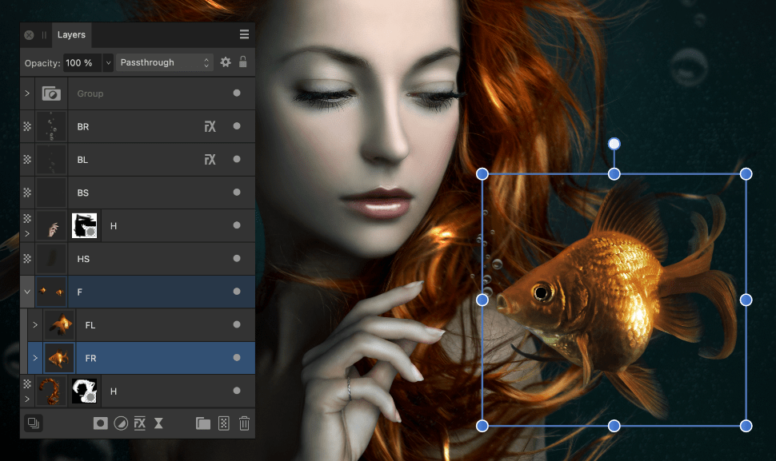
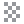
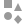
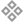

# About layers

Layers allow you to edit and design using a non-destructive methodology. This gives you maximum flexibility for your photographic projects.

## What are layers?

You can think of layers as being like sheets of paper that are stacked one on top of the other. Transparent areas of a layer reveal the layer below, while opaque parts of a layer obscure the layers below.

All layer management is carried out from the Layers panel.

Here are some important points regarding layers:

- Once editing and designing has begun, all documents will have at least one layer.
- The order of your layers is important. A layer at the *top* of the panel is at the *front* of your document view, with the lowest layer in the background.
- Any selected layer(s) are highlighted, so that you can always see what layer you are working on.
- Any layer can be hidden, to exclude its content from displaying in your project.

## Layer types

There are several types of layers that can be created; these are identified in the Layers panel with a unique icon, shown at the beginning of the layer entry.

| Panel icon | Description |
| --- | --- |
|  | Vector—used for placing vector objects into. |
|  | [Pixel](02-creating-layers.md)—used for pixel-based editing. |
|  | Shape—for geometric shapes created with shape tools. |
|  | Curve—for open curves and closed shapes drawn with Pen Tool or Pencil Tool. |
|  | Artistic Text—for scalable text. |
|  | Frame Text—for story text contained within a frame. |
|  | Path Text—for text that follows an open curve or a shape's outline. |
|  | Shape Text—for text contained within a shape. |
|  | Empty group—an empty group container for containing multiple layers as a single entity. |
|  | [Mask](12-layer-masks.md)—defines what content is hidden to reveal layers beneath. |
|  | [Compound mask](12-layer-masks.md)—combine multiple masks using Boolean operations. |
|  | [Image](11-image-layers.md)—self-contained placed images that retain the original image data including the color profile. |
|  | Linked/Embedded document—placed non-native documents (such as PDF, PSD, SVG, EPS) and native Affinity documents (afphoto, afdesign and afpub) files. |
|  | [Adjustment](07-adjustment-layers.md)—used to correct or enhance a specific object, group, layer or the whole layer stack non-destructively. |
|  | [Live filter](08-using-live-filters.md)—used to apply creative photo effects non-destructively. |
|  | [Fill layer](09-fill-layers.md)—used to apply an adjustable solid or gradient color. |
|  | [Pattern layer](10-pattern-layers.md)—applies a pattern that is repeated across the entire document. |

> **Note:** Vector layers are automatically created whenever you:
>
> - [Draw lines and shapes using the Pen Tool](../25-lines-and-shapes/02-draw-lines-and-shapes.md)
> - [Use any geometric shapes](../25-lines-and-shapes/06-about-geometric-shapes.md)
> - [Add Artistic](../26-text/03-artistic-text.md) or [Frame text](../26-text/04-frame-text.md)
> - [Perform a non-destructive boolean operation (compound layers)](../25-lines-and-shapes/11-joining-shapes.md)

#### SEE ALSO:

- [Create layers](02-creating-layers.md)
- [Image layers](11-image-layers.md)
- [Layer effects](../24-layer-effects/01-using-layer-effects.md)
- [Layers panel](../33-panels/13-layers-panel.md)
- [Using snapshots](../30-design-aids/04-using-snapshots.md)
