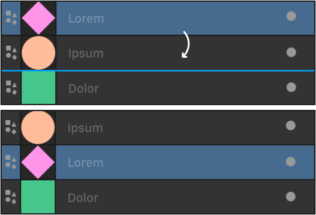
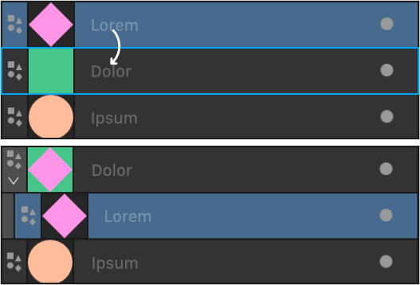
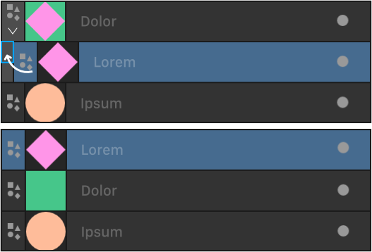
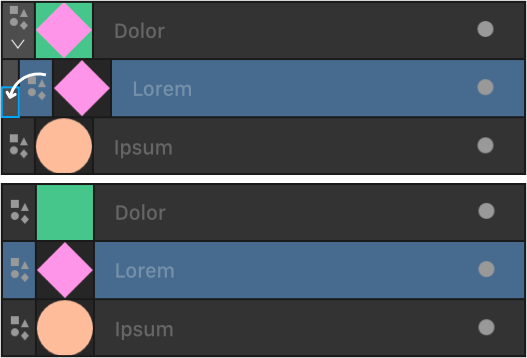
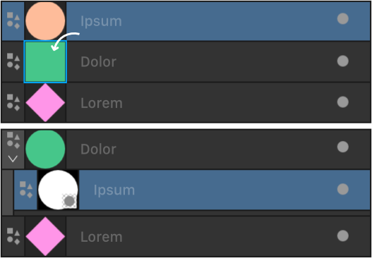

# Layer drop zones

Layer drop zones indicate suggested positions in your layer stack that a currently moved layer can be dropped.

## About layer drop zones

Layers in your Layers panel can be a simple arrangement of only a few layers stacked together in front to back order (from the top to the bottom of stack). Any layers can be reordered in relation to other layers by moving them up or down. However, for layer operations such as clipping or masking, it's useful to understand the type of drop zones possible and where these appear in the Layers panel.

Clipping involves placing one layer inside another so the clipped layer is contained within the outline of the clipping layer. This creates a parent - child layer relationship, i.e. two 'level' layer arrangement. For more complex designs, you can also have child layers within parent layers to create a multi-level layer arrangement. In Affinity, as well as reordering layers up and down the layer stack by dragging, you can also move layers up and down these levels to rearrange the layer structure by dragging too.

| Action | How to | Visual |
| --- | --- | --- |
| Change order | by dragging to a position between two layers. |  |
| Clipping (making a child layer) | by dragging onto another layer's name. |  |
| Return above parent | by dragging a clipped layer to above its Parent Bar.   You can drag to a Grandparent Bar, Great Grandparent Bar, etc. |  |
| Return below parent | by dragging a clipped layer to below its Parent Bar.   You can drag to a Grandparent Bar, Great Grandparent Bar, etc. |  |
| Mask | by dragging the masking layer onto the target layer's thumbnail |  |

#### SEE ALSO:

- [About layers](01-about-layers.md)
- [Ordering](../07-layer-operations/14-ordering.md)
- [Layer clipping](../07-layer-operations/07-layer-clipping.md)
- [Layer masks](12-layer-masks.md)
