# Layer blending

A layer's blend mode determines how the layer or object's pixels blend with the pixels on the layer beneath.

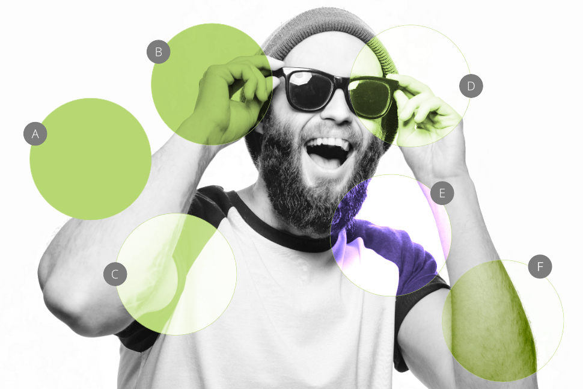
*Common blend modes: (A) Normal, (B) Multiply, (C) Screen, (D) Overlay, (E) Divide (F) Color Burn.*

## Blend mode types

Affinity apps support an impressive selection of different blend modes. They are organized in their respective groups, which initially inform of the effect they add. They are as follows:

**Normal**

The default and starting mode for layers. It results in fully opaque pixels appearing above the underlying pixels. Use to completely cover the underlying layer's content.

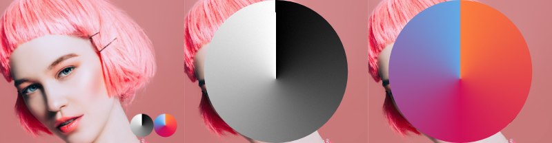

**DARKEN GROUP**

Darken Compares pixels of the active vs the underlying layer(s) and leaves darker pixels visible. Use to create dramatic, moody atmosphere.  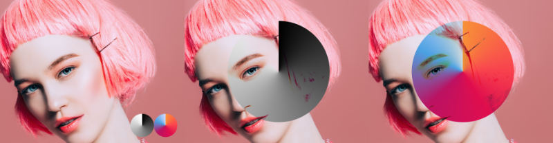

Multiply One of the most frequently used blend modes in the group. Each pixel of the active layer is multiplied with the pixels of the layer(s) below. Bright pixels are ignored while darker ones are intensified. This results in a darker overall output when compared to the Darken blend mode. Use to create darker outputs with increased contrast.  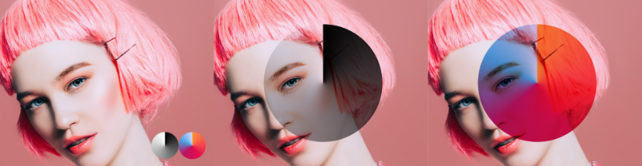

Color Burn Results in more saturated mid-tones and reduced highlights by intensifying contrast and the underlying layer's colors. Use to exaggerate colors and create highly contrasting scenes.  Color Burn isn't available in LAB16 mode.   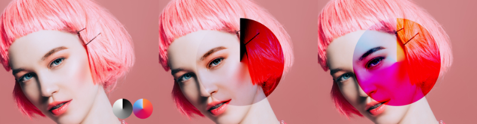

Linear Burn Results in darker output than with Multiply blend mode, yet less saturated than Color Burn. Lighter pixels of the active layer(s) are unaffected. This mode is ideal for rendering darker tones in the shadows and mid-tones.  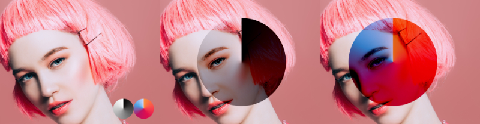

Darken Color Compares the color values of the active and underlying layer(s) and only retains the darker ones. Use to accentuate the darker tones from both layers.  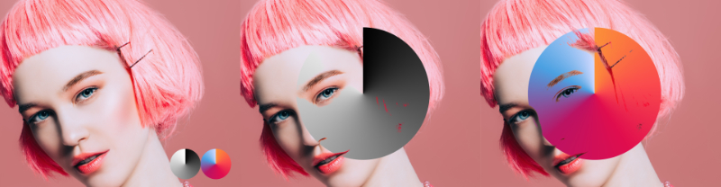

**LIGHTEN GROUP**

> **Note:** The Lighten group blend modes are preferred for blending images with a dark background where the intended outcome is to reduce or remove it completely.

Lighten Results in only the brighter values being retained upon comparing the active and underlying layer(s). Use to add complimentary color tint to images.  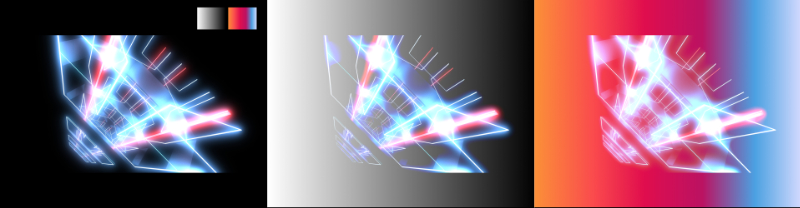

Screen Inverts colors of the underlaying layer(s) and multiplies it with those of the active layer: this results in generating smooth results. It is one of the most commonly used blend modes due to its soft rendering.  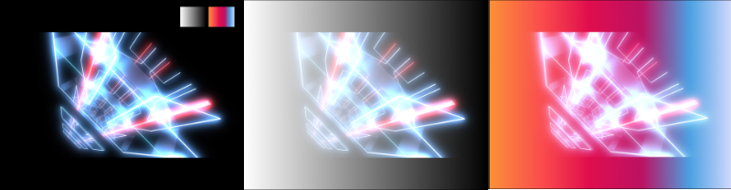

Color Dodge Increases the luminosity of the underlying layer(s) while reducing contrast between both the active and underlying layer(s). It results in a stronger effect than the one produced by Screen with saturated mid-tones and intense highlights. Use to accentuate color and highlights.  Color Dodge isn't available in LAB16 mode.   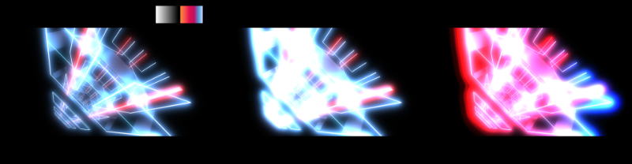

Add Results in added color information to both the active and underlying layer(s) and increases overall brightness while not affecting the black tones. Use to reveal brighter tones in images.  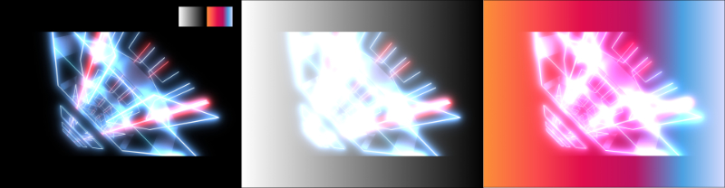

Lighter Color Rather than looking at individual color, this mode uses perceived luminosity from all color channels to determine which pixel is lighter. It acts as an inverted luminosity mask. Use for faded looks and smooth rendition of highlights in outputs.  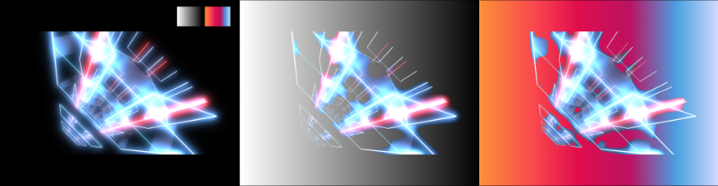

**CONTRAST GROUP**

Overlay Compares the active and underlying layer(s) and shifts to darker mid-tones if the colors are lighter than 50% gray. Results in darkening the darker pixels of the images and lightening the lighter ones. Use to enhance contrast and saturation.  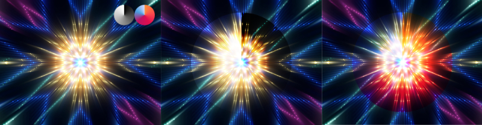

Soft Light Results in a more diffused effect from comparing luminance and color values between the active and underlying layer(s). Use for subtle blending and faded looks.  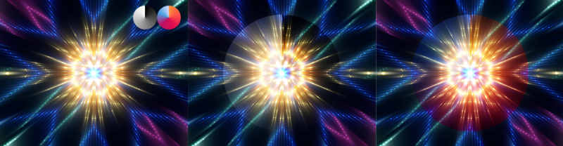

Hard Light Results in a dramatic, high-contrast effect. The top layer is used to determine the calculation required for the evaluation of pixels. Its effect can be observed as the opposite of the Overlay blend mode. Use to enhance color contrast and reduce opacity, as required, to achieve best results.  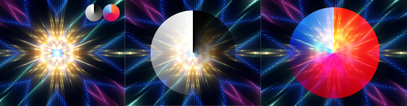

Vivid Light This blend mode applies the effect of the Color Burn or Color Dodge blend mode based on the comparison of RBG channels in the active (top) layer and underlying layer(s). Color Dodge is applied when the top layer image's values are lighter than mid-gray; Color Burn is applied when the top layer image's values are darker than mid-gray. Mid-gray serves as a neutral color, so any pixels with a gray value of 50% are not affected. Results in increased contrast and highly saturated colors. Use to enhance contrast and color intensity, though best results are achieved with reduced opacity.  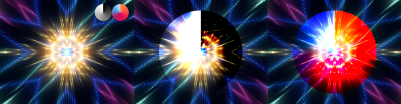

Linear Light Brighter pixels receive lighter treatment while darker ones get darkened. Results in a stronger contrast in the mid-tones.  Use to create a dramatic, enhanced effect.  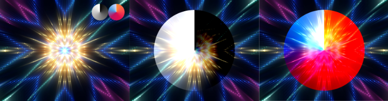

Pin Light Results can be compared to a mix of those achieved with the Darken and Lighten blend modes. This blend mode creates distinct boundaries between the dark and light regions. Use to achieve pronounced, yet somewhat faded look.  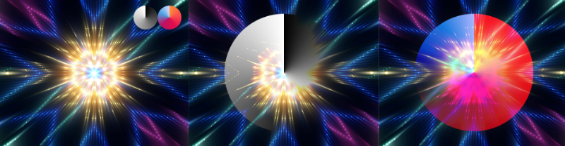

Hard Mix Results in a highly-contrasting effect between pixels (modified by either 0 or 1). The effects can be attributed to the output often observed in comic books or posters where the increase in contrast accentuates colors. Use to posterize or to maximize color contrast.  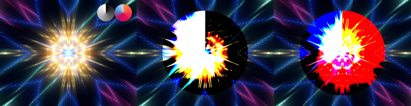

**INVERSION GROUP**

Difference Calculates the absolute difference between the active and underlying layer(s). When using this blend mode, similar values cancel each other out. Use to find errors in images.  Difference isn't available in LAB16 mode.   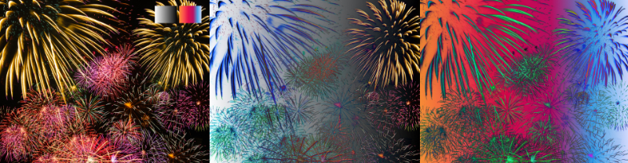

Exclusion Results in similar output to the above (Difference) mode, however with a softer effect. Use for soft blending of images consisting of similar luminance values.  Exclusion isn't available in LAB16 mode.   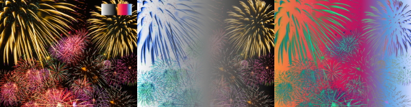

Subtract Subtracts the top layer's pixel values from the underlying layer, which results in lighter areas becoming brighter whereas the darker areas seeing little to no change. Use to remove or fade the active layer's colors and/or luminosity.  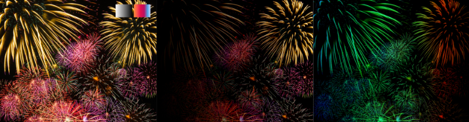

Divide The underlying layers' pixel values are divided by those of the active layer, which usually results in brighter images. The effect of this blend mode is the opposite of the Subtract mode; darker color values create brighter results while brighter color values see little to no change. Use to simulate film negative look.  Divide isn't available in LAB16 mode.   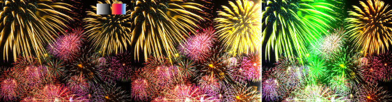

**COMPONENT GROUP**

Hue Combines the hue of the active layer and replaces that of the underlying layer(s). Use to exaggerate or create intense colors and to produce vivid, often surreal scenes.  Hue isn't available in Grayscale mode.   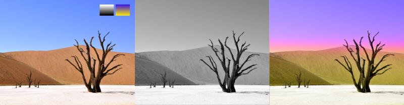

Saturation Similar to the Hue blend mode, however here Saturation is the replaced component. Depending on your images' saturation and colors, use this blend mode, as an alternative to the above, and to intensify and exaggerate colors.  Saturation isn't available in Grayscale mode.   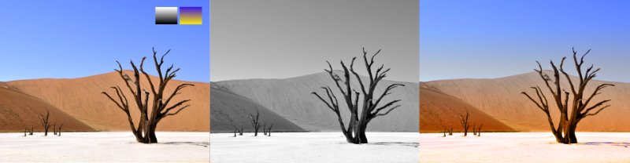

Color Combines the hue and saturation values of the active layer with the brightness of the underlying layer(s). Additionally, only the brightest colors of the underlying layer(s) are retained. Use to stylize images to produce scenes with intensified hue and saturation levels.  Color isn't available in Grayscale mode.   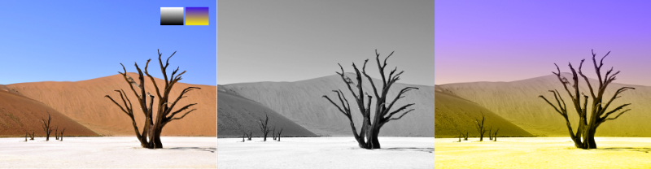

Luminosity Combines the brightness values of the active layer with the brightness of the underlying layer(s). This blend mode's effect is the opposite of the Color blend mode — it retains the hue and saturation of the underlying layer(s). Use to add detail and textures where color information of the added image layer is less important.  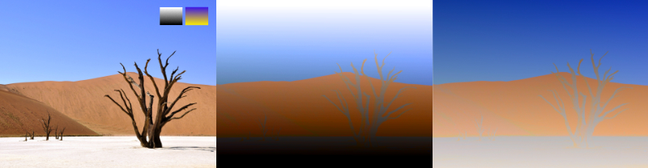

**AFFINITY GROUP**

Average Combines the color and luminance values of the active and underlying layer(s) in producing a mean average. The result is similar to the one achieved by setting the active layer's Opacity to 50%. Use to simulate simple double-exposure images.  Average isn't available in LAB16 mode.   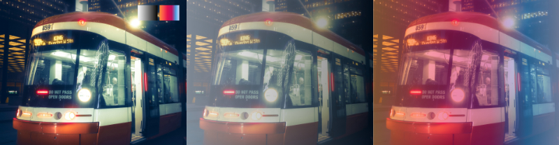

Negation Similar in effect to the Difference blend mode (Inversion group), which may be used as its alternative. Use to produce more contrasting and intense scenes; particularly powerful when working with selections and masking.  Negation isn't available in LAB16 mode.   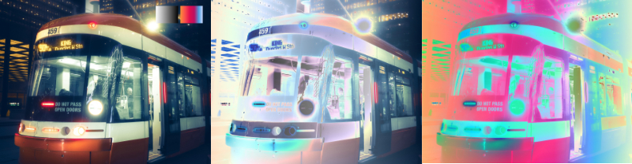

Reflect Combines the effects of the Hard Light and Hard Mix blend modes (Contrast group) and produces images with preserved darker tones while enhancing the lighter ones. Use as an alternative to control image contrast; the method is particularly useful when combined with manipulating the source layer's graph to reduce highlights output via the Blend Ranges option.  Reflect isn't available in LAB16 mode.   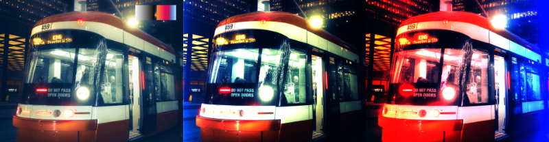

Glow The opposite of the Reflect blend mode, which produces images with preserved lighter tones (while enhancing the darker ones). As above, use to manipulate contrast and combine it with the Blend Ranges to obtain best outcomes.  Glow isn't available in LAB16 mode.   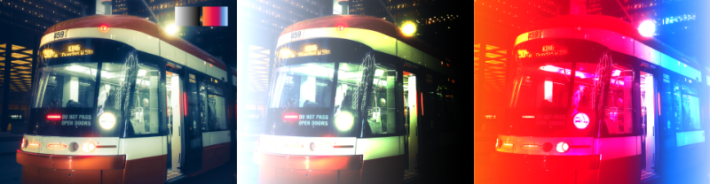

Contrast Negate Inverts pixel values depending on those of the underlying layer's content versus the active layer. Use to create effects similar to those of a two-tone color grade and posterization.  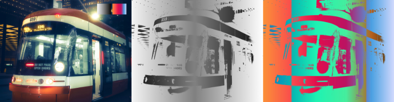

Erase Excludes pixels of the underlying layer. Use in combination with layer Opacity to produce faded and transparent outputs or to hide pixels from the layer(s) below the active one.  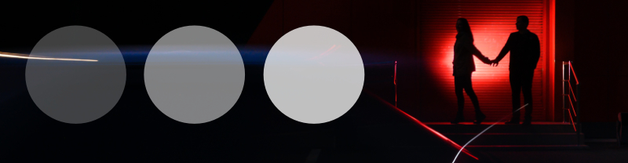 Erase blend mode set to shapes (from left) at 25%, 50% and 75% Opacity over the base image.

> **Note:** Any layer or object can have a blend mode assigned, including mask and adjustment layers. The default blend mode is 'Normal'—no special compositing is applied. For a group, the default is 'Passthrough'. When set, the group itself has no special blend properties of its own, and passes on the blend mode of its parent layer.

> **Note:** Layer blend modes applied to child layers produce isolated blending which will not affect the parent layer or any other layers in the layer stack.

> **Note:** The same blend modes can be utilized on layer effects and pixel brushes.

## 'Special 8' blend modes and fill opacity

 When adjusting blend opacity, some blend modes (listed below) work best by adjusting **Fill Opacity**, rather than the layer's **Opacity**. The Fill Opacity option is available from the **Layers** panel’s **Blend Options** option. Fill opacity is essential when using Hard Mix blending in particular.

- Color Burn
- Linear Burn
- Color Dodge
- Add (Linear Dodge)
- Vivid Light
- Linear Light
- Hard Mix
- Difference

**To change the blend mode of a layer (or object):**

1. In the **Layers** panel, select a layer (or object).
2. Choose a blend mode from the pop-up menu on the panel.

#### SEE ALSO:

- [Layer blend ranges](06-layer-blend-ranges.md)
- [Layer effects](../24-layer-effects/01-using-layer-effects.md)
- [Painting brush strokes](../23-painting-and-erasing/01-painting-brush-strokes.md)
