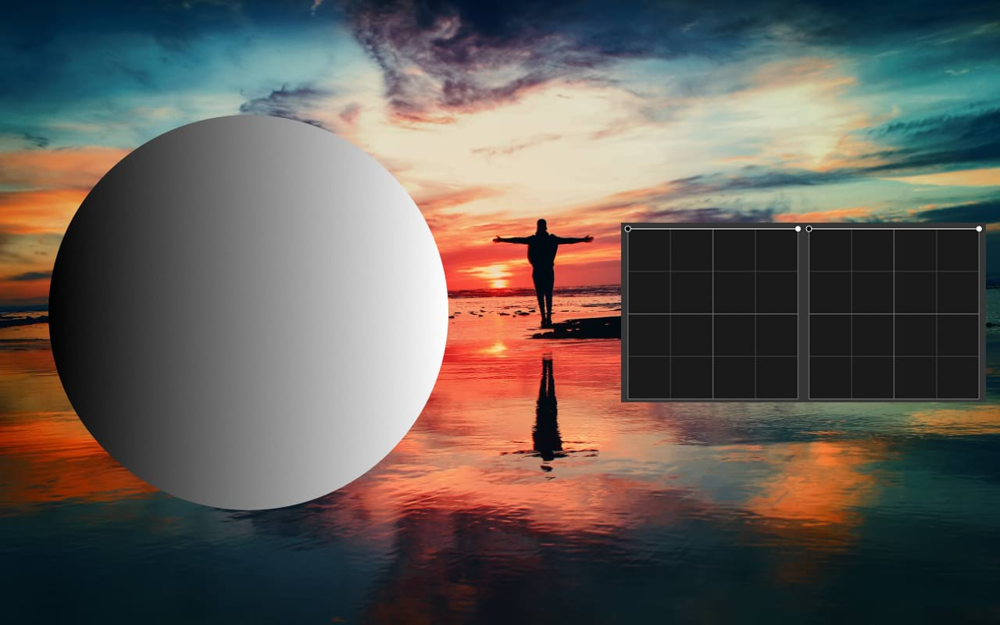
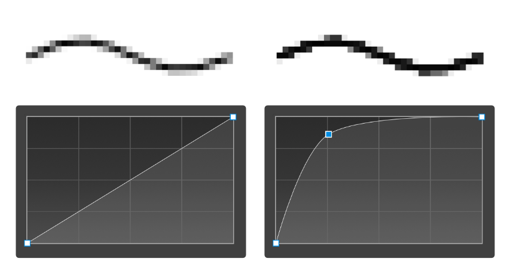

# Layer blend ranges

Blending ranges let you blend layers in a project tonally. This is done by controlling the opacity across the tonal range of the currently selected layer and/or the composite layer(s) beneath that layer.

## About blend ranges

Blend ranges allow you to specify how tonal values of a layer blend with the layer(s) below. You can set the range of the tonal values affected and can set the range to have any level of opacity (from opaque to transparent).

The blend range of the selected layer and the underlying layer(s) is controlled in the **Blend Options** dialog.

You can change the blend range for individual color channels within the dialog.

A: Blend Ranges

B: Source: Darks

C: Source: Highlights

D: Underlying: Darks

E: Underlying: Highlights

*For the tabbed images above:*

- **A: Blend Ranges**; *no blending applied on a gradient fill shape. The image layer resides below the gradient fill shape layer. The latter is selected.*
- **B: Source: Darks**; *the darker values of the shape layer blending with the image layer; by pulling the left side of the Source Layer Ranges graph down, the dark tones of the gradient fill shape are being hidden.*
- **C: Source: Highlights**; *the lighter values of the shape layer blending with the image layer; by pulling the right side of the Source Layer Ranges graph down, the light tones of the gradient fill shape are being hidden.*
- **D: Underlying: Darks**; *the darker values of the image coming through the shape layer; by pulling the left side of the Underlying Composition Ranges graph down, the dark tones of the image layer are showing through.*
- **E: Underlying: Highlights**; *the lighter values of the image coming through; by pulling the right side of the Underlying Composition Ranges graph down, the light tones of the image layer are showing through.*

### About Blend Ranges graphs

The two graphs present on the Blend Ranges are **Source Layer Ranges** and **Underlying Composition Ranges**. The first controls how the current layer worked on blends tonally with the layers beneath it, whereas the second determines how the underlying layers blend through the current one.

> **Note:** Each graph includes two nodes. The left-hand one represents minimum intensity, whereas the right-hand node represents maximum intensity.

For each of the two graphs, the dark values are represented on the left, whereas the bright ones are on the right. By modifying the graphs, you're affecting how those tones (including those in the middle) blend.

> **Tip:** You can change the blend range for individual color channels by changing the setting above the spline graphs.

### About Blend Gamma (RGB documents only)

Modifying **Gamma** offers full power over how the tones of semi-transparent or antialiased edged objects interact with the mid-range of gray tones underneath. Using Gamma via [Levels](../10-adjustments/02-tonal-adjustments/04-adjustment-levels.md), for example, is a great alternative to controlling the image's overall exposure, high dynamic range and color balance.

**Blend Gamma** options (on the Blend Ranges dialog) open up even more control over how the midtones are affected by an applied adjustment and how it blends with your image. The dialog also gives you the option of using a linear-RGB color space (1.0), regular sRGB-blending (2.2) or any gamma value up to 3.0, depending on your desired output.

*Blend Gamma adjustments targeting midtones via Levels: high dynamic range and color balance corrections via individual channels before (left) and after (right), respectively.*

> **Note:** By default, text layers are set to a gamma of 1.45 and all other types of layer to 2.2 (regular sRGB-blending). The former's default setting can be changed in Settings (Tools option).

### Antialiasing

Antialiasing is the reduction of the appearance of jagged line edges. It is achieved by the addition of semi-transparent pixels along the line to smooth the transition from the line's edge to background objects. This area of transition is sometimes referred to as the antialiasing ramp or antialiasing coverage.

In the dialog, you can adjust the antialiasing ramp (coverage) of the selected layer, as well as control how (and if) antialiasing is inherited or set independently of other layers. For improved workflow, child layers nested hierarchically in a parent layer can inherent the parent layer's antialiasing setting automatically but can be forced to apply antialiasing or ignore it.

*Antialiased line with linear coverage map (left) and custom coverage map (right), respectively. [Viewed](../03-get-started/07-viewing.md) at 800% zoom.*

### Settings (or Preferences)

The following settings are available in the Blend Options dialog:

- **Blend Gamma**—controls the layer's blend gamma.
- **Antialiasing**—controls antialiasing behavior for the selected layer: **Inherit** (default) adopts antialiasing from any parent layer, while **Force On** and **Force Off** respectively applies or disables antialiasing independently of any other layers.
- **Coverage Map**—controls the layer's antialiasing ramp and how strong the edges of the blended objects will become.
- **Fill Opacity**—alters the opacity of the layer without affecting blending. Use for layers with one of the 'special 8' blend modes applied, especially Hard Mix.
- **Channels**—controls which channel is affected when adjusting the blend range. Select from the pop-up menu.

The following settings can be adjusted for both the **Source Layer Ranges** and the **Underlying Composition Ranges**:

- **Graph**—controls the affected range of pixels and the opacity of pixels within the specified range.
- **In**—sets the horizontal position of the selected node. Type directly in the text box or drag the pop-up slider to set the value.
- **Out**—sets the vertical position of the selected node. Type directly in the text box or drag the pop-up slider to set the value.
- **Linear**—when selected (default), the graduation between two nodes is linear (i.e., nodes on the graph are connected using straight lines). If this option is off, nodes are connected using smooth curves.
- **Reset**—returns the graph to the default position (a straight line between two nodes positioned at the top of the grid).

> **Note:** When adjusting the graphs in the dialog it is worth noting the following:
>
> - The graphs represent tonal values from darkest on the left to lightest on the right.
> - Pixels on the selected layer become less visible as nodes on the **Source Layer Ranges** graph are moved downwards.
> - Pixels on the underlying layer(s) become more visible as nodes on the **Underlying Composition Ranges** graph are moved downwards.

**To change blend ranges, blend gamma and antialiasing ramp:**

1. On the **Layers** panel, select a layer and then click **Blend Options**.
2. Adjust the settings in the dialog.
3. Close the dialog.

**To adjust a graph directly:**

Do any of the following:

- Drag a node horizontally to affect more or less pixels.
- Drag a node vertically to affect the visibility of pixels at the tonal value selected.
- Click on the curve to add additional nodes.
- Click to select a node and then press the `Backspace`  to remove it.

**To modify the antialiasing ramp:**

1. Click the **Coverage Map** thumbnail.
2. From the displayed chart, select a node on the profile's line and drag it vertically or horizontally to a new position.
3. Repeat for other nodes as needed.

> **Note:** For more complex profiles, click on the profile line to add a node which can be positioned as for any generated node.

> **Tip:** To remove antialiasing, set a straight, horizontal profile line at the top of the chart.

**To reset antialiasing ramp to linear:**

1. Click the **Coverage Map** thumbnail.
2. From the displayed chart's pop-up dialog, click **Reset**.

**To save a coverage map profile:**

- Under the chart, click **Save Profile**. The profile shows under the chart.

**To apply a custom coverage map profile:**

1. Click the **Coverage Map** thumbnail.
2. Select a custom profile thumbnail from below the chart. The chart will update, showing the chosen profile.

#### SEE ALSO:

- [Layer blending](05-layer-blending.md)
