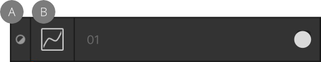
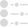
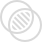
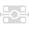

# Using adjustment layers

Adjustment layers allow you to make non-destructive corrections and enhancements to your photo project (or individual layers).

*Before and after a Recolor adjustment layer was applied.*

## About adjustment layers

The **Adjustment** and **Layers** panels provide a range of adjustments you can apply to your photo or design. Once applied, they can be identified as both an adjustment and a specific adjustment type by using unique symbols.

*Curves adjustment layer indicating it is an adjustment (A) and a Curves adjustment type (B).*

**Available adjustments:**

- [Black & White](../10-adjustments/03-color-adjustments/02-adjustment-blackandwhite.md)
- [Brightness / Contrast](../10-adjustments/02-tonal-adjustments/01-adjustment-brightnesscontrast.md)
- [Channel Mixer](../10-adjustments/03-color-adjustments/03-adjustment-channelmixer.md)
- [Color Balance](../10-adjustments/03-color-adjustments/04-adjustment-clrbalance.md)
- [Curves](../10-adjustments/02-tonal-adjustments/02-adjustment-curves.md)
- [Exposure](../10-adjustments/02-tonal-adjustments/03-adjustment-exposure.md)
- [Gradient Map](../10-adjustments/03-color-adjustments/05-adjustment-gradientmap.md)
- [HSL](../10-adjustments/03-color-adjustments/01-adjustment-hsl.md)
- [Invert](../10-adjustments/04-other-adjustments/02-adjustment-invert.md)
- [Lens Filter](../10-adjustments/03-color-adjustments/06-adjustment-lensfilter.md)
- [Levels](../10-adjustments/02-tonal-adjustments/04-adjustment-levels.md)
- [LUT](../10-adjustments/04-other-adjustments/01-adjustment-3dlut.md)
- [Normals](../10-adjustments/04-other-adjustments/03-adjustment-normals.md)
- [OCIO (OpenColorIO)](../10-adjustments/03-color-adjustments/07-adjustment-ocio.md)
- [Posterize](../10-adjustments/04-other-adjustments/04-adjustment-posterize.md)
- [Recolor](../10-adjustments/03-color-adjustments/08-adjustment-reclr.md)
- [Selective Color](../10-adjustments/03-color-adjustments/09-adjustment-selectiveclr.md)
- [Shadows / Highlights](../10-adjustments/02-tonal-adjustments/05-adjustment-shadowshighlights.md)
- [Soft Proof](../10-adjustments/04-other-adjustments/05-adjustment-softproof.md)
- [Split Toning](../10-adjustments/03-color-adjustments/10-adjustment-splittoning.md)
- [Threshold](../10-adjustments/03-color-adjustments/11-adjustment-threshold.md)
- [Vibrance](../10-adjustments/03-color-adjustments/12-adjustment-vibrance.md)
- [White Balance](../10-adjustments/03-color-adjustments/13-adjustment-whitebalance.md)

Once selected, an adjustment layer is added to the **Layers** panel.

There may be times that you only want to apply an adjustment layer to either a single layer or a group of layers. This is easily achieved by [clipping](../07-layer-operations/07-layer-clipping.md).

Adjustment layers also have mask layer properties. Areas of an adjustment layer can be revealed or hidden in the same way as with a [mask layer](12-layer-masks.md).

> **Note:** If you have a [pixel selection](../08-selections/01-creating-pixel-selections/01-overview.md) in place when you add an adjustment layer, the area selected is automatically masked.

**To apply an adjustment from the Layers panel:**

1. On the **Layers** panel, select a layer.
2. Click **Adjustments** and select an adjustment from the pop-up menu.
3. If a dialog appears for the adjustment, follow the steps below:
  1. Adjust the settings in the dialog.
  2. Close the dialog to apply.

The adjustment is added directly above the selected layer.

**To modify, merge or delete an adjustment layer:**

1. On the **Layers** panel, double-click the adjustment layer that you want to modify.
2. Adjust the settings in the dialog.
3. Close the dialog to apply the changes, **Merge** to apply the changes and merge the adjustment with the layer beneath, or **Delete** to remove entirely.

**To move an adjustment layer:**

Do one of the following:

- Drag the adjustment to the top of the **Layers** panel so it affects all layers below it.
- Drag the adjustment above or below layers to affect more or fewer layers in the project.
- Drag the adjustment onto a layer or group to apply the adjustment to that layer or group only.

**To mask an adjustment layer:**

1. On the **Layers** panel, select the Adjustment layer.
2. Do any of the following:
  - To 'erase' from the mask, paint with the **Erase Brush Tool**.
  - To 'restore' the mask, select the **Paint Brush Tool** and paint over the areas in white.
  - To apply a gradient mask, select the **Gradient Tool** from the **Tools** panel and drag across the layer. Adjust the gradient colors from the settings.

#### SEE ALSO:

- [Applying adjustments](../10-adjustments/01-applying-adjustments.md)
- [Layer masks](12-layer-masks.md)
- [Creating pixel selections](../08-selections/01-creating-pixel-selections/01-overview.md)
- [Settings (or Preferences)](../37-settings-preferences/01-settings-preferences.md)
