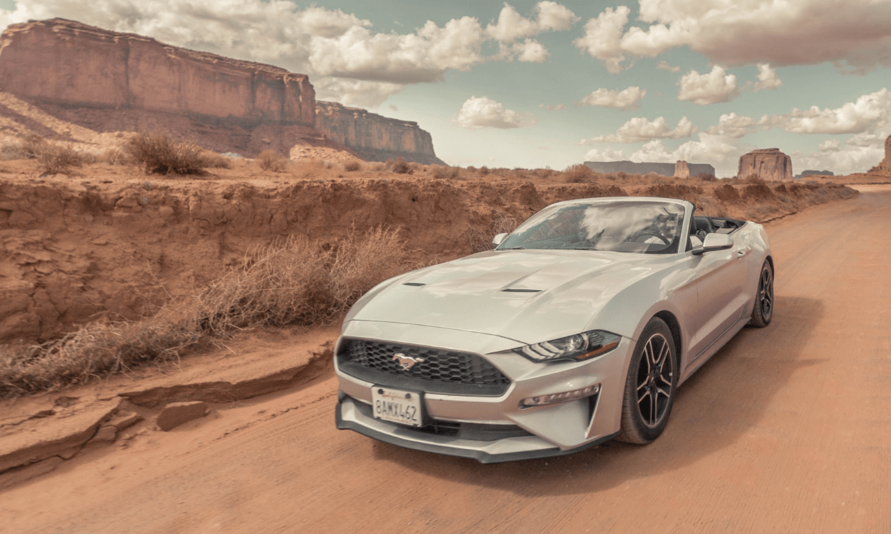
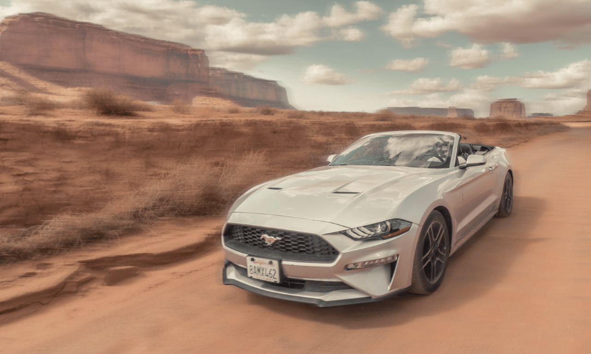
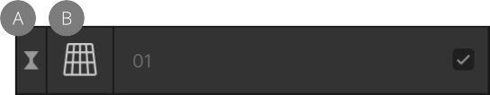

# Using live filters

Live filters allow you to apply filter effects such as blurring, sharpening, noise and distortion non-destructively, meaning you can modify or remove the effects without having to use the **History** panel to undo other operations on your work.

*Using the Motion Blur live filter to imitate motion in the scene.*

## About live filters

Live filters provide a way of applying creative effects to your images while retaining the ability to modify the effect settings or remove the effect altogether. The filter is added to the active layer, similar to applying [Adjustment Layers](07-adjustment-layers.md).

Once applied, they can be identified as both a filter and a specific live filter type by using unique symbols.

*Perspective Live filter layer (named 01) indicating it is a filter (A) and a Perspective filter type (B).*

**Available live filters:**

- **Blur**
  -  [Gaussian Blur](../11-filters-and-effects/02-blur-filters/08-filter-gaussianblur.md)
  -  [Box Blur](../11-filters-and-effects/02-blur-filters/05-filter-boxblur.md)
  -  [Median Blur](../11-filters-and-effects/02-blur-filters/11-filter-medianblur.md)
  -  [Bilateral Blur](../11-filters-and-effects/02-blur-filters/04-filter-bilateralblur.md)
  -  [Motion Blur](../11-filters-and-effects/02-blur-filters/13-filter-motionblur.md)
  -  [Radial Blur](../11-filters-and-effects/02-blur-filters/14-filter-radialblur.md)
  -  [Lens Blur](../11-filters-and-effects/02-blur-filters/09-filter-lensblur.md)
  -  [Depth Of Field Blur](../11-filters-and-effects/02-blur-filters/01-filter-dofblur.md)
  -  [Field Blur](../11-filters-and-effects/02-blur-filters/02-filter-fieldblur.md)
  -  [Diffuse Glow](../11-filters-and-effects/02-blur-filters/07-filter-diffuseglow.md)
  -  [Maximum Blur](../11-filters-and-effects/02-blur-filters/10-filter-maximumblur.md)
  -  [Minimum Blur](../11-filters-and-effects/02-blur-filters/12-filter-minimumblur.md)
- **Sharpen**
  -  [Clarity](../11-filters-and-effects/09-shadows-highlights/01-filter-clarity.md)
  -  [Unsharp Mask](../11-filters-and-effects/07-sharpen-filters/02-filter-unsharpmask.md)
  -  [High Pass](../11-filters-and-effects/07-sharpen-filters/01-filter-highpass.md)
- **Distort**
  -  [Ripple](../11-filters-and-effects/04-distortion-filters/15-filter-ripple.md)
  -  [Twirl](../11-filters-and-effects/04-distortion-filters/18-filter-twirl.md)
  -  [Spherical](../11-filters-and-effects/04-distortion-filters/17-filter-spherical.md)
  -  [Displace](../11-filters-and-effects/04-distortion-filters/03-filter-displace.md)
  -  [Pinch/Punch](../11-filters-and-effects/04-distortion-filters/11-filter-pinchpunch.md)
  -  [Lens Distortion](../11-filters-and-effects/04-distortion-filters/06-filter-lensdistortion.md)
  -  [Perspective](../11-filters-and-effects/04-distortion-filters/10-filter-perspective.md)
  -  [Liquify](../11-filters-and-effects/04-distortion-filters/07-filter-liquify.md)
  -  [Mesh Warp](../11-filters-and-effects/04-distortion-filters/08-filter-meshwarp.md)
- **Noise**
  -  [Denoise](../11-filters-and-effects/06-noise-filters/03-filter-denoise.md)
  -  [Add Noise](../11-filters-and-effects/06-noise-filters/01-filter-addnoise.md)
  -  [Diffuse](../11-filters-and-effects/06-noise-filters/04-filter-diffuse.md)
  -  [Dust & Scratches](../11-filters-and-effects/06-noise-filters/05-filter-dustscratches.md)
- **Colors**
  -  [Vignette](../11-filters-and-effects/03-color-filters/14-filter-vignette.md)
  -  [Defringe](../11-filters-and-effects/03-color-filters/02-filter-defringe.md)
  -  [Voronoi](../11-filters-and-effects/03-color-filters/15-filter-voronoi.md)
  -  [Halftone](../11-filters-and-effects/03-color-filters/06-filter-halftone.md)
  -  [Procedural Texture](../11-filters-and-effects/03-color-filters/09-filter-proceduraltexture.md)
- **Lighting**
  -  [Lighting](../11-filters-and-effects/10-lighting.md)
  -  [Shadows / Highlights](../11-filters-and-effects/09-shadows-highlights.md)

**To create a new live filter:**

Do one of the following:

- From the **Layers** panel, click **Live Filters** and select a filter from the list.
- From the **Layer** menu, select **New Live Filter Layer**.

**To modify, merge or delete a live filter:**

1. On the **Layers** panel, double-click the live filter that you want to modify.
2. Adjust the settings in the dialog; the changes will be applied in real time.
3. Close the dialog to apply the changes, **Merge** to apply the changes and merge the adjustment with the layer beneath, or **Delete** to remove the filter layer entirely.

**To move a live filter:**

Do one of the following:

- Drag the live filter to the top of the **Layers** panel so it affects all layers below it.
- Drag the live filter above or below layers to affect more or fewer layers in the project.
- Drag the live filter onto a layer or group to apply the filter to that layer or group only.

**To mask a live filter:**

1. On the **Layers** panel, select the live filter.
2. Do any of the following:
  - To 'erase' from the mask, paint with the **Erase Brush Tool**.
  - To 'restore' the mask, select the **Paint Brush Tool** and paint.
  - To apply a gradient mask, select the **Gradient Tool** from the **Tools** panel and drag across the layer. Adjust the gradient colors from the settings.

> **Note:** If you have a [pixel selection](../08-selections/01-creating-pixel-selections/01-overview.md) in place when you add a live filter, the area is automatically masked.

#### SEE ALSO:

- [Applying filters](../11-filters-and-effects/01-applying-filters.md)
- [Layer masks](12-layer-masks.md)
- [Creating pixel selections](../08-selections/01-creating-pixel-selections/01-overview.md)
- [Settings (or Preferences)](../37-settings-preferences/01-settings-preferences.md)
