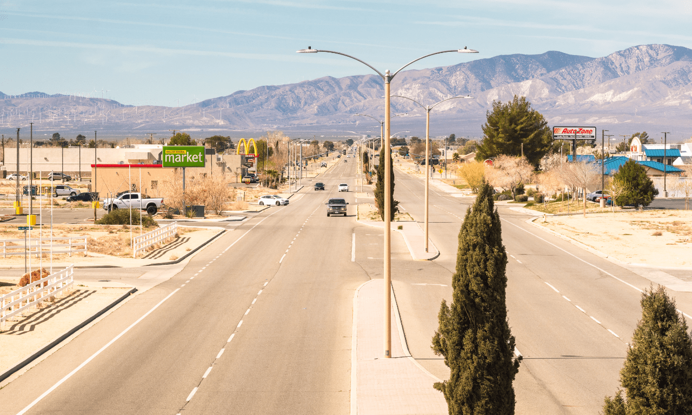
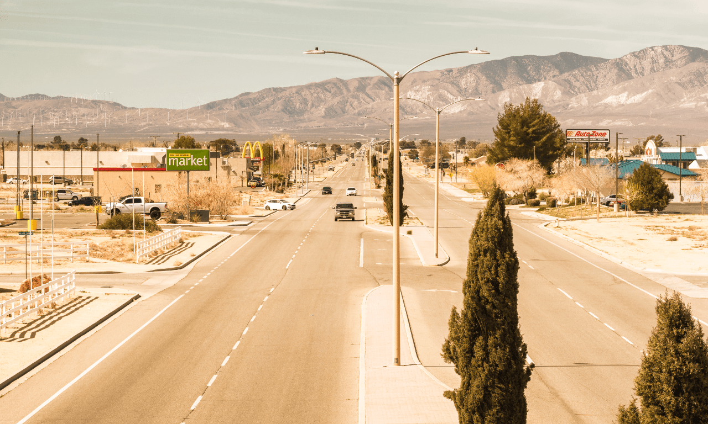

# Fill layers

Fill layers contain an adjustable solid or gradient color. They can be used for photo editing and corrective or creative purposes.

*Using a Fill layer with a blend mode to recolor an image.*

> **Tip:** When using fill layers it is common to apply a specific [opacity](04-layer-opacity.md) and/or [blend mode](05-layer-blending.md) to the layer to achieve highly customizable photo effects.

> **Note:** A fill layer will automatically resize to fill the page if the canvas size is modified.

**To create a new fill layer:**

- From the **Layer** menu, select **New Fill Layer**. A new layer is added above the current layer (or at the top of the Layers panel if no layer is selected) with a solid color applied.

> **Note:** You can use the [Color panel](../33-panels/08-color-panel.md) or [Swatches panel](../33-panels/27-swatches-panel.md) to update the solid color. Color picking from another layer is also popular for harmonizing colors. For details see [Selecting colors](../12-color/06-selecting-colors.md).

**To apply a gradient to a fill layer:**

1. Select the **Gradient** Tool from the Tools panel.
2. From the context toolbar, select a fill type from the **Type** pop-up menu.
3. Drag the cursor across the content. Hold down the `Shift`  to constrain the angle of the gradient path to 45°.

> **Note:** Once applied, you can modify the gradient and its colors to suit your specific needs. For details see [Gradient and bitmap fills](../12-color/08-gradient-and-bitmap-fills.md).

#### SEE ALSO:

- [Selecting colors](../12-color/06-selecting-colors.md)
- [Gradient and bitmap fills](../12-color/08-gradient-and-bitmap-fills.md)
- [Gradient](../32-tools/04-fill-tools/02-gradient-tool.md)
- [Layer Opacity](04-layer-opacity.md)
- [Layer blending](05-layer-blending.md)
