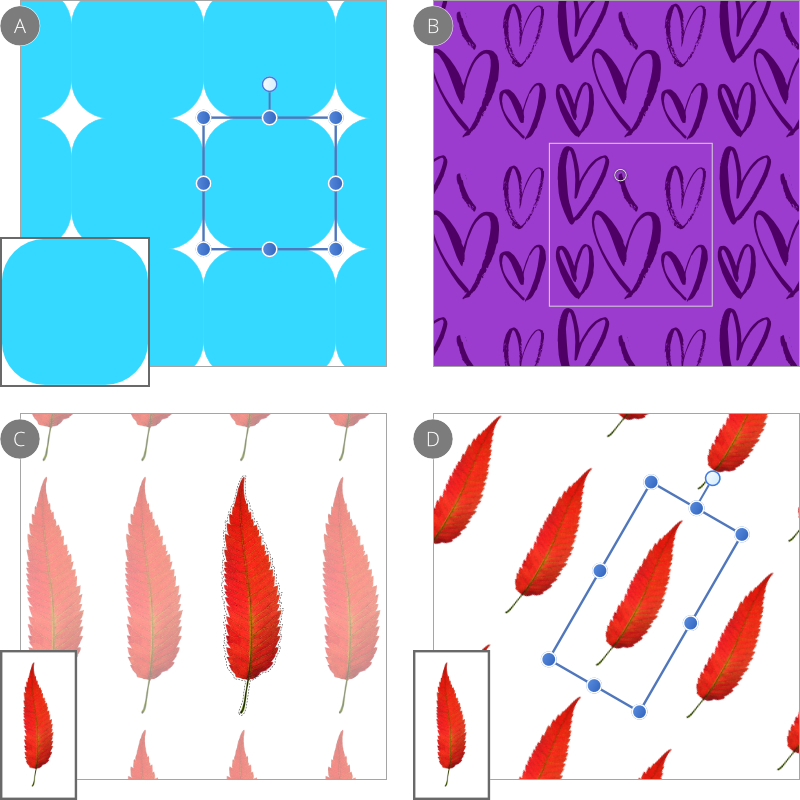

# Pattern layers

Pattern layers contain a fixed-size bitmap image which repeats across the entire document. You can paint designs on blank pattern layers or convert images, any raster layer content and pixel selections into pattern layers.

*Repeating patterns: (A) pattern from layer content - rounded rectangle, (B) from a painted raster stroke, (C) from a pixel selection and (D) from the same pixel selection but after resizing and rotating.*

Patterns can be mirrored, and pattern layers can be opened as a new document to be edited separately. Filters can also be used to manipulate pattern layers.

After a pattern is added or made from a pixel selection, a bounding box indicates the "real" area of the pattern which can be transformed or edited at any time.

**To create a blank pattern layer:**

- From the **Layer** menu, select **New Pattern Layer**. Specify the dimensions of the pattern area that will repeat across the pattern layer—this sets the scaling of the pattern.

**To create a pattern layer from a selection:**

1. Do one of the following:
  - For any raster layer content: Select a layer from the **Layers** panel with the **Move Tool**.
  - For a pixel selection: Select pixels using a [pixel selection tool](../08-selections/01-creating-pixel-selections/01-overview.md), e.g. the **Selection Brush Tool**.
2. From the **Layer** menu, select **New Pattern Layer from Selection**.

**To paint a pattern:**

- Use the **Layers** panel to select the pattern layer that you want to work on, or create a new pattern layer.
- Select the **Paint Brush Tool** or another brush-based tool and adjust it to your preferences.
- Paint on the page to paint a pattern. The stroke will be repeated across the entire document.

**To create a mirrored pattern:**

- With a pattern layer created, select the **Move Tool**.
- From the context toolbar, enable the **Mirror** option.
- The pattern will be mirrored across the entire document.

**To resize a pattern:**

1. With the **Move Tool**, select the pattern layer.
2. Drag a corner or edge control handle on the pattern area's bounding box. The opposite handle is used as the anchor point.

> **Note:** Hold down the `Shift`  to maintain the aspect ratio of the pattern or stretch it.

**To rotate a pattern:**

1. With the **Move Tool**, select the pattern layer.
2. Do one of the following:
  - Drag the pattern area's rotation handle.
  - Position the cursor close to a corner handle and drag on the page.
  - From the **Arrange** menu, select a rotate option.

> **Note:** You can rotate layer content with more precision using the **Transform** panel.

**To shear a pattern:**

1. With the **Move Tool**, select the pattern layer.
2. Position the cursor close to the pattern area's side handle and drag on the page.

**To open your pattern as a new document:**

- With a pattern layer created, select the **Move Tool**.
- From the context toolbar, select **Open as New Document**.

#### SEE ALSO:

- [Painting brush strokes](../23-painting-and-erasing/01-painting-brush-strokes.md)
- [Applying filters](../11-filters-and-effects/01-applying-filters.md)
- [Transforming](../05-sizing-cropping-and-warping/05-transforming.md)
- [Rotating and shearing](../07-layer-operations/03-rotating-and-shearing.md)
- [Creating pixel selections](../08-selections/01-creating-pixel-selections/01-overview.md)
