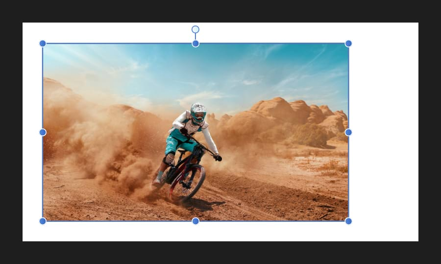

# Image layers

Placed images will automatically be added to the **Layers** panel as an image layer. This includes files that are dragged and dropped onto the document, placed via **File>Place**, or by any other placement method.

*A placed image.*

Image layers retain all of the data from the original image, which remains intact when the document is exported.

An image layer has a container which retains the placed image's original color space, resolution and physical dimensions (when placed at native resolution).

Image layers can be recolored much like an opened image or a pixel layer. If an image layer is drawn on, the layer will be rasterized and will adopt pixel layer properties. Rasterization is required to convert the image to the document's color space.

> **Note:** Images should be exported using physical print dimensions, e.g. 6in x 4in, and a set DPI when resizing or cropping a document.

**To create an image layer by placing content:**

1. From the **File** menu, select **Place**.
2. In the pop-up dialog, navigate to and select a file, and click **Open**.
3. Do one of the following:
  - Click to place the file at its default, displayed size.
  - Drag on the page to set the size and position of the content.
4. Alternatively, you can drag and drop the file onto the page to place it. The current image placement policy (embedded or linked) will be honored.

**Windows:**

**To convert a pixel layer to an image layer:**

1. With a pixel layer selected, from the **Edit** menu, select **Copy**.
2. From the **Edit** menu, select **Paste Special**, then choose **Device Independent Bitmap**.

**To convert an image layer to a pixel layer:**

Do one of the following:

- Select the **Paint Brush Tool** or another brush-based tool and paint on the layer.
- From the **Layer** menu, select **Rasterize**.

#### SEE ALSO:

- [About layers](01-about-layers.md)
