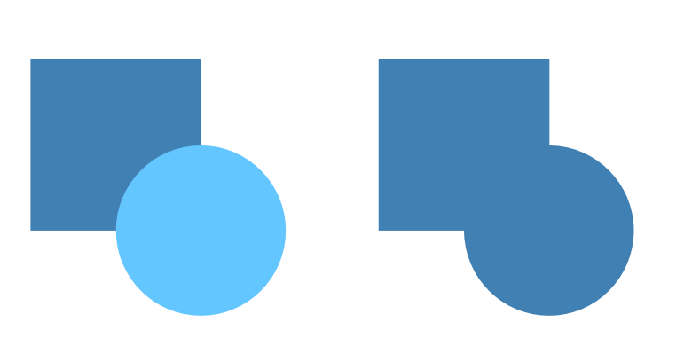
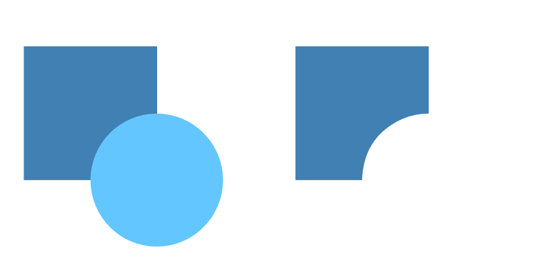
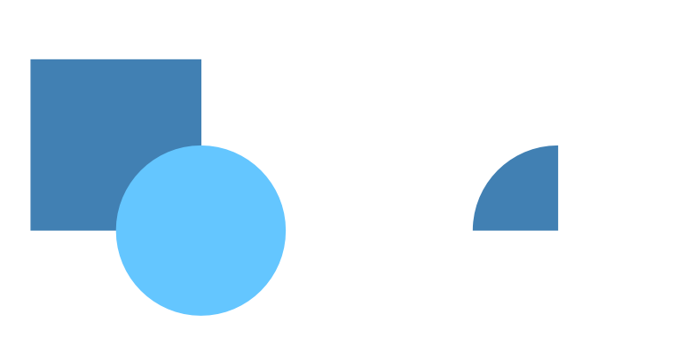
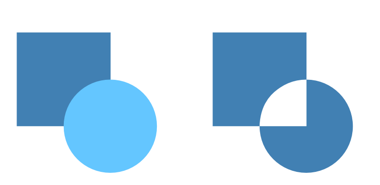

# Creating compounds

Compounds provide a flexible approach to creating a variety of shapes from separate objects using Boolean operations.

Unlike [joining objects](../../25-lines-and-shapes/11-joining-shapes.md), creating a Compound is a non-destructive process. This means a Compound can be added to, or broken apart, at any time. Objects within the Compound can also be removed and modified without restriction, if and when desired.

Objects within a Compound interact with each other depending on their individual compound mode. This mode can be changed at any time; each mode can be previewed in realtime on selection.

> **Note:** By default, a Compound adopts the properties of the lowest object when the Compound is created. However, once a Compound is in place its individual properties can be modified, as with any object.

## Compound modes

There are various operations available (illustrated as before and after):

**Add**—expands Compound by adding the object's area to all objects below; the color of the lowest object is used. This is the default mode.

**Subtract**—reduces Compound by removing overlapped areas of the lowest object. All other selected objects are discarded.

**Intersect**—modifies Compound by only showing overlapping areas of selected object and objects below.

> **Note:** For more than two objects, all objects must intersect each other.

**Xor**—modifies Compound by creating a composite shape, with transparent areas where object overlaps with objects below.

**To create a Compound:**

1. Select multiple objects.
2. From the **Layer>Geometry** menu, select **Add (Compound)**, **Intersect (Compound)**, **Subtract (Compound)** or **Xor (Compound)**.

**To change the compound mode of individual objects:**

1. On the **Layers** panel, click the object's compound mode icon.
2. Select a compound mode from the pop-up menu.

**To add an object to a Compound:**

- On the **Layers** panel, drag the object on top of the compound object.

The object is included in the Compound using the default Add mode.

**To release an object(s) from a Compound:**

Do one of the following:

- Drag the object(s) out of the Compound layer to another layer position.
- `Click`-click the object, and from the menu, choose **Release**.

#### SEE ALSO:

- [Joining objects](../../25-lines-and-shapes/11-joining-shapes.md)
