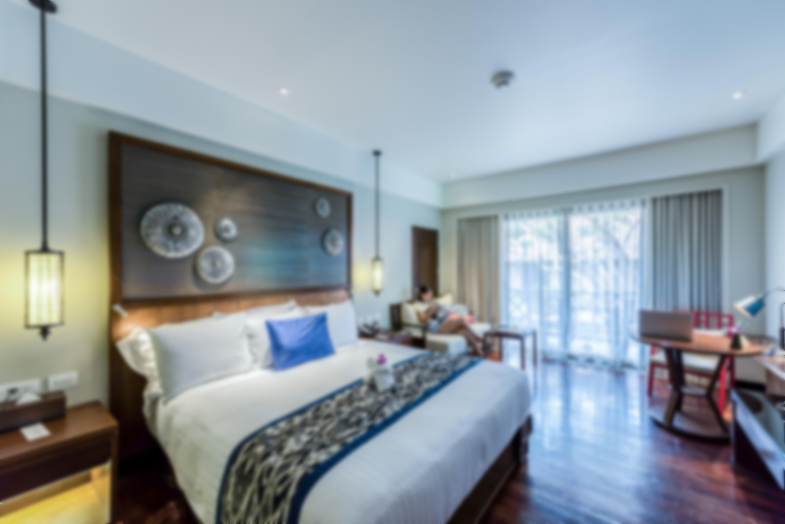
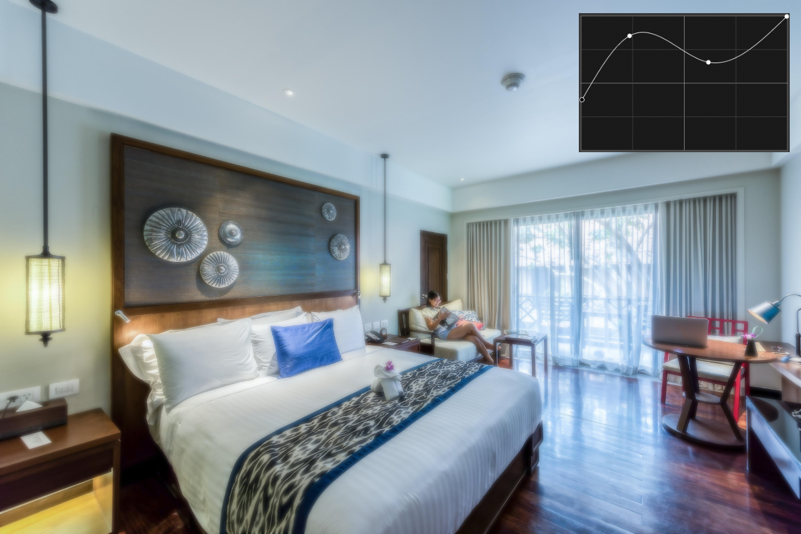

# Live Band-pass Mask

Use a non-destructive Band-pass Mask to mask based on a configurable frequency band. Band-pass masking lets you fine-tune image edges when applying sharpening filters such as High Pass or Unsharp Mask. Alternatively, you can apply blur artistic effects to image edges based on frequency.

*Live Gaussian Blur filter without (Before) and with (After) a live band-pass mask.*

### Settings (or Preferences)

The following settings can be adjusted:

- **Preset list**—Select a live mask preset if previously saved. Click the adjacent button to create, rename or delete a preset.
- **Merge**—merges the live mask with the layer immediately below it in the layer order.
- **Delete**—closes the dialog and deletes the live mask.
- **Reset**—returns the graph to the default position (a straight line between two nodes positioned at the top of the grid).
- **Low Band**—sets the lower limit of the frequency band.
- **High Band**—sets the higher limit of the frequency band.
- **Intensity Map graph**—the graph can be manipulated to precisely target the shadows, midtones and highlights affected by the band-pass mask. The left of graph represents shadows, middle is midtones and right is highlights; the lower the curve the greater the amount of masking.
- **Invert output**—reverses the values of the mask.
- **Linear**—when checked, the graduation between nodes is linear (i.e., nodes on the graph are connected using straight lines). If this option is off, nodes are connected using smooth curves.
- **Blur Radius**—controls the level of blurring at the edges of masked areas.
- **Opacity**—alters the opacity of the mask.

#### SEE ALSO:

- [Live layer masks](../14-live-layer-masks.md)
- [Live hue range mask](02-mask-livehuerange.md)
- [Live luminosity range mask](03-mask-liveluminosityrange.md)
