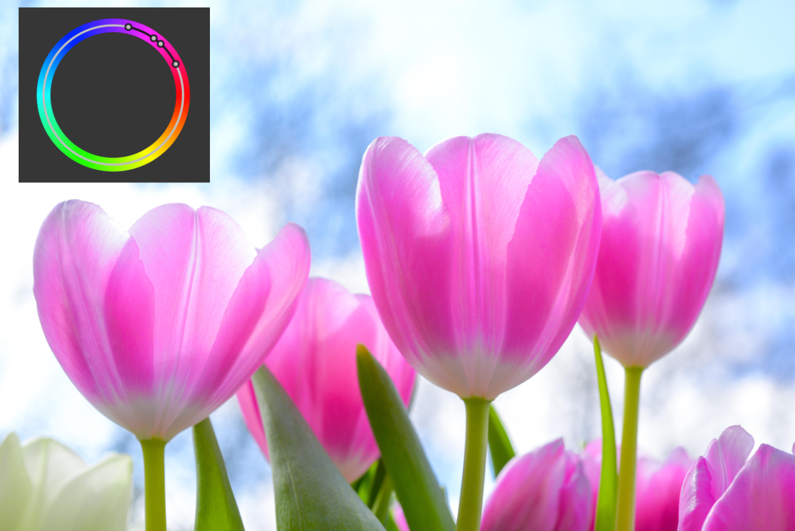

# Live Hue Range Mask

Use non-destructive Hue Range Masks to automatically mask based on a chosen hue. You can apply adjustments, effects or paint on the mask.

*HSL adjustment (increased saturation) without (Before) and with (After) a live hue range mask targeting a pink hue range.*

### Settings (or Preferences)

The following settings can be adjusted:

- **Preset list**—Select a live mask preset if previously saved. Click the adjacent button to create, rename or delete a preset.
- **Merge**—merges the live mask with the layer immediately below it in the layer order.
- **Delete**—closes the dialog and deletes the live mask.
- **Reset**—returns the graph to the default position (a straight line between two nodes positioned at the top of the grid).
- **Hue Picker**—allows you to sample a specific hue from your image on which to base your mask.
- **Preview**—allows you to display the selected hue on black and white values (where white is the selected range).
- **Hue Wheel**—presents a spectrum of hues presented on a wheel. A series of four hue wheel nodes determines the range of colors included in your mask. (See Using the hue wheel nodes below.)
-  In/out ramps—use the In or Out charts to subtly affect how much the hue range contributes to the mask; use a preset chart or customize the graph by dragging nodes, clicking on the curve to add new ones or deleting existing nodes.
- **Invert output**—reverses the values of the mask.
- **Opacity**—controls how much of the selected hue is visible.
- **Blur Radius**—controls the level of blurring at the edges of masked areas.

> **Note — Using the hue wheel nodes:** You can choose the hue that will make up your mask in different ways:
>
> - Drag on an individual node to reposition it around the color circle.
> - Drag the black line that connects the colored nodes. The central line between inside nodes moves all four nodes simultaneously and in relation to each other. The black line between either outer node and its adjacent node moves just that pair of nodes independent of the other node pairing.

#### SEE ALSO:

- [Live layer masks](../14-live-layer-masks.md)
- [Live luminosity range mask](03-mask-liveluminosityrange.md)
- [Live band-pass mask](01-mask-livebandpass.md)
