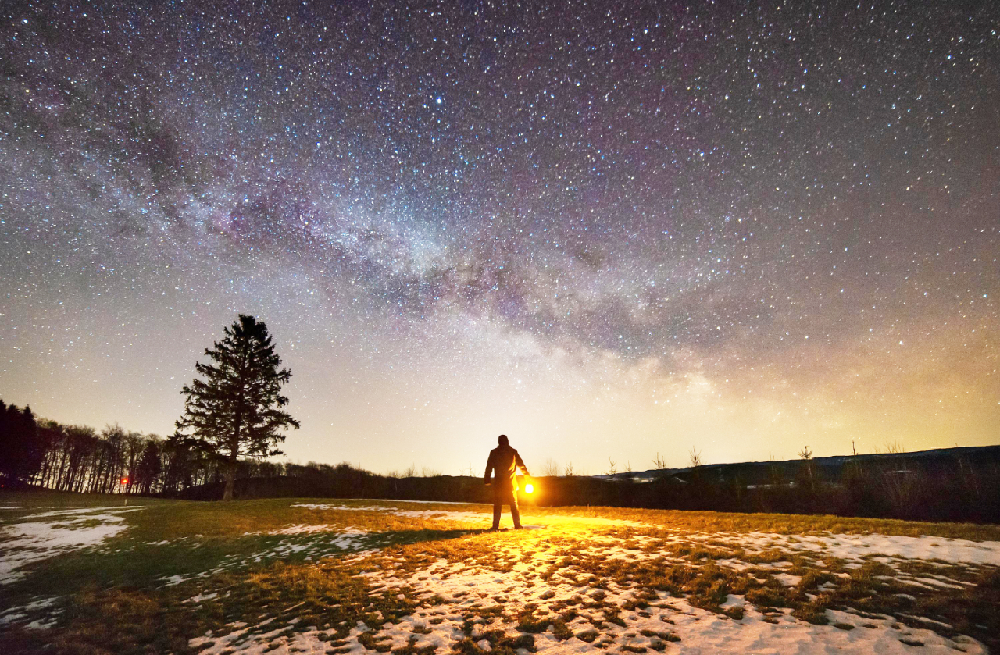
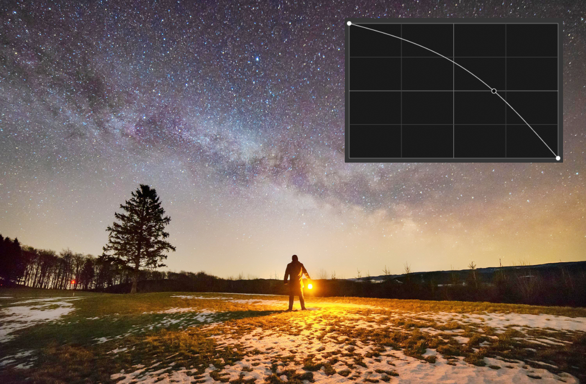

# Live Luminosity Range Mask

Use non-destructive Luminosity Range Masks to mask an image's tonal range based on its luminosity values. You can isolate specific ranges of shadows or highlights in order to target them with adjustments.

*Curves adjustment without (Before) and with (After) a live luminosity range mask.*

### Settings (or Preferences)

The following settings can be adjusted:

- **Preset list**—Select a live mask preset if previously saved. Click the adjacent button to create, rename or delete a preset.
- **Merge**—merges the live mask with the layer immediately below it in the layer order.
- **Delete**—closes the dialog and deletes the live mask.
- **Reset**—returns the graph to the default position (a straight line between two nodes positioned at the top of the grid).
- **Luminosity Map graph**—the graph can be manipulated to mask out the shadows, midtones and highlights affected by the luminosity mask. The left of graph represents shadows, middle is midtones and right is highlights; the lower the curve the greater the amount of masking.
- **Invert output**—reverses the values of the mask.
- **Linear**—when checked, the graduation between nodes is linear (i.e., nodes on the graph are connected using straight lines). If this option is off, nodes are connected using smooth curves.
- **Blur Radius**—controls the level of blurring at the edges of masked areas.
- **Opacity**—alters the opacity of the mask.

#### SEE ALSO:

- [Live layer masks](../14-live-layer-masks.md)
- [Live hue range mask](02-mask-livehuerange.md)
- [Live band-pass mask](01-mask-livebandpass.md)
