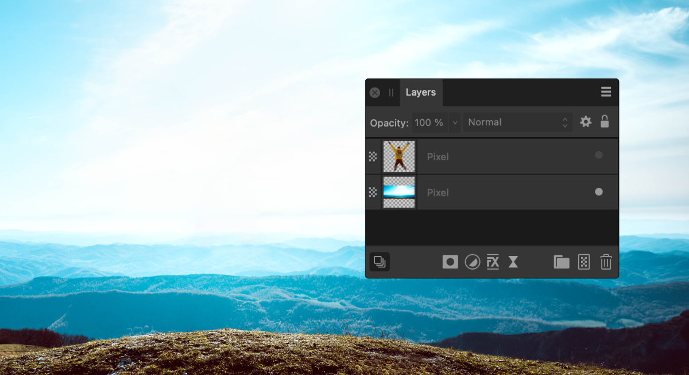
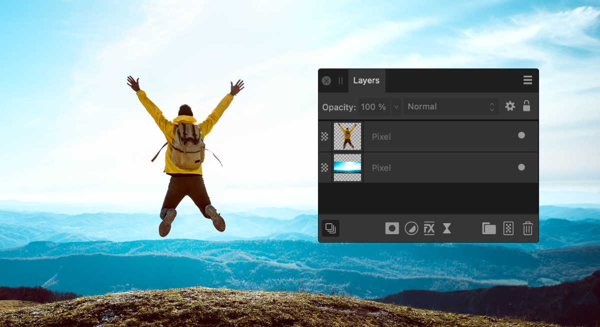

# Viewing

Show or hide layers to include/exclude layers (and layer objects) in your document and any output. You can also hide/show a selection of layers in one operation, as well as all other layers apart from any currently selected layers.

*Before and after layer hidden.*

**To hide or show a layer:**

Do one of the following:

- On the **Layers** panel, disable or enable **Toggle Visibility** on the layer entry.
- Select **Hide** or **Show** from the **Layer** menu.

**To hide or show selected layers in one operation:**

1. On the **Layers** panel, select multiple layers using `Shift`-click or `Cmd`-click.
2. Click on the **Toggle Visibility** icon on any of the selected layers.

**To show all hidden layers:**

- On the **Layer** menu, select **Show All**.

> **Note:** If a hidden layer(s) is selected before Show All is applied, only that layer will be displayed, instead of all layers.

**To hide or show all other layers (except selected):**

- On the **Layers** panel, do one of the following:
  -  `Click`-click **Toggle Visibility**, and select **Hide Others** or **Show Others** from the pop-up menu. For multiple selected layers, any of the selected layers can be targeted.
  - `Click`-click a layer and select the same options from the pop-up menu.

> **Preferences — Settings (or Preferences):** Related behaviors can be adjusted from [the app's settings](../37-settings-preferences/01-settings-preferences.md):
>
> - **Performance>View Quality**

#### SEE ALSO:

- [Selecting](02-selecting.md)
