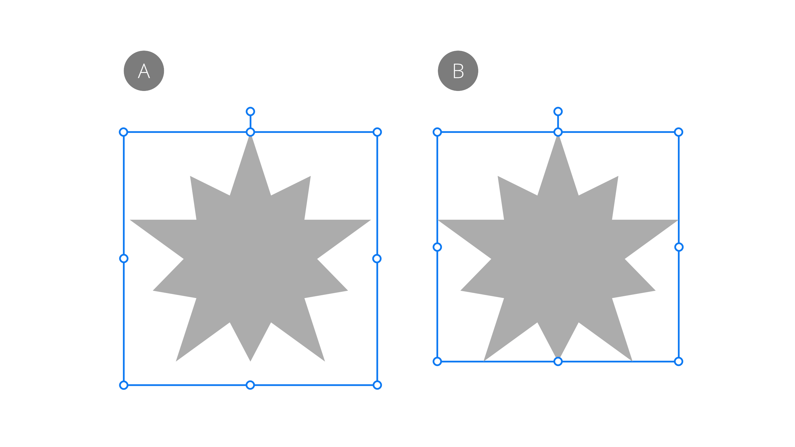
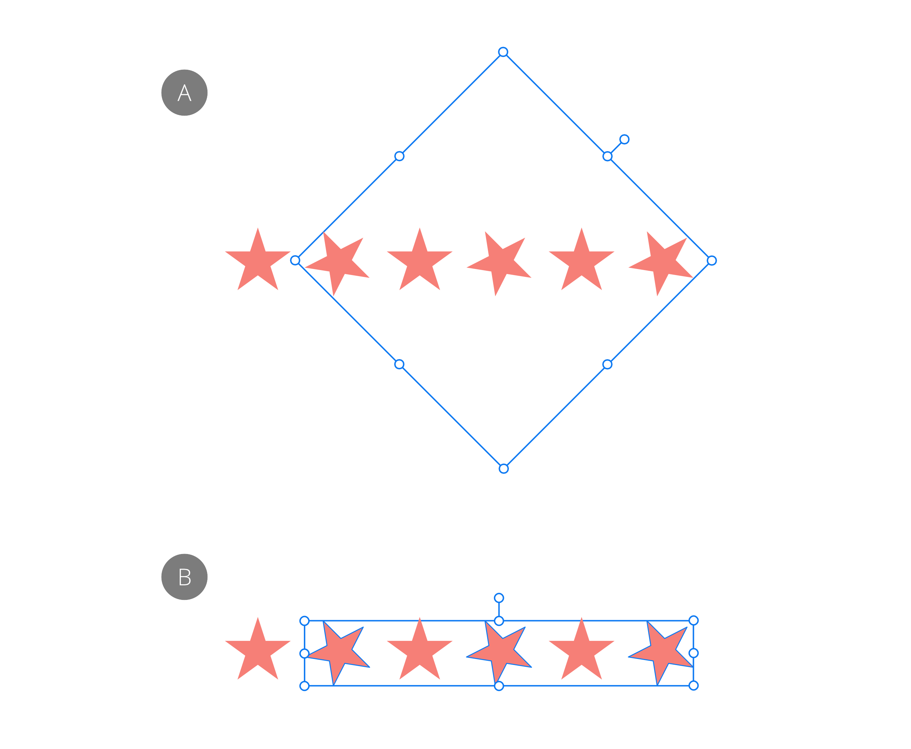

# Selecting

Before you can move or modify layers, you must first select them. Furthermore, you can select and edit a single layer (including layer masks, adjustment layers and fill layers) in isolation.

Layers can be renamed for easy identification or given a unique tag color to differentiate content belonging to different layers.

## Auto-select

By default, the **Auto-select** option is checked on the context toolbar. As expected, it automatically selects the layer content and its layer entry when you click to select it on the page. The option can be disabled if preferred.

## Edit All Layers and Select All

The behavior of the Select All command depends on the **Edit All Layers** setting on the **Layers** panel:

- When enabled, the command will select all objects across all layers and sub-layers.
- If this option is off, only objects on the current layer are selected. Objects within sub-layers are not selected.

> **Note:** Edit All Layers is enabled by default but can be disabled at any time.

## Selection box types

For some shapes (e.g. star shapes), a *Base box* type will be established on shape creation to accommodate the range of different potential shape sizes when creating variants of that shape. However, you can temporarily swap to a 'tighter' bounding box called *Regular bounds* if needed. The latter is useful for accurately resizing a shape by its corner/edge handles to another object or page element.

*Selection box types: Base box (A) and Regular bounds (B)*

For rotated multiple selections of objects or pixel layers, you can temporarily reorient the selection's selection box to vertical using the same Regular bounds type. Otherwise, the selection box will stay transformed with the transformed item.

*Rotated multiple selection before (A) and after (B) reorienting the selection box to Regular bounds*

> **Tip:** Try targeting an independently rotated key object in a multiple selection using `Alt`-click. The overall Base Box will adopt the same rotation as that key object.

It's possible to permanently set the object's selection box to orient to the page's horizontal and vertical edges. The object is unaffected. When reselecting the items again, the selection box will remain unrotated.

If you're using axonometric grids, the additional selection box type *Planar bounds*, which matches the current grid, can also be swapped to and be made permanent if needed.

**To select a layer:**

Do one of the following:

- With the **Move Tool** selected, click layer content on the page.
- On the **Layers** panel, click a layer.

**To select multiple layers:**

Do one of the following:

- With the **Move Tool** selected, click the layers' contents on the page while pressing the `Shift` .
- With the **Move Tool** selected, drag to draw a marquee around the layer contents.
- On the **Layers** panel, `Cmd`-click each layer.
- On the **Layers** panel, `Shift`-click two layers to select them and all layers between.

**To select all layers:**

- On the **Select** menu, select **Select All Layers**.

**To select a specific child layer:**

1. On the **Layers** panel, expand the parent layer or layer group to show its contents by clicking the layer's arrow.
2. Click to select the child layer.

**To deselect layers:**

- With the **Move Tool** selected, click on any empty area of the canvas or anywhere else in the document view.

**To select all layers sharing the same name:**

- With a layer selected, on the **Layers** panel, `Click`-click and choose **Select Same Name** from the pop-up menu.

**To select all layers sharing a tag color:**

- With a layer selected, on the **Layers** panel, `Click`-click and choose **Select Same Tag Color** from the pop-up menu.

**To select other layers in a selected layer's z-order:**

Do one of the following:

- With the layer selected, on the **Select** menu, choose:
  - **Select Next Layer** / **Select Previous Layer**—selects a layer adjacent to the selected layer in z-order sequence, within the same layer, group or entire layer stack. The option will cycle selection from bottom to top and vice versa.
  - **Select Top Layer** / **Select Bottom Layer**—as above but selection is made of the top or bottom layer in the layer, group or entire layer stack in z-order.
  - **Select Parent Layer**—selects the parent clipping layer or group in which the selected layer is placed.
- `Click`-click the layer, then choose the same options as above from the pop-up menu.

**To control automatic selection behavior:**

- On the Move Tool's context toolbar, choose one of the following options. These let you optionally select only layers or groups on the page, or just from the Layers panel (on-page selection is prevented).
  - **Default**—objects and groups can be selected on the page or Layers panel.
  - **Layers**—only layers can be selected on the page, while grouped items will be selected as if ungrouped; both groups and layers can be selected from Layers panel.
  - **Groups**—only groups can be selected on the page; both groups and layers can be selected from Layers panel.

**To cycle between selection box types:**

- On the **Select** Menu, choose **Cycle Selection Box**.

**To set the selection box permanently:**

1. Cycle to the selection box you want using **Cycle Selection Box** on the **Select** Menu.
2. On the same menu, choose **Set Selection Box**.

> **Note — Modifier keys:** When using the **Move Tool**, the following modifier keys can be used to aid layer selection:
>
> - With the **Auto-select** option disabled:
>   - `Cmd`-click layer content on the page to temporarily override the option and enable the selection.
> - With the **Auto-select** option enabled:
>   - On the **Layers** panel, holding the `Shift`  and clicking selects multiple layers. The same is achieved by clicking layer contents on the page while holding the key.
>   - **macOS:** Holding the `Cmd`+`Shift` keys while clicking on multiple layer contents on the page in turn, selects them.
>   - **Windows:** Holding the `Ctrl`+`Shift` keys while clicking on multiple layer contents on the page in turn, selects them.
>   - `Alt` -click a layer in the panel temporarily disables the whole composition preview leaving only the one (clicked on) selected—helpful in confirming selection of layers in complex compositions.
>   - The `.`  toggles a shape's bounding box between a Base box and a Regular bounds box. Alternatively, use **Cycle Selection Box** on the **Select** Menu. To permanently use a Regular bounds box on the object, use `Cmd`+`.`.
>   - **macOS:** As you drag a selection marquee, pressing the `Ctrl`  selects layers which are only partially covered by the selection marquee. This behavior can be made the default in the app's Settings*.

> **Tip:**  You can **Lock**/**Unlock** layers from the **Layers** panel or **Layer** menu.

**To find a layer in the Layers panel manually:**

Do one of the following:.

- `Click`-click the layer content on the page and select **Find in Layers Panel**.
- From the **Layer** menu, select **Find in Layers Panel**.
- **macOS:** On your keyboard, press `Cmd` + `K`.
- **Windows:** On your keyboard, press `Cmd`+`K`.

> **Preferences — Settings:** Related behaviors can be adjusted from the app's settings:
>
> - ***Tools>Select object when intersects with selection marquee**

#### SEE ALSO:

- [Move Tool](../32-tools/01-photo-editing-tools/02-move-tool.md)
- [Grouping](10-grouping.md)
- [Layers panel (Photo Persona)](../33-panels/13-layers-panel.md)
- Settings
