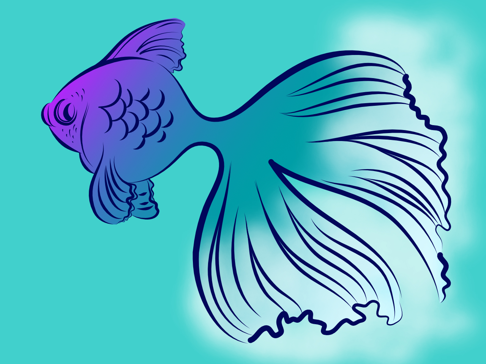
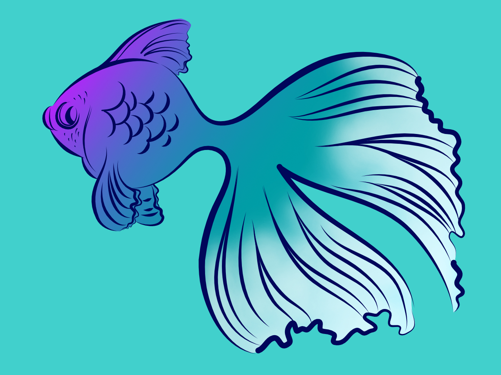
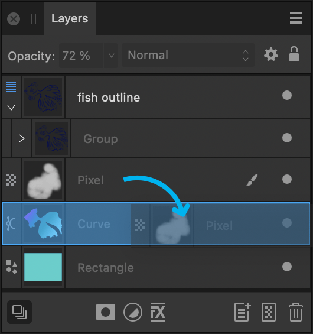

# Layer clipping

Clipping involves positioning one layer or object inside another, creating a parent - child layer relationship. The path of the parent becomes the new boundaries for the child. Any areas of the child layer (object) which lie outside its parent's path are masked (hidden).

*Pixel brush strokes clipped within the fish's vector outline.*

*Layers panel showing white brush stroke layer being dragged onto the fish's outline layer (above).*

Clipping can also be used to confine an adjustment, filter or mask to a single layer or layer group.

## About clipping

Any layer can act as a parent or child in clipping relationships. Therefore both pixel and vector layer content can be either clipped or clipping.

When scaling a parent layer, child (clipped) layers scale to maintain the correct aspect ratio. Scaling a clipped layer has no effect on the parent layer. A clipped layer can be edited independently from its parent, e.g. adjusting opacity, and/or blend mode.

**To clip layers:**

1. On the page, position the layer to be clipped so it overlaps the layer (or object) which will perform the clipping.
2. Do one of the following, with the layer to be clipped being selected:
  - On the **Layers** panel, drag it on top of the layer which is to perform the clipping. A blue highlight appears to target the layer.
  - On the **Arrange** menu, select **Move Inside**. This moves the object inside the object above it on the **Layers** panel.

The clipped layer is nested within the clipping layer in the Layers panel. The clipped layer has become a child of the clipping layer.

**To remove clipping (unclip):**

Do one of the following:

- On the **Layers** panel, drag the clipped layer outside the parent layer.
- Select the clipped layer, then select **Arrange>Move Outside**.
- -click the clipped layer, then select **Release**.

**To resize a layer without scaling its child layer content:**

- Select the parent layer with the **Move Tool**, and then check **Lock Children** on the context toolbar. Resize the parent layer to your chosen size.

> **Tip:** As you resize the parent, you can press the `Spacebar`  to temporarily override the current Lock Children state while the key remains pressed.

#### SEE ALSO:

- [Targeting](15-targeting.md)
- [Copy and paste options](08-copying-and-pasting-content.md)
- [Layers panel](../33-panels/13-layers-panel.md)
- [Layer blending](../06-layers/05-layer-blending.md)
