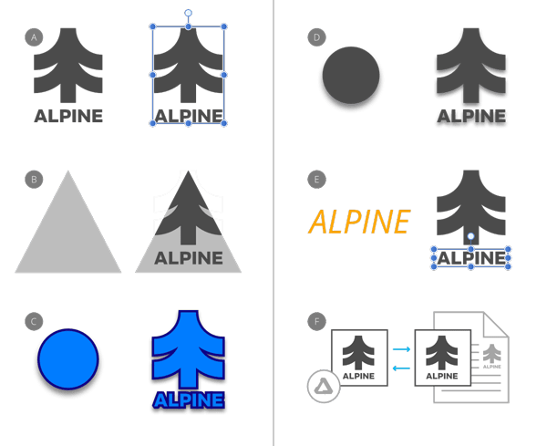

# Copying and pasting content

The **Edit** menu provides multiple ways to copy and paste content. Pasted content can include/exclude specific copied content properties.

*(A) Paste, (B) Paste Inside, (C) Paste Style (Stroke, Fill and Outer Shadow), (D) Paste FX (Outer Shadow layer effect only), (E) Paste without Format (retains target formatting), (F) Paste Special (Windows only); pastes as a choice of clipboard formats such as SVG, Device Independent Bitmap, etc.*

## About copying

You can copy content throughout the app or externally to third-party apps. Both need a reciprocal pasting operation to add the content to the target page.

The **Copy items as SVG** preference [accessed via **Settings** or (**Preferences** (**General**)] copies content in SVG format in readiness for pasting to external apps.

## About pasting

As well as the commonly used Paste command, other paste commands can be used to selectively control which properties are included/excluded in the paste operation.

| Paste option | Description |
| --- | --- |
| Paste | Pastes content, preserving the copied content's look and formatting. |
| Paste Inside | Pastes one or more layers inside another layer. |
| Paste Style1 | Pastes copied stroke, fill, layer effects and text formatting/styles2, 3 to another object/text. |
| Paste FX | Pastes only layer effect(s) to another layer. |
| Paste without Format | Pastes unformatted text by stripping the formatting from the copied text. When pasted, the target text will retain its text formatting. |
| Paste Special | Pastes copied content into and out of your Affinity app using a choice of clipboard formats that show dynamically by the type of content copied externally or within Affinity. |

1 Use the **Style Picker Tool** instead if you want to paste only some of the copied style attributes, e.g. paragraph settings but not character settings and other object styles.

2 If the copied text contains text ranges with different formatting, the formatting of its first character will be pasted.

3 If copied text's formatting includes settings that are incompatible with the target text, the incompatible settings will not be pasted. For example, horizontal centering is ignored when pasting onto a range *within* a left-aligned paragraph.

**Windows:**

## About Paste Special

When using **Paste Special** you will be offered a choice of clipboard formats to use for pasting. These options are dependent on the type of content copied and will dynamically change accordingly.

For example, for copied curves and shapes your formats are:

- image/x-inkscape-svg 1
- SVG 1
- Portable Document Format
- PNG
- Device Independent Bitmap
- Serif Persona Nodes 2

For text, the available choices will be different, and may include:

- Unicode text
- Rich Text Format
- Serif Persona Story 2

1 These clipboard formats are available when **Copy items as SVG** is enabled via **Settings** (or **Preferences**) (**General** option).

2 These are proprietary Affinity formats that retain the highest level of fidelity to the original copied object. This format is used by default when copying and pasting between Affinity apps.

**To copy content:**

1. Make a selection.
2. From the **Edit** menu, select **Copy**.

**To paste content:**

1. Make a selection.
2. From the **Edit** menu, select one of the paste options.

> **Note:** *Alternatively, you can cut (rather than copy) the content. From the **Edit** menu, select **Cut**.

#### SEE ALSO:

- [Targeting](15-targeting.md)
- [Layer clipping](07-layer-clipping.md)
- [Style Picker Tool](../32-tools/01-photo-editing-tools/04-style-picker-tool.md)
