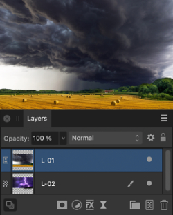
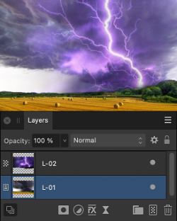

# Ordering

Once created, any layer in the layer stack can be reordered.

This stacking order will dictate which layer content will show in front of other layer content; the higher the layer in the layer stack the more that layer will be brought to the front of the image.

*The effect of layer order on a document.*

**To change a layer's position:**

Do one of the following:

- From the **Layers** panel, drag a layer entry up/down the layer stack. When you see a blue line between two layers, drop the layer to place.
- With layer(s) selected, choose one of the following from the toolbar:
  - **Move to Back**—repositions the selected layer(s) at the bottom of the layer stack.
  - **Back One**—moves the selected layer(s) down one position in the layer stack.
  - **Forward One**—moves the selected layer(s) up one position in the layer stack.
  - **Move to Front**—repositions the selected layer(s) at the top of the layer stack.

> **Note:** The above options are also available from the **Arrange** menu.

**macOS:**

> **Tip:** To select nested content directly from the document view, select the **Move Tool**, then hold the  and  s and click an object in the view. From the contextual menu that appears, select any content contained in the same group as (or deeper than) the object you clicked.

**Windows:**

> **Tip:** To select nested content directly from the document view, select the **Move Tool**, then hold the   and right-click an object in the view. From the contextual menu that appears, select any content contained in the same group as (or deeper than) the object you clicked.

#### SEE ALSO:

- [Targeting](15-targeting.md)
- [Layers panel](../33-panels/13-layers-panel.md)
- [Keyboard shortcuts for layer operations](../36-keyboard-shortcuts/01-keyboard-shortcuts.md)
