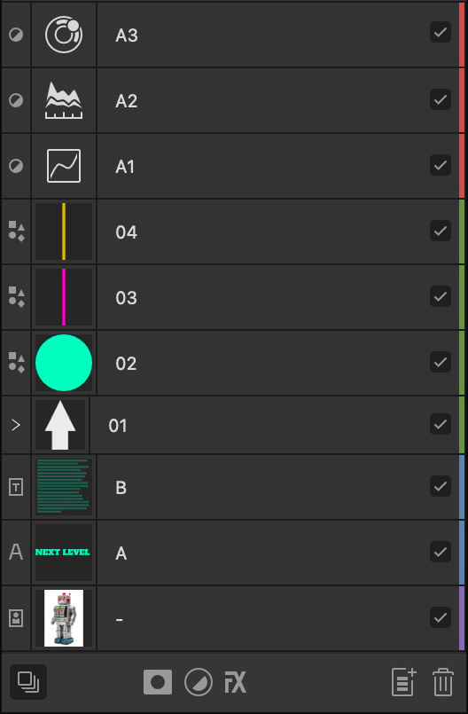

# Tagging layers

Layers can be tagged with a color to help with organization and navigation of your document. Each layer can be assigned a single color.

*Layers showing color tagging as vertical colored strips at the end of each entry.*

Tagging provides a useful additional means of organizing layer content beyond grouping layers, as it allows you to organize a set of layers without affecting the layer order. All layers that share the same tag color can be [selected at once](02-selecting.md) from the **Layers** panel.

**To assign a tag color to a layer(s):**

1. (Optional) On the **Layers** panel, select multiple layers.
2. Do one of the following:
  -  `Click`-click **Toggle Visibility**, and select a color tag from the pop-up menu. For multiple selected layers, any of the selected layers can be targeted.
  - `Click`-click a layer and select a color swatch from the pop-up menu.

> **Note:** When you assign a tag color to a layer group, it is also applied to layers within the group *except* any that have a color tag already.

**To remove a tag color:**

- With a layer (or multiple layers) selected, on the **Layers** panel, `Click`-click and choose the first color swatch (white with a red line through it). Tag colors are removed from the entire selection.

> **Note:** When you remove a tag color from a layer group, it is also removed from any layers of the same color within the group.

#### SEE ALSO:

- [Layers panel](../33-panels/13-layers-panel.md)
- [Selecting](02-selecting.md)
