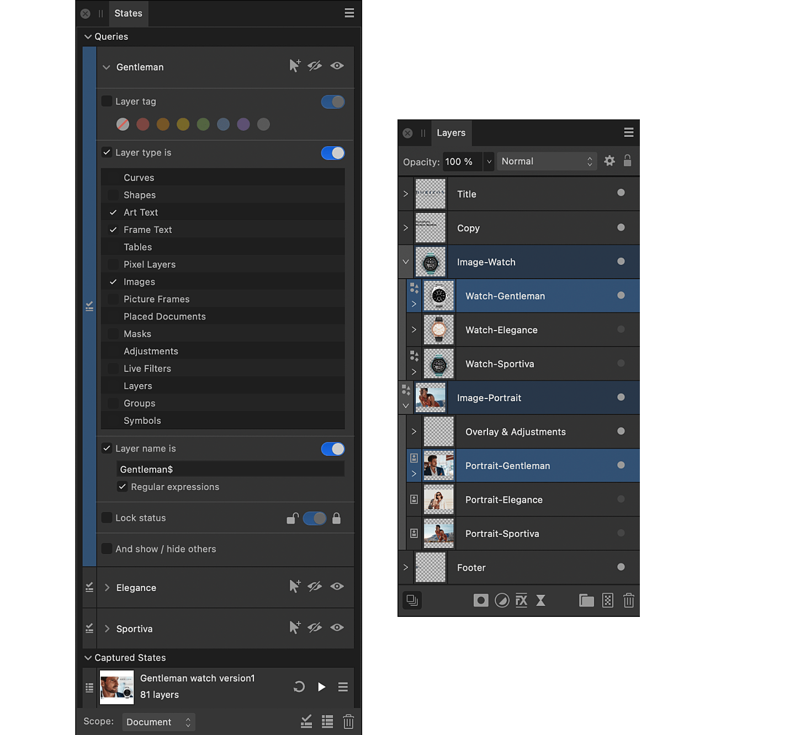

# Layer states

Layer states, or simply states, allow you to instantly set the visibility and layer effects of multiple layers.

*Before and after a query applied: product, model image and text visibility.*

There are two types of state:

-  A captured state captures the visibility of and layer effects applied to layers at the time the state is added to a document.
-  A query specifies criteria—any combination of a layer's tag color, type, name and lock status—that determine the visibility of layers. For example, you may want to hide all layers that have a tag color of red and show all other layers.

States of each type can be given a name.

With several states or queries added to the **States** panel, you can quickly compare different design choices for your document, such as alternative masks, adjustments, live filters and even entirely different layer content.

## Understanding state and query entries

Entries on the States panel for each type of state provide different information about how they will affect your document's layers.

*A captured state example.*

Each state entry displays:

- A thumbnail representation of the state.
- The state's name.
- The number of layers for which information is captured in the state.

*States and Layers panels for the query example: before and after images at the top of the page.*

Each query entry displays the query's name, and specifies the criteria that must all be met in order to set your chosen layer visibility. You can specify any combination of the available attributes. Unselected attributes are ignored.

### Example scenarios

The application of states and queries can be used in a number of professional scenarios. Apart from a preview of what your composition would display, as per the example above, more could include:

- Variations of color grading applied to an image.
- Modifications and adjustments applied to only a selected area of a photo.
- Previewing variations of edits for numerous color and monochromatic styles.

> **Note:** Find and replace can locate document text that matches a pattern. See [Regular expressions](../35-extras/02-using-regular-expressions-in-affinity.md) for more information. Detailed information about the capabilities of regular expressions is available on the Web.

## Controlling the scope of affected layers

When adding or updating a state or applying a state or a query, use the **Scope** setting to determine how broadly information is captured from or affects the current visibility of your document's layers, respectively.

The scope can be the whole document, the current selection on the **Layers** panel, or an individual spread—useful when editing certain kinds of document, such as .afpub

This allows you to focus your use of states on a specific portion of your work. For example, layers whose tag color is orange but only if they are nested within a selected layer.

**To add a state:**

1. On the **Layers** panel, set the visibility of your document's layers as you want them to be captured.
2. On the **States** panel, set the **Scope** of layers whose visibility and layer effects you wish to capture to either **Document**, **Spread** or **Selection**.
3. (Optional) If the selected scope is either:
  - Spread—use the page navigation bar, at the bottom left of the workspace when editing a suitable document type, to navigate to the required spread.
  - Selection—on the Layers panel, select the layers whose visibility you want to capture.
4. Click **Add new captured state**.

**To add a query:**

1. On the **States** panel, select **Add new query**.
2. On the query's entry:
  - Select only the attributes (**Layer tag**, **Layer type**, **Layer name** and **Lock status**) that you want to include as criteria.
  - For each selected attribute, specify the values that layers must match.
  - (Optional) Select **And show / hide others** if you wish to set the visibility of non-matching layers to the opposite of matching layers when the query is applied.

**To apply a state:**

- (Optional) On the **Layers** panel, select the layers whose visibility you wish to affect.
- On the **States** panel:
  - Select the **Scope** for layers you wish to affect.
  - Click **Apply** on the state you wish to apply.

**To apply a query:**

On the **States** panel:

1. Select the **Scope** for layers you wish to affect.
2. On the query you wish to apply:
  1. (Optional) Select or deselect **And show / hide others** according to whether you wish to affect non-matching layers.
  2. On the query you wish to apply, click **Hide** or **Show**.

**To set whether a state's captured visibility/layer effects will be applied:**

- On the **States** panel, click the state's options menu and do the following:
  1. Select **Visibility changes** to allow layer visibility captured in the state to be applied, or deselect it to ignore captured layer visibility.
  2. Select **Effects changes** to allow layer effects captured in the state to be applied, or deselect it to ignore captured layer effects.

**To update a state:**

1. (Optional) On the **Layers** panel, select the layers you wish to include in the updated state. (Layers that were not captured when the state was added will be ignored even if they are selected.)
2. On the **States** panel:
  1. Select the **Scope** of layers you wish to include in the updated state.
  2. Click **Update** on the state's entry.

#### SEE ALSO:

- [States panel](../33-panels/23-states-panel.md)
- [About layers](../06-layers/01-about-layers.md)
- [Viewing](01-viewing.md)
- [Layers panel](../33-panels/13-layers-panel.md)
- [Regular expressions](../35-extras/02-using-regular-expressions-in-affinity.md)
