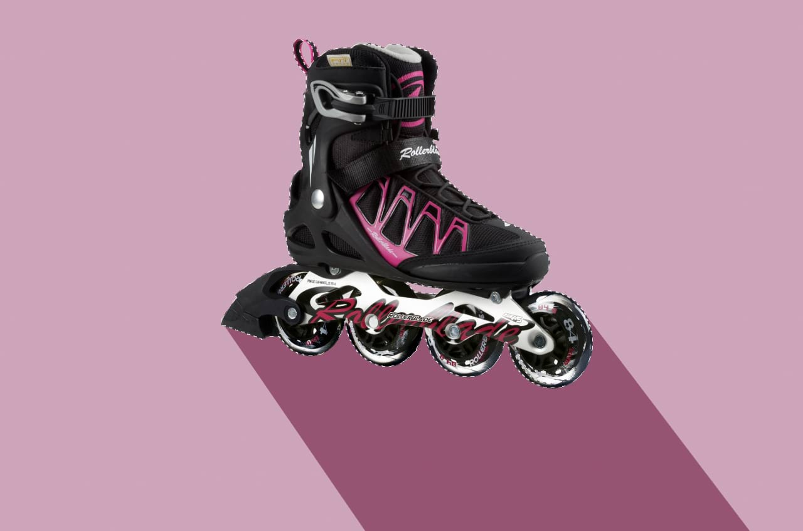

# Creating pixel selections

Pixel selections can be created for focused editing of specific pixel regions. Selection boundaries are defined depending on whether individual pixels are included or excluded.

## About pixel selections

A pixel selection is simply a drawn area on your image (bounded by a flashing dashed line, often called 'marching ants'). A selection is created for various reasons:

- To limit editing (e.g., painting, applying fills, etc.) to within that selection area only.
- To selectively copy pixels.
- As a precursor to creating a mask layer.
- To draw areas for removal (cutout).

Selection boundaries are defined depending on whether individual pixels are included or excluded.

Once your selection has been created, you can invert it so all included pixels are excluded and vice versa.

## Pixel selections and RAW layers

In Affinity, you can perform pixel selection on RAW layers, which opens up a number of options for various flexible workflows.

Note the following behaviors when working with RAW layers, with a pixel selection active and an image layer selected in the panel:

- Deleting the selection will mask the layer rather than delete it entirely from the layer stack. This aids local editing workflows, especially when targeting inverted selection areas.
- Duplicating action will create a new pixel layer with just the selected pixel data.

> **Note:** You can use the **Assistant** options (found in the app's **Settings**) to change the above default behaviors.

**macOS:** Additionally, the following two options are available via a `Ctrl`-click a layer in the panel:

**Windows:** Additionally, the following two options are available via a -click a layer in the panel:

- **Merge Down**—merges a layer with a pixel layer below.
- **Merge Visible**—merges all visible layers in the panel into a new pixel layer.

## Selection tools

You can create a pixel selection using the [Object Selection Tool](../../32-tools/03-selection-tools/01-object-selection-tool.md), [Selection Brush Tool](../../32-tools/03-selection-tools/02-selection-brush-tool.md) or [Marquee Selection Tools](../../32-tools/03-selection-tools/04-marquee-selection-tools.md) or base it on a layer. Using the [Flood Select Tool](../../32-tools/03-selection-tools/03-flood-select-tool.md), you can also define a selection of similar color value pixels with a single click. Selections created using the Marquee tools align to individual pixels.

Once your selection has been created, you can invert it so all included pixels are excluded and vice versa.

There are several tools you can use to create pixel selections:

-  **Object Selection Tool** (see [Object Selection Tool](../../32-tools/03-selection-tools/01-object-selection-tool.md))
-  **Selection Brush Tool** (see [Painting pixel selections](02-by-painting.md))
-  **Flood Select Tool** (see [Flooding pixel selections](03-by-flooding.md))
-  **Rectangular Marquee Tool** (see [Marquee pixel selections](10-using-a-marquee.md))
-  **Elliptical Marquee Tool**
-  **Column Marquee Tool**
-  **Row Marquee Tool**
-  **Freehand Selection** (see [Drawing pixel selections](04-by-drawing.md))

## Selection procedures

Alongside the many selection tools available, there are also a variety of procedures you can follow to create a pixel selection from:

- The most prominent subject of a layer (see [Select Subject](../05-select-subject-ml.md))
- The contents of a layer (see [Pixel selections from layers](06-by-layer-content-luminosity.md))
- The luminosity of a layer (see [Pixel selections from layers](06-by-layer-content-luminosity.md))
- Layer and composite channels (see [Pixel selections from channels](07-from-channels.md))
- Curves and shapes (see [Pixel selections from shapes](08-from-shapes.md))
- Tonal or color ranges (see [Range pixel selections](05-by-range.md))
- Sampled colors (see [Sampled color pixel selections](09-from-a-sampled-color.md))
- Quick Masks (see [Edit selection as layer using Quick Mask](../04-edit-selection-as-layer-using-quick-mask.md))
- Previously created selections (see [Creating outline selections](../07-creating-outline-selections.md))

## Selection modes

When working with, and creating, selections, you may have access to the following **Modes** which affect how your selection develops:

-  **New**—cancels all current selections and creates a new selection.
-  **Add**—adds areas to the current selection. If there is no selection in place, a new selection will be created.
-  **Subtract**—removes areas from the current selection.
-  **Intersect**—a new selection area is created from the overlap between the newly added selection area and the current selection.

**To select an object:**

1. From the **Tools** panel, select the **Object Selection Tool** .
2. Adjust the settings on the context toolbar.
3. Hover over the object you wish to select.

> **Note — Modifier keys:** When using the tool, the following modifiers can be used:
>
> - **macOS:** Pressing the `Alt`  while clicking to confirm selections separates them into object components, which inevitably may consist of varied textures. For example, it is possible to separate a model's face from the eyes.
> - **Windows:** Pressing the `Alt`  while clicking to confirm selections separates them into object components, which inevitably may consist of varied textures. For example, it is possible to separate a model's face from the eyes.
> - **macOS:** Pressing the `Alt` + `Shift` s, further separates object components. For example, it is possible to separate parts of an outfit consisting of varied colors or textures.
> - **Windows:** Pressing the `Alt`+`Shift` s, further separates object components. For example, it is possible to separate parts of an outfit consisting of varied colors or textures.
> - Dragging on an object enables you to establish smaller selection areas, as indicated by the hatched pattern during the operation.

> **Tip:** Use the **Object Selection Tool** for making selections of either the main subject of the composition or its individual parts while employing the above modifiers.

> **Tip:** On the tool's context toolbar, toggle the **Multi-part Objects** option on to enable selections of similar textures, particularly when separated by other objects.

**To select the most prominent subject:**

1. From the top menu, choose **Select**>**Select Subject**.

**To paint a pixel selection:**

1. From the **Tools** panel, select the **Selection Brush Tool**.
2. Adjust the settings on the context toolbar.
3. Drag on your page.

> **Note — Modifier keys:** The following Mode modifier keys may be available for some selection tools and can aid in the creation of selections:
>
> - The `Cmd`  temporarily toggles **Snap to edges** setting.
> - **macOS:** The `Ctrl`  automatically adds areas to the current selection.
> - The `Alt`  automatically removes areas from the current selection.

**To create a pixel selection using a Marquee Selection tool:**

1. From the **Tools** panel, select the **Rectangular**, **Elliptical**, **Row** or **Column Marquee Tool**.
2. Adjust the settings on the context toolbar.
3. Drag on your page.

> **Note — Modifier keys:** When using the Marquee Selection tools, the following modifier keys can be used to aid in the creation of selections:
>
> - **macOS:** Pressing the `Cmd`  while dragging constrains the marquee's proportions.
> - **Windows:** Pressing the `Cmd`  while dragging constrains the marquee's proportions.
> - Pressing the `Shift`  while dragging adds to the current selection.
> - **macOS:** Pressing the `Alt`  while dragging removes areas from the current selection.
> - **Windows:** Pressing the `Alt`  while dragging removes areas from the current selection.
> - **macOS:** Pressing the `Cmd`  while dragging inside the current marquee selection repositions it.
> - **Windows:** Pressing the `Cmd`  while dragging inside the current marquee selection repositions it.

**To draw a pixel selection:**

1. From the **Tools** panel, select the **Freehand Selection Tool**.
2. On the context toolbar, choose a selection **Type**.
3. Do one of the following:
  - With **Freehand** selected, drag on the page to draw the edge of the selection and release to close the selection.
  - With **Polygon** selected, click to define the beginning of the selection and then click for every change in direction.
  - With **Magnetic** selected, click to define the beginning of the selection and then click to place a custom node position. Automatic nodes will be placed along distinct image edges as the cursor moves.
4. Double-click to close the selection (**Polygon** and **Magnetic** only).

> **Note — Modifier keys:** When using the Freehand Selection Tool, the following modifier keys can be used to aid in the creation of selections:
>
> - The `Shift`  temporarily switches to **Polygonal** if using **Freehand**.
> - The `Shift`  temporarily switches between **Polygonal** and **Magnetic**.
> - If using **Polygonal** and **Magnetic**, dragging will temporarily invoke **Freehand**.
> - **macOS:** Holding the `Ctrl`  temporarily switches the mode to Add.
> - Holding the `Alt`  temporarily switches the mode to Subtract.

**To create a pixel selection from a layer:**

- On the **Layers** panel, click the chosen layer's thumbnail while pressing the `Cmd` .

**To select every pixel in the image:**

Do one of the following:

- On the Toolbar, select **Select All**.
- From the **Select** menu, select **Select All**.

**To invert a pixel selection:**

With a selection in place, do one of the following:

- On the Toolbar, select **Invert Selection**.
- From the **Select** menu, select **Invert Pixel Selection**.

**To hide/show a pixel selection temporarily:**

- From the **View** menu, select **Show Pixel Selection**.

**To remove a pixel selection:**

Do one of the following:

- On the Toolbar, select **Deselect**.
- From the **Select** menu, select **Deselect**.

#### SEE ALSO:

- [Modifying pixel selections](../02-modifying-pixel-selections.md)
- [Object Selection Tool (ML)](../../32-tools/03-selection-tools/01-object-selection-tool.md)
- [Select Subject (ML)](../05-select-subject-ml.md)
- [Affinity and Machine Learning (ML)](../../35-extras/01-affinity-and-machine-learning-ml.md)
- [Refining pixel selection edges](../06-refining-pixel-selection-edges.md)
- [Keyboard shortcuts for pixel selection and masking](../../36-keyboard-shortcuts/01-keyboard-shortcuts.md)
- [Settings](../../37-settings-preferences/01-settings-preferences.md)
