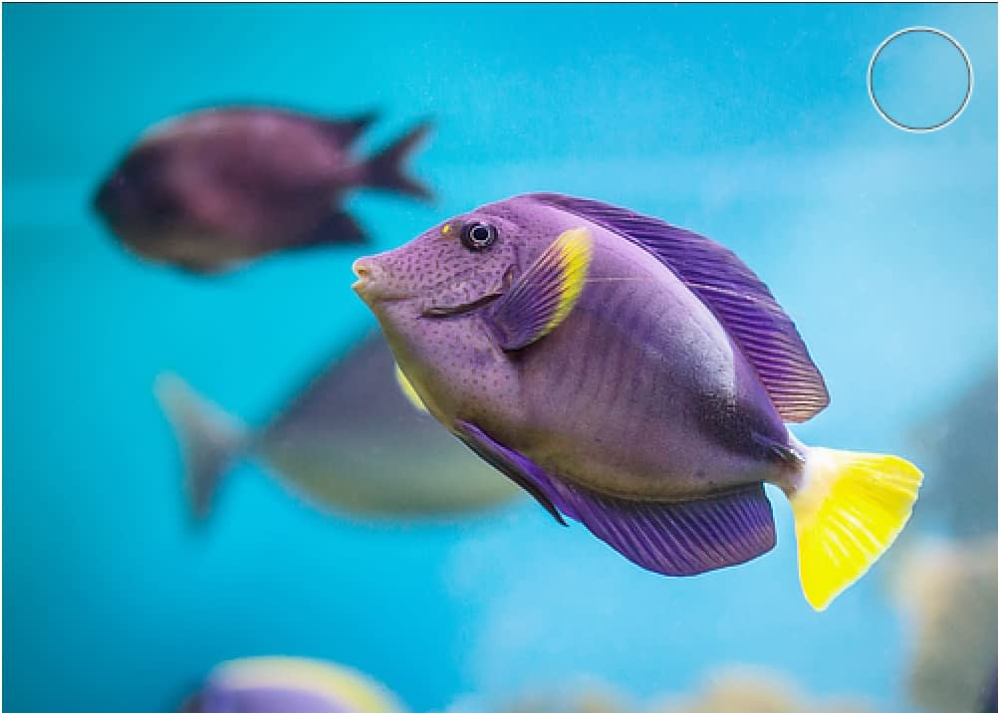
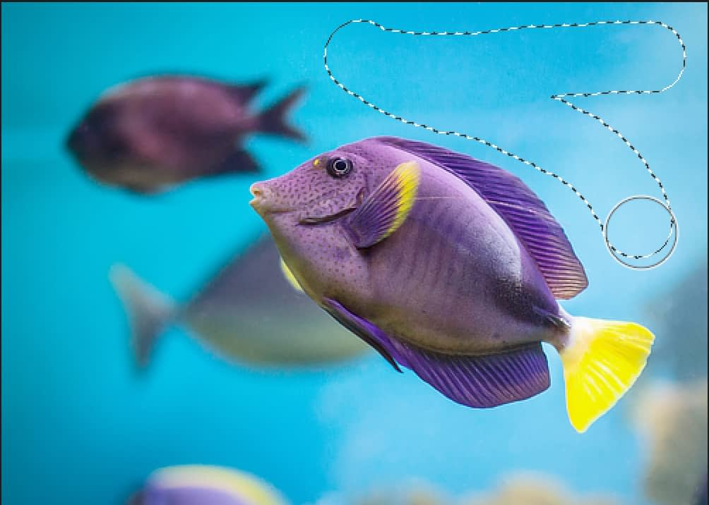
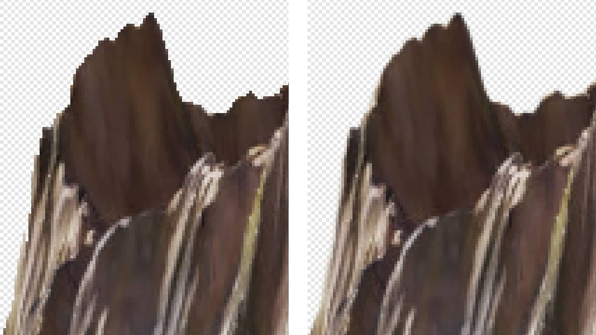

# Painting pixel selections

Using the **Selection Brush Tool** you can define a selection by painting on your page.

## Default Selection Brush 'expansion' behavior

By default the [Selection Brush Tool](../../32-tools/03-selection-tools/02-selection-brush-tool.md) is set to expand the selection to include similar color value pixels to those selected, even if these are not directly painted. In other words, the selection will grow up to high contrast edges within the image.

*Before and after selection painted.*

The number of pixels selected is determined by the size (width) of the brush in two ways:

- A larger brush size will paint a larger area in one stroke and therefore more pixels are selected.
- A larger brush size will give Affinity Photo 2 a larger sample size in which to determine how far the selection should expand when selecting similar color value pixels.

This makes selecting an area of similar color and tone effortless.

> **Note:** The selection will only expand to pixels with similar color values if they are adjacent to the stroke painted. To select a separated area, you must start another stroke within that area.

## Alternative 'non-expansion' behavior

As an alternative to the expansion method detailed above, the Selection Brush Tool also has a non-expansion method of selection. This method will only select pixels which are under the brush when the stroke is painted. To use this method, clear the box next to **Snap to edges**.

*Difference in selection method between non-expansion (before) and expansion (after).*

## Selection edge fidelity

Pixels along the edge of a selection made using the Selection Brush Tool are fully opaque by default, which may result in a ragged edge when the selection is, for example, used as a mask or to composite a cut-out against a new background.

If the area being selected has a relatively simple edge, turn on **Soft edges** on the context toolbar and then make your selection. The tool will antialias the selection's edge; some pixels will be semi-transparent, giving an appearance that is less sharp yet often more desirable.

*Edge fidelity of a selection made with the **Soft edges** option disabled (left) and enabled (right).*

For complex edges, such as finely detailed hair or fur, better results can be achieved using [the tool's Refine option](../06-refining-pixel-selection-edges.md).

**To create a pixel selection:**

With the **Selection Brush Tool** selected:

1. Adjust the context toolbar settings. (See [Selection Brush Tool](../../32-tools/03-selection-tools/02-selection-brush-tool.md) for details.)
2. Drag on your page.

**To refine a pixel selection:**

With the **Selection Brush Tool** selected, do any of the following:

- Switch the tool's working **Mode** on the context toolbar.
- Change the brush size (**Width**).

See the note below for details.

> **Note — Modifier keys:** The following modifier keys can be used to aid in the creation of selections:
>
> - **macOS:** The `Ctrl`  automatically adds areas to the current selection.
> - The `Alt`  automatically removes areas from the current selection.
> - **Windows:** Dragging using the right mouse button (rather than the left mouse button) automatically adds areas to the current selection.
> - **macOS:** Press the `Ctrl` and `Alt` s and drag on the page. Dragging left or right will decrease or increase the brush size, respectively. Alternatively, use the [ or ] s, respectively.
> - **Windows:** Press the `Cmd` and `Alt` s and drag on the page. Dragging left or right will decrease or increase the brush size, respectively. Alternatively, use the [ or ] s, respectively.

**To set 'non-expansion' method:**

- With the **Selection Brush Tool** selected, on the context toolbar, ensure the **Snap to edges** option is off.

#### SEE ALSO:

- [Selection Brush Tool](../../32-tools/03-selection-tools/02-selection-brush-tool.md)
- [Creating pixel selections](01-overview.md)
- [Modifying pixel selections](../02-modifying-pixel-selections.md)
- [Refining pixel selection edges](../06-refining-pixel-selection-edges.md)
- [Flooding pixel selections](03-by-flooding.md)
