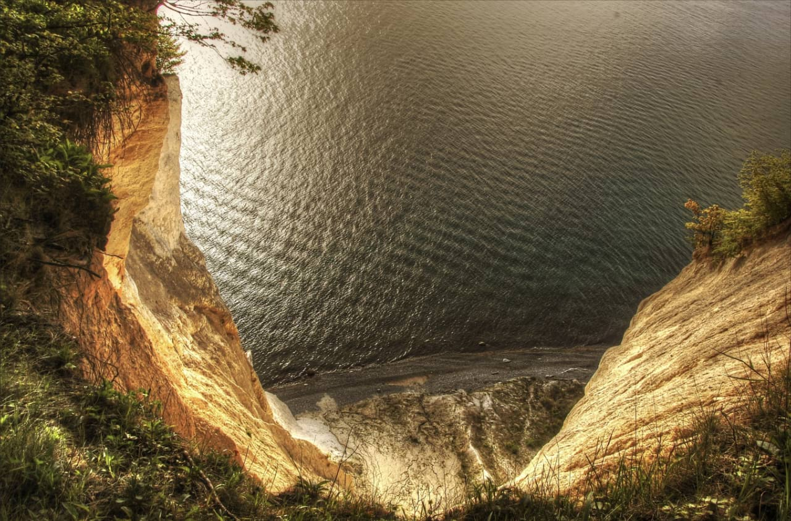
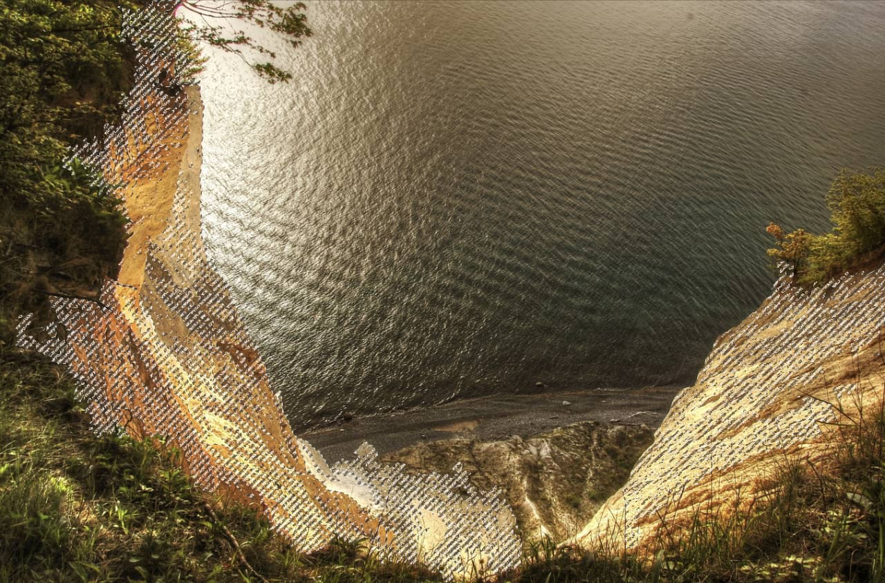
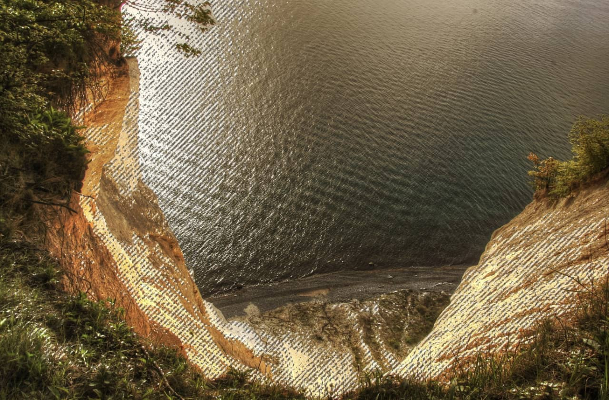

# Flooding pixel selections

Using the **Flood Select Tool** you can define a selection of similar color value pixels with a single click.

## Flooding and tolerance

When using the [Flood Select Tool](../../32-tools/03-selection-tools/03-flood-select-tool.md), Affinity Photo 2 will analyse the target (clicked) pixel and use its color value to create a selection which includes pixels with similar color values.

*Before and after pixel clicked.*

The number of pixels selected is determined by the tool's tolerance setting. The higher the tolerance the more variance allowed between the target pixel and selected pixels. Therefore, a higher tolerance will likely lead to more pixels being included in the selection.

This makes selecting an area of similar color and tone effortless.

## Contiguous behavior

By default, flood selecting is contiguous. This means pixels with similar color values must be adjacent to one another to be selected. Therefore, pixels must be directly connected to the target pixel (or other selected pixels) to be selected. If there is a high contrast edge between areas of similar color, the pixels on the opposite side of the edge will not be selected using a single click.

As an alternative, the contiguous behavior can be switched off. This will mean pixels of similar color to the target pixel will be selected regardless of their position within the image.

*Difference in selection method with contiguous on (before) and off (after).*

**To create a pixel selection:**

With the **Flood Select Tool** selected:

1. (Optional) On the context toolbar, set the **Tolerance**.
2. Click on your page.

**To create a pixel selection using multiple target pixels:**

With the **Flood Select Tool** selected:

1. On the context toolbar, set the **Mode** to **Add**.
2. Click on your page.
3. Repeat step 2 as needed.

> **Note:** Alternatively, you can subtract or intersect a 'flood selection' from the current selection using the other **Mode** options. For more information on the available selection modes, see [Creating pixel selections](01-overview.md).

**To switch off contiguous selection:**

- With the **Flood Select Tool** selected, on the context toolbar, ensure the **Contiguous** option is off.

> **Note — Modifier keys:** The following modifier keys can be used to aid in the creation of selections:
>
> - **macOS:** Holding the `Ctrl`  temporarily switches the mode to Add.
> - **Windows:** Holding the `Cmd`  temporarily switches the mode to Add.
> - **macOS:** Holding the `Alt`  temporarily switches the mode to Subtract.
> - **Windows:** Holding the `Alt`  temporarily switches the mode to Subtract.

#### SEE ALSO:

- [Flood Select Tool](../../32-tools/03-selection-tools/03-flood-select-tool.md)
- [Creating pixel selections](01-overview.md)
- [Modifying pixel selections](../02-modifying-pixel-selections.md)
- [Refining pixel selection edges](../06-refining-pixel-selection-edges.md)
- [Painting pixel selections](02-by-painting.md)
