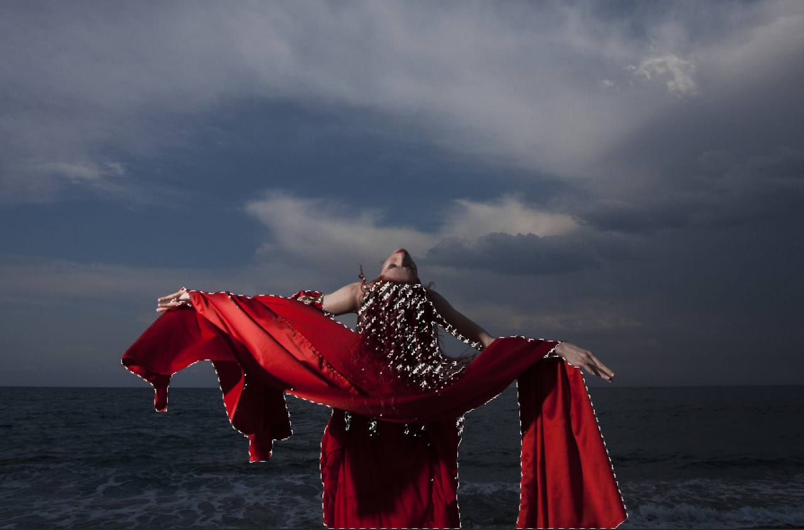

# Range pixel selections

You can create a pixel selection using color, tonal or transparency (alpha/opacity) ranges from your image.

*Pixel selection of red color range.*

If you decide to create a selection based on any range, your image is analyzed and all pixels which fall into the chosen range are included in the selection. Pixels which are not in the chosen range are excluded.

Color, tonal and transparency range selections are available from the **Select** menu. These include:

- From the **Color Range** submenu:
  - **Select Reds**
  - **Select Blues**
  - **Select Greens**
- From the **Tonal Range** submenu:
  - **Select Midtones**
  - **Select Shadows**
  - **Select Highlights**
- From the **Alpha Range** submenu:
  - **Select Fully Transparent**—only pixels which have an opacity of 0% are selected.
  - **Select Partially Transparent**—all pixels with a transparency higher than 0% are selected.
  - **Select Opaque**—only pixels that are 0% transparent are selected.

> **Tip:** Try creating range pixel selections before [applying an adjustment layer](../../10-adjustments/01-applying-adjustments.md). This allows you to target the adjustment directly to any one of the Color or Tonal ranges.

#### SEE ALSO:

- [Creating pixel selections](01-overview.md)
- [Sampled color pixel selections](09-from-a-sampled-color.md)
