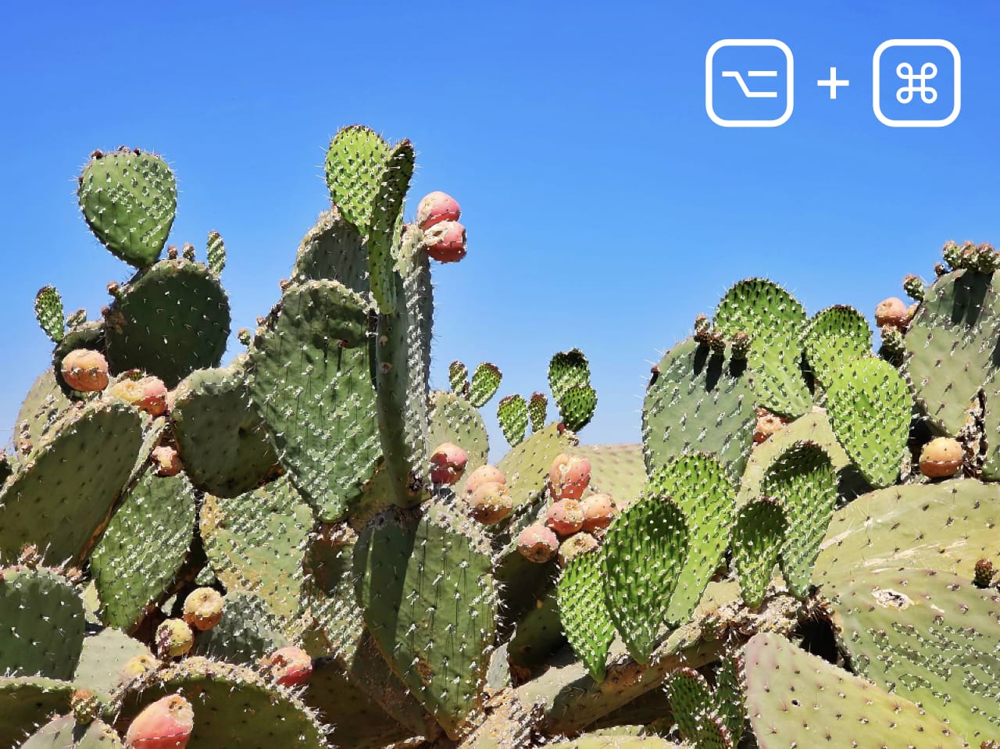

# Pixel selections from layers

You can create pixel selections based on layers (or layer groups) or layer luminosity.

*Example of a pixel selection from layer intensity (luminosity).*

If the layer or layer group contains areas which have an opacity lower than 100%, these are partially selected. This partial selection is based on the percentage of their opacity (i.e. areas of 20% opacity will be selected by 20%). Transparent areas will not be included in the selection.

> **Note:** A selection marquee only appears around areas which are selected by more than 50%. Areas selected by 50% or less will not display a marquee at their edges.

**To create a pixel selection from layer contents:**

Do one of the following:

- On the **Layers** panel, select a layer. From the **Select** menu, select **Selection from Layer**.
- On the **Layers** panel, click the chosen layer's thumbnail while pressing the `Cmd` .

**To create a pixel selection from layer intensity (luminosity):**

Do one of the following:

- On the **Select** menu, choose **Selection from Layer Intensity**.
- On the **Layers** panel, click the chosen layer's thumbnail while pressing the `Alt` and `Cmd` s.

**To add a layer's contents to an existing selection:**

- On the **Layers** panel, click the chosen layer's thumbnail while pressing the `Shift` and `Cmd` s.

**To add a layer's luminosity information to an existing selection:**

- On the **Layers** panel, click the chosen layer's thumbnail while pressing the `Shift`, `Alt` and `Cmd` s.

#### SEE ALSO:

- [Modifying pixel selections](../02-modifying-pixel-selections.md)
- [Refining pixel selection edges](../06-refining-pixel-selection-edges.md)
- [Range pixel selections](05-by-range.md)
- [Sampled color pixel selections](09-from-a-sampled-color.md)
