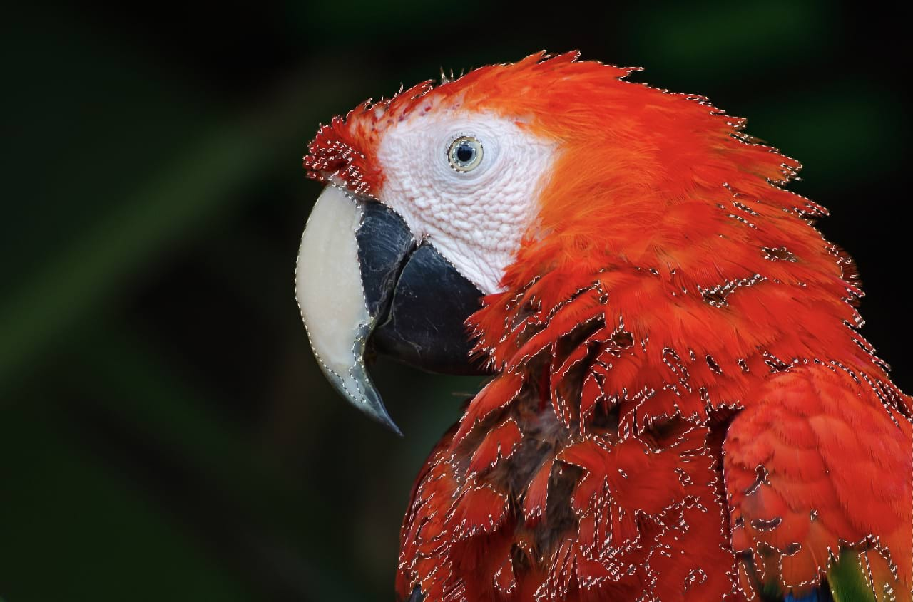

# Pixel selections from channels

You can create pixel selections based on a single channel or combination of channels. This feature is available from the [Channels panel](../../33-panels/06-channels-panel.md).

*Selection created from the image's red channel.*

Pixels are selected based on the contribution that the chosen channel makes to its color value. If a channel only contributes partially to a pixel, that partial amount is selected (i.e. where a channel contributes 20% of the color to that pixel, that 20% is selected).

> **Note:** A selection marquee only appears around areas which are selected by more than 50%. Areas selected by 50% or less will not display a marquee at their edges.

**To create a pixel selection from a channel:**

- In the **Channels** panel, `Click`-click any channel and select **Load to Pixel Selection**.

**To combine channels in a single pixel selection:**

In the **Channels** panel:

1. `Click`-click any channel and select **Load to Pixel Selection**.
2. `Click`-click any other channel and select **Add to Pixel Selection**.
3. Repeat step 2 as needed.

> **Note:** Alternatively, you can subtract or intersect a channel from a selection using the other options on the context (`Click`-click) menu. For more information on the available selection modes, see [Creating pixel selections](01-overview.md).

**To create a pixel selection from a selected layer's channel:**

1. In the **Layers** panel, select a layer.
2. In the **Channels** panel:
  - `Click`-click a channel named after the selected layer (e.g. Background Red) and select **Create Spare Channel**
  - `Click`-click the newly created spare channel and select **Load to Pixel Selection**.

**To save a selection as an alpha channel:**

- With a pixel selection in place, `Click`-click the 'Pixel Selection' entry and select **Create Spare Channel**.

The selection is stored at the bottom of the Channels panel as a new 'Spare Channel' entry.

**To invert the layer's Pixel Selection channel:**

- `Click`-click the Pixel Selection layer's channel, then click an option from the pop-up menu.

#### SEE ALSO:

- [Using channels](../../13-channels/01-using-channels.md)
- [Spare channels](../../13-channels/03-spare-channels.md)
- [Channels panel](../../33-panels/06-channels-panel.md)
- [Creating pixel selections](01-overview.md)
