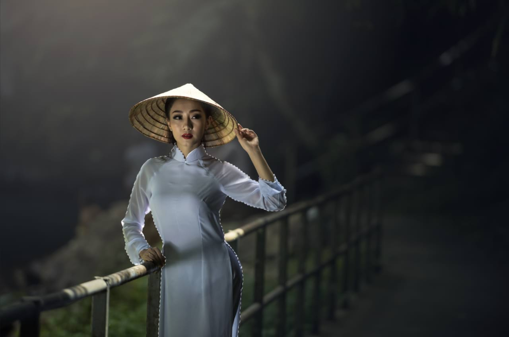
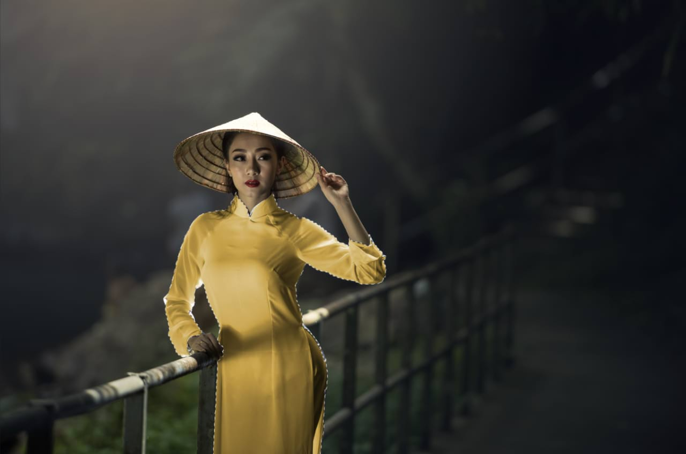

# Sampled color pixel selections

You can create a pixel selection by sampling colors from pixel layers.

Sampled color selection can be precursors to further adding to or subtracting from selected regions. In the image above, an initial sampled color selection was made prior to switching to the [Selection Brush Tool](../../32-tools/03-selection-tools/02-selection-brush-tool.md) (set to Add mode) for fine tuning selected areas.

### Settings (or Preferences)

The following settings can be adjusted from the dialog:

- **Tolerance**—determines how closely pixels must match the selected color to be included in the selection. For lower tolerance settings, pixels must be very close in value to the clicked pixel. For higher tolerance settings, pixel color can vary widely from the clicked pixel. Drag the slider to set the value.
- **Model**—determines the color model used when sampling. Select from the pop-up menu.

**To create a pixel selection from a sampled color:**

1. Select the pixel layer containing the color to be sampled.
2. From the **Select** menu, choose **Select Sampled Color**.
3. Click on the color to be sampled.
4. Adjust the settings in the dialog.
5. Click **Apply**.

#### SEE ALSO:

- [Creating pixel selections](01-overview.md)
- [Range pixel selections](05-by-range.md)
- [Selection Brush Tool](../../32-tools/03-selection-tools/02-selection-brush-tool.md)
