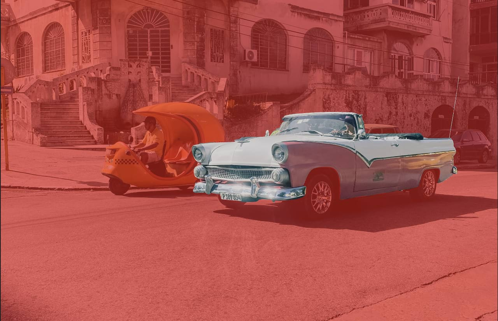

# Edit selection as layer using Quick Mask

Using **Quick Mask** mode, you can modify (or create) a selection using pixel-editing tools.

*Previewing pixel selection with Quick Mask.*

When entering this mode, your selection is temporarily presented as a pixel mask. Pixels can be added or erased using the standard painting and erase tools.

- Painting in black will erase areas from the selection.
- Painting in white will add areas to the selection.
- Painting a gray will vary the opacity of the selection depending on the tone of gray used.
- Erased areas are always removed from a selection.

By default, the Quick Mask is presented in the workspace as a translucent red overlay. The red areas are not included in the selection. This default view can be changed to show the masked area as black, white or transparent depending on your preferences.

> **Note:** Tools which can be used in conjunction with Quick Mask include, but are not limited to the following:
>
> - [Erase Brush Tool](../32-tools/06-erase-tools/01-erase-brush-tool.md)
> - [Flood Erase Tool](../32-tools/06-erase-tools/03-flood-erase-tool.md)
> - [Flood Fill Tool](../32-tools/04-fill-tools/01-flood-fill-tool.md)
> - [Gradient Tool](../32-tools/04-fill-tools/02-gradient-tool.md)
> - [Paint Brush Tool](../32-tools/05-paint-tools/01-paint-brush-tool.md)
> - [Paint Mixer Brush](../32-tools/05-paint-tools/04-paint-mixer-brush.md)
> - [Pixel Tool](../32-tools/05-paint-tools/03-pixel-tool.md)

> **Tip:** You can create a new selection from scratch using the painting tools by entering Quick Mask mode without a selection in place.

**To edit a selection using Quick Mask mode:**

1. Do one of the following:
  - Press **Q**.
  - On the Toolbar, click **Quick Mask**.
  - From the **Select** menu, select **Edit Selection as Layer**.
2. Click or drag on the page using any pixel-editing tool.
3. Repeat step 1 to exit Quick Mask mode and display the selection as a marquee.
4. (Optional) To create a layer mask using the current selection, from the **Layer** menu, select **New Mask Layer**.

> **Tip:** Use a hard-edged brush from the **Masking** category of the **Brushes** panel.

**To change Quick Mask view:**

- On the Toolbar, click the arrow next to **Quick Mask Enabled** and then select a **Show As** option from the pop-up menu.

#### SEE ALSO:

- [Moving and transforming pixel selections](03-moving-and-transforming-pixel-selections.md)
- [Modifying pixel selections](02-modifying-pixel-selections.md)
- [Creating pixel selections](01-creating-pixel-selections/01-overview.md)
